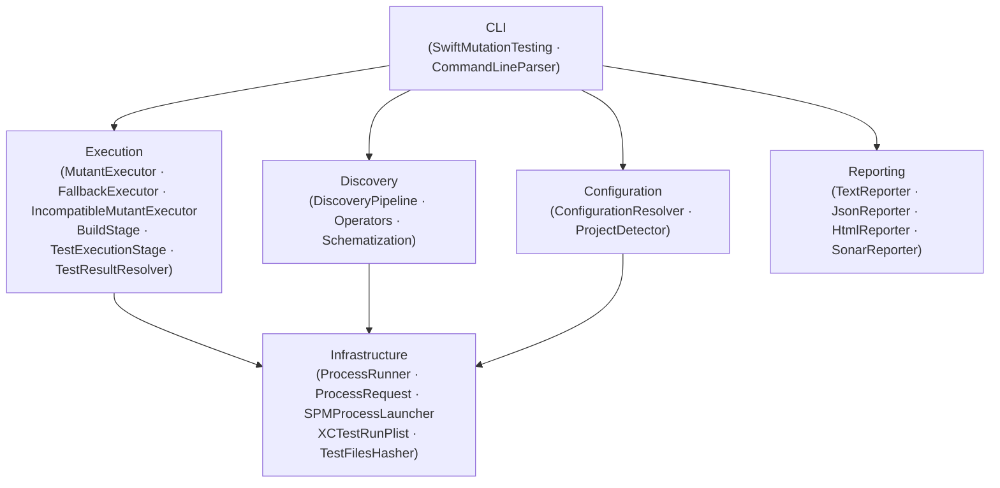
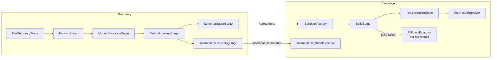

# Overview

← [Index](README.md) | Next: [Discovery Pipeline →](02-discovery.md)

---

## Purpose

`swift-mutation-testing` is a mutation testing CLI for Swift projects (Xcode and SPM). It introduces controlled faults (mutants) into source code, runs the test suite for each one, and reports whether the tests detected the fault. The mutation score — the ratio of killed mutants to all testable mutants — measures the effectiveness of the test suite.

The tool never modifies the original project. All mutations happen inside isolated sandbox copies in `$TMPDIR`.

## Module Map

The codebase is organized into six layers. Each has a single responsibility and communicates through well-defined value types.



| Layer | Responsibility |
|---|---|
| **CLI** | Argument parsing, subcommand routing, exit codes |
| **Configuration** | Config file parsing, CLI merge, auto-detection of scheme and destination |
| **Discovery** | Source file collection, AST parsing, mutant identification, schematization |
| **Execution** | Sandbox creation, build, simulator management, parallel test execution, result parsing (Xcode and SPM), fallback per-file builds, caching |
| **Reporting** | Progress output, mutation report generation (text, JSON, HTML, Sonar) |
| **Infrastructure** | Process lifecycle management (`ProcessRunner`, `ProcessRequest`, `SPMProcessLauncher`), xctestrun plist manipulation, test file hashing |

## Entry Point

`SwiftMutationTesting.swift` is the `@main` entry point. It routes each invocation through configuration loading, discovery, execution, and reporting.

```mermaid
flowchart TD
    A[Parse CLI arguments] --> B{Subcommand?}
    B -- init --> C[ProjectDetector auto-detects scheme\nand destination]
    C --> D[ConfigurationFileWriter writes\n.swift-mutation-testing.yml]
    D --> EXIT0[Exit 0]
    B -- default --> E[ConfigurationFileParser reads\n.swift-mutation-testing.yml]
    E --> F[ConfigurationResolver merges\nCLI args + file values]
    F --> G[DiscoveryPipeline\nfinds all mutants]
    G --> H[MutantExecutor\nbuilds and tests each mutant]
    H --> I[TextReporter prints summary]
    I --> J[JsonReporter · HtmlReporter\n· SonarReporter write files]
    J --> EXIT0
    B -- --help / --version --> EXIT0
```

## Both Pipelines at a Glance



| Stage | Input | Output |
|---|---|---|
| `FileDiscoveryStage` | `DiscoveryInput` | `[SourceFile]` |
| `ParsingStage` | `[SourceFile]` | `[ParsedSource]` |
| `MutantDiscoveryStage` | `[ParsedSource]` | `[MutationPoint]` |
| `MutantIndexingStage` | `[MutationPoint]`, `[ParsedSource]` | `[IndexedMutationPoint]` |
| `SchematizationStage` | `[IndexedMutationPoint]`, `[ParsedSource]` | `[SchematizedFile]`, `[MutantDescriptor]` |
| `IncompatibleRewritingStage` | `[IndexedMutationPoint]`, `[ParsedSource]` | `[MutantDescriptor]` |
| `SandboxFactory` | project path + schematized files | `Sandbox` |
| `BuildStage` | `Sandbox` | `BuildArtifact` |
| `TestExecutionStage` | `BuildArtifact` + mutants | `[ExecutionResult]` |
| `FallbackExecutor` | `RunnerInput` + `SimulatorPool` | `[ExecutionResult]` |
| `IncompatibleMutantExecutor` | incompatible mutants | `[ExecutionResult]` |
| `TestResultResolver` | `TestLaunchResult` + `ProjectType` | `TestRunOutcome` |

## Invariants

| Invariant | Enforcement |
|---|---|
| Original project is never modified | All mutations happen inside `$TMPDIR/xmr-<UUID>/` sandbox |
| Build runs exactly once for the normal path | `BuildStage` builds once (Xcode: `build-for-testing`, SPM: `swift build --build-tests`); `TestExecutionStage` uses `test-without-building` (Xcode) or `swift test --skip-build` (SPM) |
| No mutant results are lost or duplicated | `MutationCounter` tracks total; `withThrowingTaskGroup` accounts for every task |
| Mutant positions are accurate | UTF-8 offsets are preserved from AST through to final report |
| A cancelled task never permanently holds a simulator slot | `withTaskCancellationHandler` in `SimulatorPool.acquire` releases the slot on cancel |
| `schematizedContent` never contains the `__swiftMutationTestingID` global | Global lives exclusively in `__SMTSupport.swift`, injected by `SandboxFactory` |

## Exit Codes

| Code | Meaning |
|---|---|
| `0` | Success |
| `1` | Error (usage error, build failure, unexpected failure) |

---

← [Index](README.md) | Next: [Discovery Pipeline →](02-discovery.md)
