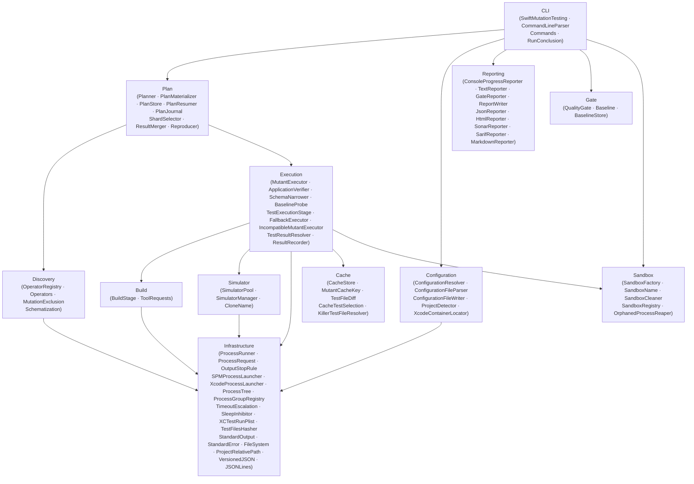
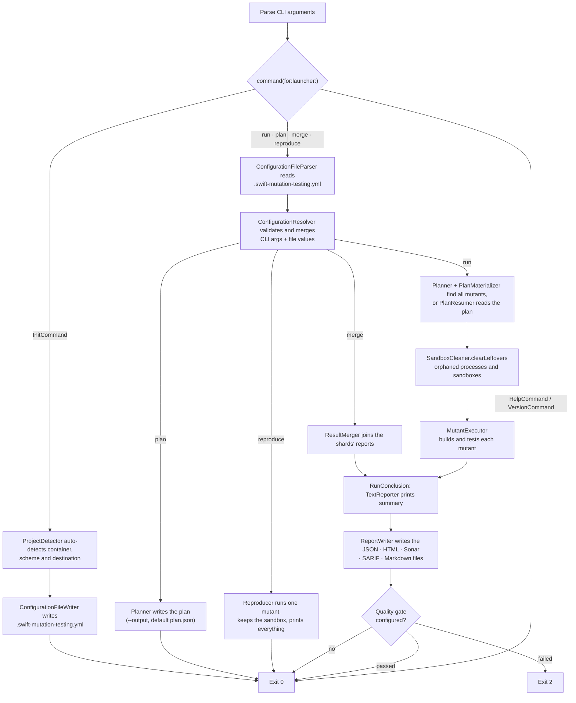
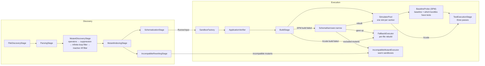

# Overview

← [Index](README.md) | Next: [Discovery Pipeline →](02-discovery.md)

---

## Purpose

`swift-mutation-testing` is a mutation testing CLI for Swift projects (Xcode and SPM). It introduces controlled faults (mutants) into source code, runs the test suite for each one, and reports whether the tests detected the fault. The mutation score — the ratio of detected mutants to all testable mutants — measures the effectiveness of the test suite.

The tool never modifies the original project. All mutations happen inside isolated sandbox copies in `$TMPDIR`.

## Module Map

The codebase is organized into twelve layers, one directory each under `Sources/SwiftMutationTesting/`. Each has a single responsibility and communicates through well-defined value types.

```mermaid
graph TD
    CLI["CLI\n(SwiftMutationTesting · CommandLineParser\nCommands · RunConclusion)"]
    CONFIG["Configuration\n(ConfigurationResolver · ConfigurationFileParser\nConfigurationFileWriter · ProjectDetector · XcodeContainerLocator)"]
    DISCOVERY["Discovery\n(OperatorRegistry · Operators · MutationExclusion\nSchematization)"]
    BUILD["Build\n(BuildStage · ToolRequests)"]
    EXECUTION["Execution\n(MutantExecutor · ApplicationVerifier · SchemaNarrower · BaselineProbe\nTestExecutionStage · FallbackExecutor · IncompatibleMutantExecutor\nTestResultResolver · ResultRecorder)"]
    SIMULATOR["Simulator\n(SimulatorPool · SimulatorManager · CloneName)"]
    REPORTING["Reporting\n(ConsoleProgressReporter · TextReporter · GateReporter · ReportWriter\nJsonReporter · HtmlReporter · SonarReporter · SarifReporter · MarkdownReporter)"]
    INFRA["Infrastructure\n(ProcessRunner · ProcessRequest · OutputStopRule\nSPMProcessLauncher · XcodeProcessLauncher · ProcessTree · ProcessGroupRegistry\nTimeoutEscalation · SleepInhibitor · XCTestRunPlist · TestFilesHasher\nStandardOutput · StandardError · FileSystem · ProjectRelativePath · VersionedJSON · JSONLines)"]
    CACHE["Cache\n(CacheStore · MutantCacheKey · TestFileDiff\nCacheTestSelection · KillerTestFileResolver)"]
    SANDBOX["Sandbox\n(SandboxFactory · SandboxName · SandboxCleaner\nSandboxRegistry · OrphanedProcessReaper)"]
    GATE["Gate\n(QualityGate · Baseline · BaselineStore)"]
    PLAN["Plan\n(Planner · PlanMaterializer · PlanStore · PlanResumer · PlanJournal\nShardSelector · ResultMerger · Reproducer)"]

    CLI --> PLAN
    PLAN --> DISCOVERY
    PLAN --> EXECUTION
    CLI --> CONFIG
    CLI --> REPORTING
    CLI --> GATE
    CLI --> SANDBOX
    EXECUTION --> BUILD
    EXECUTION --> SIMULATOR
    EXECUTION --> INFRA
    EXECUTION --> CACHE
    EXECUTION --> SANDBOX
    BUILD --> INFRA
    SIMULATOR --> INFRA
    DISCOVERY --> INFRA
    CONFIG --> INFRA
```

| Layer | Responsibility |
|---|---|
| **CLI** | Argument parsing, one `Command` per subcommand, the end of a run (`RunConclusion`), exit codes |
| **Configuration** | Config file parsing and validation, CLI merge, the Xcode container (`XcodeContainerLocator`), auto-detection of scheme and destination, the file `init` writes |
| **Discovery** | Source file collection, AST parsing, mutant identification (`OperatorRegistry`, `MutationExclusion`), mutant ids (`MutantID`) and fingerprints, schematization |
| **Build** | The one build of a sandbox (`BuildStage`) and every `swift` and `xcodebuild` request of a run (`ToolRequests`) |
| **Execution** | The application check (`ApplicationVerifier`), schema narrowing (`SchemaNarrower`), the baseline probe (`BaselineProbe`), parallel test execution, result parsing (Xcode and SPM), recording verdicts (`ResultRecorder`), fallback per-file builds, incompatible mutants |
| **Simulator** | The pool of worker slots, cloned simulators when the destination needs them (`SimulatorPool`, `SimulatorManager`), clone names and the sweep of orphaned clones (`CloneName`) |
| **Sandbox** | Sandbox creation (`SandboxFactory`), orphaned sandbox and process cleanup (`SandboxCleaner`, `OrphanedProcessReaper`), signal-based cleanup of the active sandbox (`SandboxRegistry`) |
| **Cache** | Granular per-file cache invalidation (`CacheStore`, `TestFileDiff`), the tests a cache was made against (`CacheTestSelection`), killer test file resolution (`KillerTestFileResolver`), cache key computation (`MutantCacheKey`) |
| **Reporting** | Progress output, the console summary, the gate's report, mutation report files (JSON, HTML, Sonar, SARIF, Markdown, written by `ReportWriter`) |
| **Gate** | Quality gate policies, baselines of undetected mutants matched by fingerprint, gate exit code |
| **Plan** | What a run will do, written down: `Planner` makes it, `PlanMaterializer` turns it into the execution input, `ShardSelector` slices it, `ResultMerger` joins the slices' results, `Reproducer` runs one mutant of it, `PlanResumer` and `PlanJournal` pick a run of it up after an interruption |
| **Infrastructure** | Process lifecycle management (`ProcessRunner`, `ProcessRequest`, `SPMProcessLauncher`, `XcodeProcessLauncher`), xctestrun plist manipulation, test file snapshots (`TestFilesHasher`), capturable stdout and stderr (`StandardOutput`, `StandardError`), injectable file-system calls (`FileSystem`), project-relative paths (`ProjectRelativePath`), versioned JSON and JSON-lines files (`VersionedJSON`, `JSONLines`) |

## Commands

| Command | What it does | Ends with |
|---|---|---|
| `run` (the default) | Discovers every mutant, or reads them from `--plan` (optionally one `--shard`), tests them, reports | `RunConclusion` |
| `plan` | Discovers the mutants and writes the plan to `--output` (default `plan.json`), without building | exit `0` |
| `merge` | Joins the JSON reports of a plan's shards into one result set | `RunConclusion` |
| `reproduce` | Runs one mutant, by id or fingerprint, keeps its sandbox and prints the diff, the full test output and the verdict | exit `0`, or `1` when the mutant reached no verdict |
| `init` | Detects the project and writes a starter `.swift-mutation-testing.yml` | exit `0` |
| `--help`, `-h` / `--version` | Print the usage or the version | exit `0` |

## Entry Point

`SwiftMutationTesting.swift` is the `@main` entry point. It installs the signal handlers (`SandboxCleaner.installSignalHandlers()`), parses the arguments into `ParsedArguments`, turns them into a `Command` with `command(for:launcher:)` — `HelpCommand`, `VersionCommand`, `InitCommand`, `PlanCommand`, `MergeCommand`, `ReproduceCommand` or `RunCommand`, each built with the resolved configuration it needs — and returns what its `execute()` returns. A `UsageError` or any other thrown error is written to stderr and exits `1`. A run and a merge both end in `RunConclusion`; a run and a reproduction hold off idle sleep (`SleepInhibitor`) while they work.

```mermaid
flowchart TD
    A[Parse CLI arguments] --> B{"command(for:launcher:)"}
    B -- InitCommand --> C["ProjectDetector auto-detects container,\nscheme and destination"]
    C --> D["ConfigurationFileWriter writes\n.swift-mutation-testing.yml"]
    D --> EXIT0[Exit 0]
    B -- "run · plan · merge · reproduce" --> E["ConfigurationFileParser reads\n.swift-mutation-testing.yml"]
    E --> F["ConfigurationResolver validates and merges\nCLI args + file values"]
    F -- plan --> PW["Planner writes the plan\n(--output, default plan.json)"]
    PW --> EXIT0
    F -- merge --> MR["ResultMerger joins the shards' reports"]
    MR --> I
    F -- reproduce --> RP["Reproducer runs one mutant,\nkeeps the sandbox, prints everything"]
    RP --> EXIT0
    F -- run --> G["Planner + PlanMaterializer find all mutants,\nor PlanResumer reads the plan"]
    G --> CL["SandboxCleaner.clearLeftovers\norphaned processes and sandboxes"]
    CL --> H["MutantExecutor\nbuilds and tests each mutant"]
    H --> I["RunConclusion: TextReporter prints summary"]
    I --> J["ReportWriter writes the JSON · HTML · Sonar\n· SARIF · Markdown files"]
    J --> GT{"Quality gate\nconfigured?"}
    GT -- no --> EXIT0
    GT -- passed --> EXIT0
    GT -- failed --> EXIT2[Exit 2]
    B -- "HelpCommand / VersionCommand" --> EXIT0
```

## Both Pipelines at a Glance

```mermaid
flowchart LR
    subgraph Discovery
        FD[FileDiscoveryStage] --> PS[ParsingStage]
        PS --> MD["MutantDiscoveryStage\noperators → suppression → infinite-loop filter → inactive #if filter"]
        MD --> MI[MutantIndexingStage]
        MI --> SS[SchematizationStage]
        MI --> IRS[IncompatibleRewritingStage]
    end
    subgraph Execution
        SF[SandboxFactory] --> AV[ApplicationVerifier]
        AV --> BS[BuildStage]
        BS --> POOL["SimulatorPool\none slot per worker"]
        POOL --> PROBE["BaselineProbe (SPM)\nbaseline + which bundles have tests"]
        PROBE --> TES["TestExecutionStage\nthree passes"]
        POOL -- Xcode --> TES
        BS -- "SPM build failed" --> RETRY[SchemaNarrower.narrow]
        RETRY -- rebuilt --> POOL
        RETRY -- gave up --> FBP["FallbackExecutor\nper-file rebuild"]
        BS -- "Xcode build failed" --> FBP
        IME["IncompatibleMutantExecutor\nwarm sandboxes"]
        RETRY -- excluded mutants --> IME
    end
    SS -- RunnerInput --> SF
    IRS -- incompatible mutants --> IME
```

| Stage | Input | Output |
|---|---|---|
| `Planner` | `DiscoveryInput` | `Plan` + `[ParsedSource]` (the four stages below) |
| `PlanMaterializer` | `Plan` + `[ParsedSource]` (or the files on disk, hashed again) | `RunnerInput` (the two schematization stages) |
| `FileDiscoveryStage` | `DiscoveryInput` | `[SourceFile]` |
| `ParsingStage` | `[SourceFile]` | `[ParsedSource]` |
| `MutantDiscoveryStage` | `[ParsedSource]` | `[MutationPoint]` |
| `MutantIndexingStage` | `[MutationPoint]`, `[ParsedSource]`, project path | `[IndexedMutationPoint]` |
| `SchematizationStage` | `[IndexedMutationPoint]`, `[ParsedSource]` | `[SchematizedFile]`, `[MutantDescriptor]` |
| `IncompatibleRewritingStage` | `[IndexedMutationPoint]`, `[ParsedSource]` | `[MutantDescriptor]` |
| `SandboxFactory` | project path + schematized files | `Sandbox` |
| `ApplicationVerifier` | `Sandbox` + schematized files + mutants | nothing, or `IntegrityError` |
| `BuildStage` | `Sandbox` | `BuildArtifact` |
| `BaselineProbe` | `Sandbox` (SPM) | `[TestBundle]` + test filter, or `BaselineError` |
| `TestExecutionStage` | `TestExecutionContext` + mutants | `[ExecutionResult]` |
| `FallbackExecutor` | `RunnerInput` + `SimulatorPool` | `[ExecutionResult]` |
| `IncompatibleMutantExecutor` | incompatible mutants + `SimulatorPool` | `[ExecutionResult]` |
| `TestResultResolver` | `TestLaunchResult` + `ProjectType` | `TestRunOutcome` |

## Invariants

| Invariant | Enforcement |
|---|---|
| Original project is never modified | All mutations happen inside `$TMPDIR/swift-mutation-testing/xmr-<pid>-<UUID>/` sandboxes |
| Build runs exactly once for the normal path | `BuildStage` builds once (Xcode: `build-for-testing`, SPM: `swift build --build-tests`); `TestExecutionStage` uses `test-without-building` (Xcode) or the built test bundles (SPM) |
| No mutant results are lost or duplicated | `MutationCounter` tracks total; `withThrowingTaskGroup` accounts for every task |
| Mutant positions are accurate | UTF-8 offsets are preserved from AST through to final report |
| A cancelled task never permanently holds a simulator slot | `withTaskCancellationHandler` in `SimulatorPool.acquire` releases the slot on cancel |
| Every schematized file declares its own support block, named after the file | `SchemataGenerator` ends every file it schematizes with `SupportDeclarations.appended(to:path:syntax:style:)`, which adds `perFile(for:)`: `@usableFromInline internal` declarations whose names carry a hash of the file's path; there is no shared support file, so a second module, an `@inlinable` body or a regenerated schema needs nothing else |

## Exit Codes

| Code | Meaning |
|---|---|
| `0` | Success |
| `1` | Error (usage error, invalid configuration file, a build that timed out or produced no `.xctestrun`, failing baseline, integrity error, stale plan, failed merge, unreadable or out-of-scope baseline, a reproduction with no verdict, unexpected failure) |
| `2` | The run completed but the quality gate failed |

---

← [Index](README.md) | Next: [Discovery Pipeline →](02-discovery.md)
