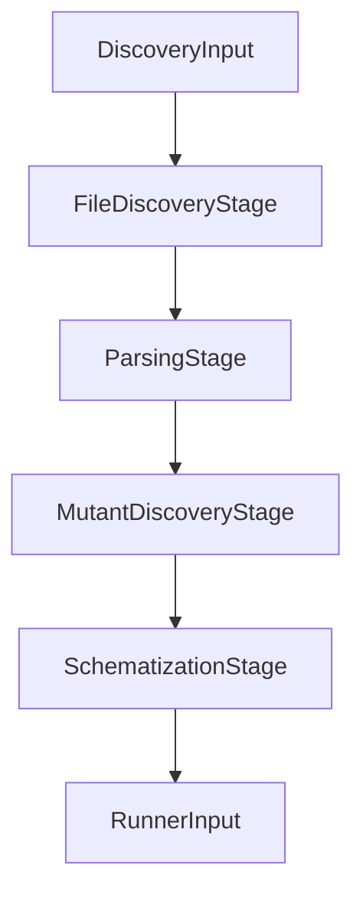

# Discovery Pipeline

← [Overview](01-overview.md) | Next: [Execution Pipeline →](03-execution.md)

---

## Design

The discovery pipeline is a **linear chain of pure stages**. Each stage receives an immutable input, produces an immutable output, and has no side effects. `DiscoveryPipeline` is the entry point and orchestrates the four stages sequentially.



## Stages

### FileDiscoveryStage

Collects Swift source files under the configured sources path.

| | |
|---|---|
| Input | `DiscoveryInput` — project path, sources path, exclude patterns |
| Output | `[SourceFile]` — path + raw text content |

Traverses the directory tree recursively. Excludes files matching any `--exclude` glob pattern and files located under paths that contain `Tests`, `Specs`, `.build`, or similar test-only indicators. Each discovered file is read into a `SourceFile` value.

### ParsingStage

Parses each source file into a SwiftSyntax AST. Runs concurrently across files via `async` iteration.

| | |
|---|---|
| Input | `[SourceFile]` |
| Output | `[ParsedSource]` — `SourceFile` + `SourceFileSyntax` tree |

Files that fail to parse are silently dropped. The resulting `[ParsedSource]` array contains only successfully parsed files.

### MutantDiscoveryStage

Applies mutation operators to each parsed source and collects mutation points. Runs concurrently across files.

| | |
|---|---|
| Input | `[ParsedSource]`, resolved `[any MutationOperator]` |
| Output | `[MutationPoint]` — file path, position, original text, mutated text, operator |

Each operator walks the AST with its own visitor and emits a `MutationPoint` for every applicable node. Points are collected from all operators and all files, then returned as a flat list.

### SchematizationStage

Transforms mutation points into the final `RunnerInput` consumed by the execution pipeline.

| | |
|---|---|
| Input | `[MutationPoint]`, `[ParsedSource]` |
| Output | `RunnerInput` — schematized files, incompatible mutants, support file content |

For each file, the stage separates schematizable mutations (inside function bodies) from incompatible ones (outside function bodies). Schematizable mutations are embedded into the source via `SchemataGenerator`. Incompatible mutations are stored as full file rewrites via `MutationRewriter`. See [Schematization](05-schematization.md) for a detailed breakdown.

## Mutation Operators

All operators implement the `MutationOperator` protocol and are registered in `DiscoveryPipeline`. Each has a dedicated `Visitor` that extends `MutationSyntaxVisitor`.

| Operator | What it mutates | Example |
|---|---|---|
| `RelationalOperatorReplacement` | Comparison operators | `>` → `>=`, `<` → `<=`, `==` → `!=` |
| `BooleanLiteralReplacement` | Boolean literals | `true` → `false`, `false` → `true` |
| `LogicalOperatorReplacement` | Logical connectives | `&&` → `\|\|`, `\|\|` → `&&` |
| `ArithmeticOperatorReplacement` | Arithmetic operators | `+` → `-`, `-` → `+`, `*` → `/`, `/` → `*` |
| `NegateConditional` | Conditional expressions | `condition` → `!condition` |
| `SwapTernary` | Ternary branches | `a ? b : c` → `a ? c : b` |
| `RemoveSideEffects` | Standalone function call statements | `doSomething()` → *(removed)* |

Operators are activated by name via `--operator` or deactivated via `--disable-mutator`. If neither flag is provided, all seven operators are active.

## Suppression

Mutations can be suppressed on a per-scope basis using the inline annotation `// xmt:disable`. `SuppressionAnnotationExtractor` collects suppressed ranges from comments, and `SuppressionFilter` removes any `MutationPoint` whose location falls within a suppressed range before points reach `SchematizationStage`.

## Data Structures

```
DiscoveryInput
├── projectPath       — Xcode project root
├── sourcesPath       — root for Swift file discovery
├── excludePatterns   — glob patterns to skip
├── operators         — list of active operator identifiers
└── scheme, destination, timeout, concurrency, noCache

SourceFile
├── path              — absolute path to the .swift file
└── content           — raw source text

ParsedSource
├── file              — SourceFile
└── syntax            — SourceFileSyntax (SwiftSyntax AST)

MutationPoint
├── filePath          — absolute source file path
├── line, column      — 1-based position
├── utf8Offset        — byte offset in UTF-8 encoded content
├── originalText      — token(s) before mutation
├── mutatedText       — token(s) after mutation
├── operatorIdentifier
└── replacement       — ReplacementKind enum

RunnerInput
├── projectPath
├── scheme, destination, timeout, concurrency, noCache
├── schematizedFiles  — [SchematizedFile] (one per modified source file)
├── supportFileContent — __swiftMutationTestingID global declaration
└── mutants           — [MutantDescriptor] (all mutants, schematizable and incompatible)
```

---

← [Overview](01-overview.md) | Next: [Execution Pipeline →](03-execution.md)
