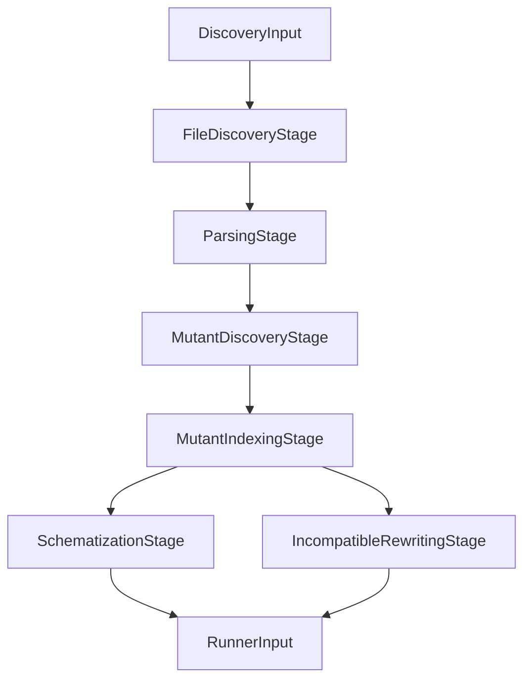

# Discovery Pipeline

← [Overview](01-overview.md) | Next: [Execution Pipeline →](03-execution.md)

---

## Design

The discovery pipeline is a **linear chain of pure stages**. Each stage receives an immutable input, produces an immutable output, and has no side effects. `DiscoveryPipeline` is the entry point and orchestrates the six stages sequentially.



## Stages

### FileDiscoveryStage

Collects Swift source files under the configured sources path.

| | |
|---|---|
| Input | `DiscoveryInput` — project path, sources path, exclude patterns |
| Output | `[SourceFile]` — path + raw text content |

Traverses the directory tree recursively. Excludes files matching any `--exclude` glob pattern and files located under paths that contain `Tests`, `Specs`, `.build`, or similar test-only indicators. Each discovered file is read into a `SourceFile` value.

### ParsingStage

Parses each source file into a SwiftSyntax AST. Runs concurrently across files via `async` iteration.

| | |
|---|---|
| Input | `[SourceFile]` |
| Output | `[ParsedSource]` — `SourceFile` + `SourceFileSyntax` tree |

Files that fail to parse are silently dropped. The resulting `[ParsedSource]` array contains only successfully parsed files.

### MutantDiscoveryStage

Applies mutation operators to each parsed source and collects mutation points. Runs concurrently across files.

| | |
|---|---|
| Input | `[ParsedSource]`, resolved `[any MutationOperator]` |
| Output | `[MutationPoint]` — file path, position, original text, mutated text, operator |

Each operator walks the AST with its own visitor and emits a `MutationPoint` for every applicable node. Points are collected from all operators and all files, then returned as a flat list.

### MutantIndexingStage

Assigns unique sequential IDs to each mutation point and classifies them as schematizable or incompatible.

| | |
|---|---|
| Input | `[MutationPoint]`, `[ParsedSource]` |
| Output | `[IndexedMutationPoint]` — mutation point + unique ID + schematizable flag |

Each mutation point receives an ID in the format `swift-mutation-testing_<index>`, where `<index>` is a zero-based global counter. `TypeScopeVisitor` determines whether a mutation falls inside a function body (schematizable) or outside (incompatible). The indexed points are consumed by the next two stages.

### SchematizationStage

Embeds all schematizable mutations into the source files via `SchemataGenerator`, producing `SchematizedFile` values and `MutantDescriptor` values for the execution pipeline.

| | |
|---|---|
| Input | `[IndexedMutationPoint]`, `[ParsedSource]` |
| Output | `[SchematizedFile]`, `[MutantDescriptor]` — schematized files and schematizable mutant descriptors |

For each file, the stage processes only the schematizable indexed points. Mutations are embedded into the source via `SchemataGenerator`, which rewrites function bodies to contain `switch __swiftMutationTestingID` blocks. See [Schematization](05-schematization.md) for a detailed breakdown.

### IncompatibleRewritingStage

Produces full-file rewrites for mutants that cannot be schematized (mutations outside function bodies, such as stored property initializers or global-scope expressions).

| | |
|---|---|
| Input | `[IndexedMutationPoint]`, `[ParsedSource]` |
| Output | `[MutantDescriptor]` — incompatible mutant descriptors with pre-computed `mutatedSourceContent` |

Each incompatible mutation point is applied to the source via `MutationRewriter`, producing a complete replacement source file stored in `MutantDescriptor.mutatedSourceContent`. These mutants are executed later by `IncompatibleMutantExecutor`, each requiring a separate build + test cycle.

## Mutation Operators

All operators implement the `MutationOperator` protocol and are registered in `DiscoveryPipeline`. Each has a dedicated `Visitor` that extends `MutationSyntaxVisitor`.

| Operator | What it mutates | Example |
|---|---|---|
| `RelationalOperatorReplacement` | Comparison operators | `>` → `>=`, `<` → `<=`, `==` → `!=` |
| `BooleanLiteralReplacement` | Boolean literals | `true` → `false`, `false` → `true` |
| `LogicalOperatorReplacement` | Logical connectives | `&&` → `\|\|`, `\|\|` → `&&` |
| `ArithmeticOperatorReplacement` | Arithmetic operators | `+` → `-`, `-` → `+`, `*` → `/`, `/` → `*` |
| `NegateConditional` | Conditional expressions | `condition` → `!condition` |
| `SwapTernary` | Ternary branches | `a ? b : c` → `a ? c : b` |
| `RemoveSideEffects` | Standalone function call statements | `doSomething()` → *(removed)* |

Operators are activated by name via `--operator` or deactivated via `--disable-mutator`. If neither flag is provided, all seven operators are active.

## Suppression

Mutations can be suppressed on a per-scope basis using the inline annotation `// xmt:disable`. `SuppressionAnnotationExtractor` collects suppressed ranges from comments, and `SuppressionFilter` removes any `MutationPoint` whose location falls within a suppressed range before points reach `SchematizationStage`.

## Data Structures

```
DiscoveryInput
├── projectPath       — project root (Xcode or SPM)
├── projectType       — ProjectType (.xcode or .spm)
├── sourcesPath       — root for Swift file discovery
├── excludePatterns   — glob patterns to skip
├── operators         — list of active operator identifiers
└── timeout, concurrency, noCache

SourceFile
├── path              — absolute path to the .swift file
└── content           — raw source text

ParsedSource
├── file              — SourceFile
└── syntax            — SourceFileSyntax (SwiftSyntax AST)

MutationPoint
├── filePath          — absolute source file path
├── line, column      — 1-based position
├── utf8Offset        — byte offset in UTF-8 encoded content
├── originalText      — token(s) before mutation
├── mutatedText       — token(s) after mutation
├── operatorIdentifier
└── replacementKind   — ReplacementKind enum

IndexedMutationPoint
├── point             — MutationPoint
├── id                — unique ID (swift-mutation-testing_<index>)
└── isSchematizable   — whether the mutation is inside a function body

MutantDescriptor
├── id                — unique ID
├── filePath          — absolute source file path
├── line, column      — 1-based position
├── utf8Offset        — byte offset
├── originalText      — token(s) before mutation
├── mutatedText       — token(s) after mutation
├── operatorIdentifier
├── replacementKind   — ReplacementKind enum
├── description       — human-readable mutation description
├── isSchematizable   — schematizable or incompatible
└── mutatedSourceContent — pre-computed full source (incompatible only)

RunnerInput
├── projectPath
├── projectType       — ProjectType (.xcode or .spm)
├── timeout, concurrency, noCache
├── schematizedFiles  — [SchematizedFile] (one per modified source file)
├── supportFileContent — __swiftMutationTestingID global declaration
└── mutants           — [MutantDescriptor] (all mutants, schematizable and incompatible)
```

---

← [Overview](01-overview.md) | Next: [Execution Pipeline →](03-execution.md)
