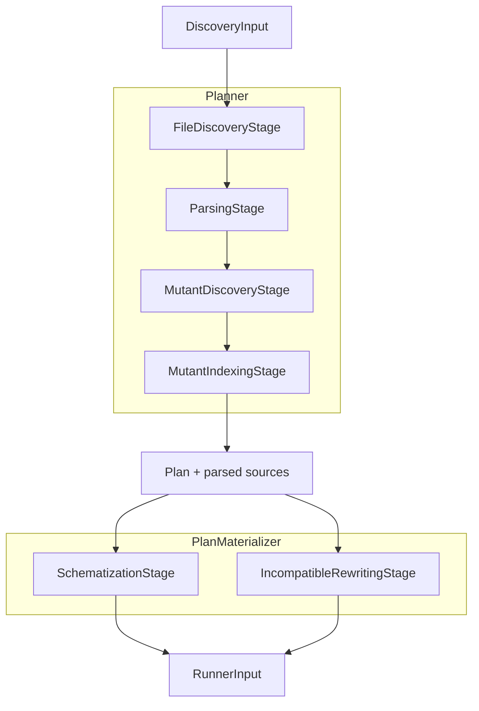

# Discovery Pipeline

← [Overview](01-overview.md) | Next: [Execution Pipeline →](03-execution.md)

---

## Design

The discovery pipeline is a **linear chain of stages**. Each stage receives an immutable input and produces an immutable output; only the first reads the file system. `DiscoveryPipeline.run` is `Planner` followed by `PlanMaterializer`: `Planner` runs the first four stages and writes their result down as a [plan](06-plans.md), and `PlanMaterializer` runs the two schematization stages over it.


```mermaid
flowchart TD
    IN[DiscoveryInput] --> FD
    subgraph Planner
        FD[FileDiscoveryStage] --> PA[ParsingStage]
        PA --> MD[MutantDiscoveryStage]
        MD --> MI[MutantIndexingStage]
    end
    MI --> PLAN[Plan + parsed sources]
    subgraph PlanMaterializer
        SC[SchematizationStage]
        IR[IncompatibleRewritingStage]
    end
    PLAN --> SC
    PLAN --> IR
    SC --> OUT[RunnerInput]
    IR --> OUT
```

## Stages

### FileDiscoveryStage

Collects Swift source files under the configured sources path.

| | |
|---|---|
| Input | `DiscoveryInput` — project path, sources path, exclude patterns |
| Output | `[SourceFile]` — path + raw text content |

Traverses the directory tree recursively, skipping hidden files. The sources path may also be a single `.swift` file; a path that does not exist, or a file that is not Swift, is a `FileDiscoveryError`. Excludes files matching any `--exclude` pattern (`ExcludePattern`) — a glob against the path relative to the project root, or a fragment of the path — and a fixed list of test-only and build locations: paths containing `/Tests/`, `/Mocks/`, `/Stubs/`, `/Fakes/`, `/TestHelpers/`, `/TestSupport/`, `/Snippets/`, `/.build/`, `/DerivedData/` or the cache directory, file names ending in `Tests.swift`, `Mock.swift` or `Spec.swift`, and package manifests. Each discovered file is read into a `SourceFile` value.

### ParsingStage

Parses each source file into a SwiftSyntax AST. Runs concurrently across files in a task group.

| | |
|---|---|
| Input | `[SourceFile]` |
| Output | `[ParsedSource]` — `SourceFile` + `SourceFileSyntax` tree + location converter + function scopes |

SwiftParser recovers from syntax errors, so every file yields a `ParsedSource`. Building one does the per-file work every later stage shares, once: a `SourceLocationConverter` that the operators' visitors use for line and column, and the file's `FunctionBodyScopes`, collected by `TypeScopeVisitor`, that indexing and schematization use.

### MutantDiscoveryStage

Applies mutation operators to each parsed source and collects mutation points. Runs concurrently across files.

| | |
|---|---|
| Input | `[ParsedSource]`, resolved `[any MutationOperator]` |
| Output | `[MutationPoint]` — file path, position, original text, mutated text, operator |

Each operator walks the AST with its own visitor and emits a `MutationPoint` for every applicable node. The points of each file then pass through the stage's exclusions in turn — suppression, infinite-loop prevention and inactive `#if` branches, below — each a `MutationExclusion` that names the ranges it covers and the points it applies to. Points are collected from all operators and all files, then returned as one list in source order (file path, then UTF-8 offset).

### MutantIndexingStage

Assigns unique sequential IDs to each mutation point and classifies them as schematizable or incompatible.

| | |
|---|---|
| Input | `[MutationPoint]`, `[ParsedSource]`, project path |
| Output | `[IndexedMutationPoint]` — mutation point + index + schematizable flag + fingerprint |

Each mutation point receives an index, a zero-based global counter over the points in source order, and its ID is `swift-mutation-testing_<index>`. `MutantID` is the one place that builds, reads and orders that format. A point is schematizable when it falls inside a function body: `ParsedSource.functionScopes.isSchematizable(utf8Offset:)` answers it from the scopes collected at parse time. The indexed points are consumed by the plan and the next two stages.

The ID is only unique within one run: a mutant added earlier in any file renumbers every later one. Each point therefore also gets a **fingerprint** (`MutantFingerprint`) — a hash of its project-relative file, the declaration that contains it (`DeclarationPath`, e.g. `Parser.parse(_:)`), its operator, its change, and an ordinal that tells apart identical changes in one declaration — which stays the same when other code moves or changes. The quality gate matches baselines by fingerprint, and plans, shards and merges identify mutants by it.

### SchematizationStage

Embeds all schematizable mutations into the source files via `SchemataGenerator`, producing `SchematizedFile` values and `MutantDescriptor` values for the execution pipeline.

| | |
|---|---|
| Input | `[IndexedMutationPoint]`, `[ParsedSource]` |
| Output | `[SchematizedFile]`, `[MutantDescriptor]` — schematized files and schematizable mutant descriptors |

For each file, the stage processes only the schematizable indexed points. Mutations are embedded into the source via `SchemataGenerator`, which rewrites function bodies to contain `switch __swiftMutationTestingID_<hash>` blocks, the hash naming the file, splicing them into the file's UTF-8 bytes. The import style of the support block (`ImportStyle`) is decided once over all sources. See [Schematization](05-schematization.md) for a detailed breakdown.

### IncompatibleRewritingStage

Produces full-file rewrites for mutants that cannot be schematized (mutations outside function bodies, such as stored property initializers or global-scope expressions).

| | |
|---|---|
| Input | `[IndexedMutationPoint]`, `[ParsedSource]` |
| Output | `[MutantDescriptor]` — incompatible mutant descriptors with pre-computed `mutatedSourceContent` |

Each incompatible mutation point is applied to the source via `MutationRewriter`, producing a complete replacement source file stored in `MutantDescriptor.mutatedSourceContent`. These mutants are executed later by `IncompatibleMutantExecutor`, each requiring its own rebuild + test cycle.

## Mutation Operators

All operators implement the `MutationOperator` protocol and are registered in `OperatorRegistry`, each with its tier. Each is a `VisitorOperator` over a dedicated visitor that extends `MutationSyntaxVisitor` and conforms to `OperatorVisitor`; the visitor declares the operator's name, its description and whether it is loop-risky, and the rest of the tool — configuration, tiers, SARIF rules, the infinite-loop filter — reads those from the operator rather than from lists of its own.

| Operator | Tier | What it mutates | Example |
|---|---|---|---|
| `RelationalOperatorReplacement` | experimental | Comparison operators, each to a boundary and an opposite variant | `>` → `>=` and `<`, `<=` → `<` and `>=`, `==` → `!=` |
| `BooleanLiteralReplacement` | experimental | Boolean literals | `true` → `false`, `false` → `true` |
| `LogicalOperatorReplacement` | conservative | Logical connectives | `&&` → `\|\|`, `\|\|` → `&&` |
| `ArithmeticOperatorReplacement` | experimental | Arithmetic operators | `+` → `-`, `-` → `+`, `*` → `/`, `/` → `*` |
| `NegateConditional` | conservative | Conditional expressions | `condition` → `!(condition)` |
| `SwapTernary` | conservative | Ternary branches | `a ? b : c` → `a ? c : b` |
| `RemoveSideEffects` | experimental | Standalone function call statements | `doSomething()` → *(removed)* |

The tiers are ordered `conservative` < `default` < `experimental`, and a tier runs every operator at or below it; no operator sits in `default` today, so the `default` tier runs the conservative set. `--operator` names the operators to run, whatever their tier. Without it, the operators of `--operator-tier` run — `default` unless configured otherwise — minus those named by `--disable-mutator` or set `active: false` under `mutators:`. The tiers and the measurements behind them are in [`Docs/OPERATORS.md`](../OPERATORS.md).

## Suppression

Mutations are suppressed with comments, which need nothing declared in the user's project: `// swift-mutation-testing:disable` above a declaration suppresses the declaration, and `// swift-mutation-testing:disable-next-line` suppresses the line after it. `SuppressionAnnotationExtractor` walks the file and records the range of every suppressed declaration and line, and `SuppressionFilter` removes any `MutationPoint` falling inside one before the points reach `MutantIndexingStage`. The `@SwiftMutationTestingDisabled` attribute the documentation used to recommend is still honoured, but Swift only accepts it where the project declares it, so it is no longer the documented way.

## Infinite-loop prevention

`ArithmeticOperatorReplacement` and `RemoveSideEffects` can turn a terminating loop into one that never ends — by flipping the step that moves an index towards its bound, or by deleting the statement that advances it. A mutant like that does not fail the tests, it hangs them, and the run pays the full `--timeout` for a `Timeout` verdict that says nothing about the suite.

`InfiniteLoopBodyExtractor` collects the body range of every `while` and `repeat`, and `InfiniteLoopFilter` drops the points of those two operators — the ones that declare themselves loop-risky — that fall inside one. `for` loops are left alone: they iterate a sequence, and neither operator can make that sequence infinite. The filter runs right after suppression, inside `MutantDiscoveryStage`.

## Inactive `#if` branches

A mutant in a branch the host build leaves out — `#if os(Windows)`, `#if canImport(Glibc)`, the `#else` of `#if canImport(Darwin)` — compiles to nothing, so no test can reach it and it can only survive. `InactiveRegionExtractor` asks SwiftIfConfig, with `HostBuildConfiguration` describing the macOS build the tool runs, which clauses of each file are not active, and `InactiveRegionFilter` drops every point inside one. An `#if` the configuration cannot decide — a `canImport` of a module outside its curated lists — keeps all of its clauses: the filter errs towards keeping a mutant, never towards dropping a real one. It runs last in `MutantDiscoveryStage`, after the infinite-loop filter.

## Data Structures

```
DiscoveryInput
├── projectPath       — project root (Xcode or SPM)
├── projectType       — ProjectType (.xcode or .spm)
├── timeout, concurrency, noCache
├── sourcesPath       — root (or single file) for Swift file discovery
├── excludePatterns   — globs or path fragments to skip
└── operators         — list of active operator identifiers

SourceFile
├── path              — absolute path to the .swift file
└── content           — raw source text

ParsedSource
├── file              — SourceFile
├── syntax            — SourceFileSyntax (SwiftSyntax AST)
├── locationConverter — SourceLocationConverter, built once per file
└── functionScopes    — FunctionBodyScopes, collected once per file by TypeScopeVisitor

MutationPoint
├── operatorIdentifier
├── filePath          — absolute source file path
├── line, column      — 1-based position
├── utf8Offset        — byte offset in UTF-8 encoded content
├── originalText      — token(s) before mutation
├── mutatedText       — token(s) after mutation
├── replacement       — ReplacementKind enum
└── description       — human-readable mutation description

IndexedMutationPoint
├── index             — global position in source order; mutantID = MutantID.make(index:)
├── mutation          — MutationPoint
├── isSchematizable   — whether the mutation is inside a function body
└── fingerprint       — MutantFingerprint, stable across unrelated edits

MutantDescriptor
├── id                — unique ID (swift-mutation-testing_<index>)
├── filePath          — absolute source file path
├── line, column      — 1-based position
├── utf8Offset        — byte offset
├── originalText      — token(s) before mutation
├── mutatedText       — token(s) after mutation
├── operatorIdentifier
├── replacementKind   — ReplacementKind enum
├── description       — human-readable mutation description
├── isSchematizable   — schematizable or incompatible
├── mutatedSourceContent — pre-computed full source (incompatible only)
├── sourceContentHash — SHA-256 of the unmutated file, part of the cache key
└── fingerprint

RunnerInput
├── projectPath
├── projectType       — ProjectType (.xcode or .spm)
├── timeout, concurrency, noCache
├── schematizedFiles  — [SchematizedFile] (one per modified source file, each ending with its own support declarations)
├── mutants           — [MutantDescriptor] (all mutants, schematizable and incompatible, in id order)
└── importStyle       — ImportStyle, for a schema regenerated after a failed build
```

---

← [Overview](01-overview.md) | Next: [Execution Pipeline →](03-execution.md)
