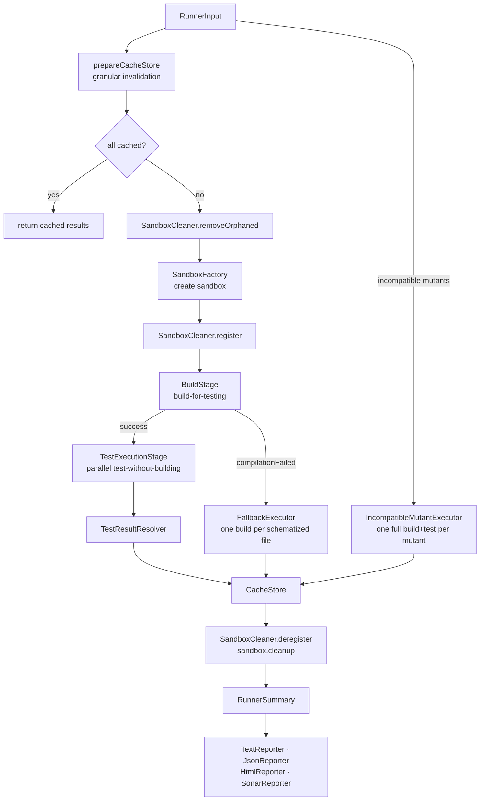
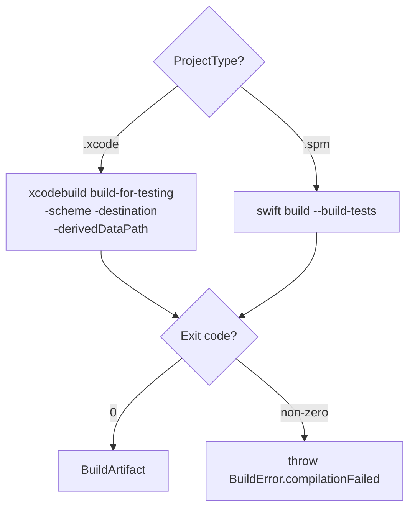
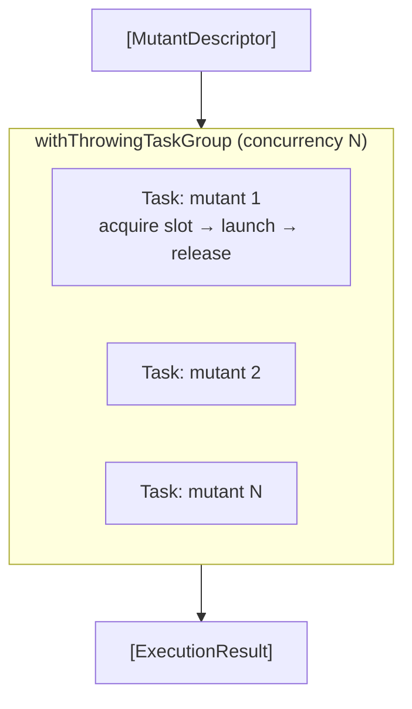
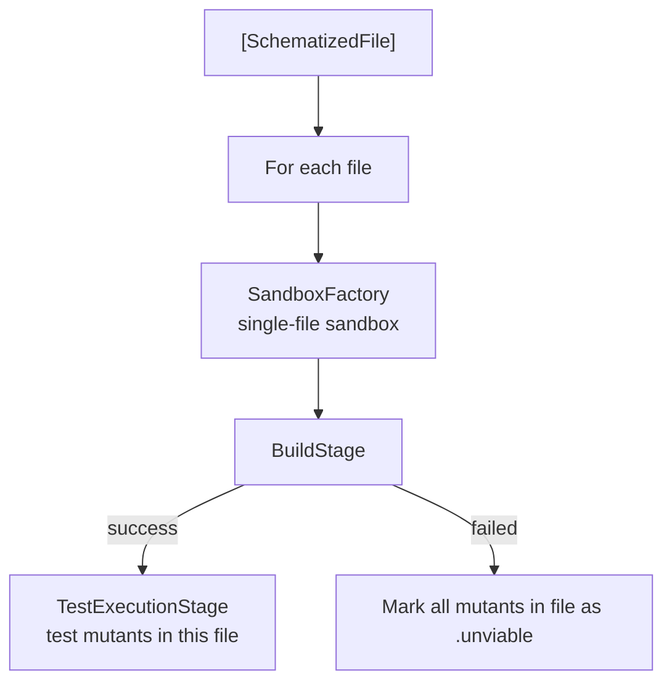
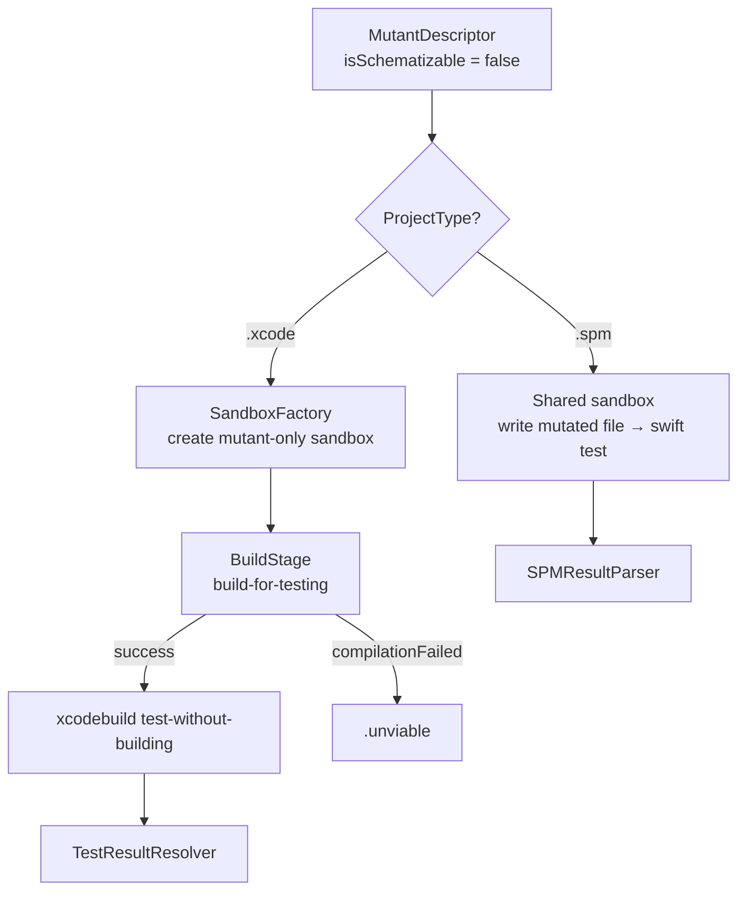
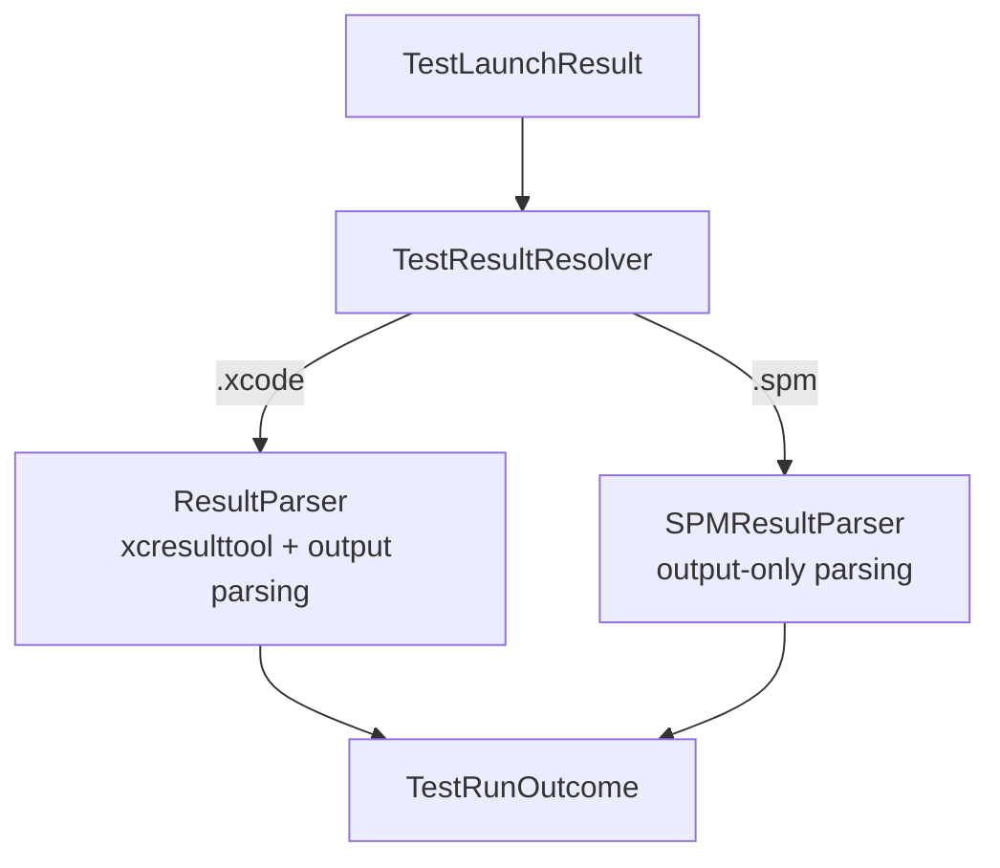

# Execution Pipeline

← [Discovery Pipeline](02-discovery.md) | Next: [Configuration →](04-configuration.md)

---

## Design

`MutantExecutor` is the entry point for the execution pipeline. It separates mutants into two populations — schematizable and incompatible — and routes each through the appropriate path. The executor supports both Xcode (`xcodebuild`) and SPM (`swift test`) project types via `ProjectType`.



## SandboxFactory

Creates an isolated copy of the project in `$TMPDIR/xmr-<UUID>/` before every build. Supports both Xcode and SPM projects.

**Factory methods:**
- `create(projectPath:schematizedFiles:supportFileContent:)` — full sandbox with schematized files and support file injection (normal path)
- `createClean(projectPath:)` — clean sandbox without mutations (used by `IncompatibleMutantExecutor` for SPM shared sandbox)
- `create(projectPath:mutatedFilePath:mutatedContent:)` — sandbox with a single mutated file (incompatible mutants, Xcode path)

**Copy strategy:**
- Skips `.build`, `DerivedData`, and directories prefixed with `.xmr-`
- For `.xcodeproj`: creates fresh `xcuserdata`, copies `xcshareddata`, symlinks everything else
- For source files in `schematizedFiles`: writes the schematized content directly
- For all other files: creates symlinks to the originals (fast, space-efficient)
- Writes `__SMTSupport.swift` (or appends to the first schematized file if no `Sources/` directory exists)
- Disables SwiftLint `PBXShellScriptBuildPhase` entries by patching `project.pbxproj`
- Inserts `break` statements into empty `switch case` bodies to prevent compiler errors in schematized code

The original project is never touched. Cleanup removes the entire `xmr-*` directory when execution completes.

## SandboxCleaner

Handles cleanup of orphaned sandbox directories and signal-based cleanup of the active sandbox.

**Orphaned cleanup (`removeOrphaned`):** Called once at startup via `main()`. Scans `$TMPDIR` (or a provided directory) for directories prefixed with `xmr-` and removes them. This cleans up sandboxes from previous interrupted runs that were never cleaned up normally.

**Signal cleanup (`installSignalHandlers`):** Installs `SIGINT` and `SIGTERM` handlers at startup. When a signal is received, the handler removes the active sandbox directory (if registered) and calls `_exit(1)`. Uses a `nonisolated(unsafe)` C pointer for the active path — necessary because signal handlers are C function pointers that cannot capture Swift context.

**Lifecycle:** `MutantExecutor` calls `register(sandbox)` after creating the sandbox and `deregister()` after cleanup (both on the success and error paths). This ensures the signal handler always has the correct path.

## BuildStage

Runs a single build for all schematizable mutants.

**Xcode path:** `xcodebuild build-for-testing` → find `.xctestrun` → parse plist → `BuildArtifact`

**SPM path:** `swift build --build-tests` → `BuildArtifact` (no `.xctestrun` needed)



| | |
|---|---|
| Input | `Sandbox`, project type, timeout |
| Output | `BuildArtifact` — derived data path + `.xctestrun` URL (Xcode) or sandbox path (SPM) |

`BuildError` conforms to `LocalizedError`, providing structured error descriptions. `MutantExecutor` catches `BuildError.compilationFailed` and delegates to `FallbackExecutor` for per-file rebuilds rather than aborting. Any other thrown error propagates up.

## SimulatorPool

`SimulatorPool` is an `actor` that manages a pool of simulator slots for parallel test execution.

| Destination | Behaviour |
|---|---|
| `platform=macOS` | Single slot, no simulator needed; `setUp` and `tearDown` are no-ops |
| iOS / tvOS / watchOS | Clones the base simulator N times (one per concurrency slot); boots each clone on `setUp`; shuts down and deletes on `tearDown` |

`acquire()` returns an available `SimulatorSlot` or suspends the caller until one is released. A `withTaskCancellationHandler` wraps the suspension — if the owning task is cancelled, the slot is released immediately to avoid a permanent deadlock.

`SimulatorError` conforms to `LocalizedError` and covers three failure modes: `deviceNotFound(destination:)`, `bootTimeout(udid:)`, and `cloneFailed(udid:)`. Each provides a structured `errorDescription` for diagnostics.

## TestExecutionStage

Runs `xcodebuild test-without-building` for each mutant in parallel via `withThrowingTaskGroup`.



**Per-mutant execution:**

1. Check cache — return cached result immediately if `noCache` is false and a match exists
2. Activate the mutant: `XCTestRunPlist.activating(_:)` injects the mutant ID into `EnvironmentVariables.__SWIFT_MUTATION_TESTING_ACTIVE` in a fresh `.xctestrun` copy
3. Acquire a simulator slot from the pool
4. Run `xcodebuild test-without-building -xctestrun <path> -resultBundlePath <xcresult>`
5. Release the simulator slot
6. Parse the result via `ResultParser`
7. Store status in `CacheStore`

**Dynamic concurrency:** the task group seeds N tasks initially, then adds one new task for each completed task, maintaining exactly N active tasks at all times.

## FallbackExecutor

When the baseline build for all schematized files fails (`BuildError.compilationFailed`), `MutantExecutor` delegates to `FallbackExecutor`. This executor rebuilds one schematized file at a time — if one file causes a compilation error, the others can still be tested.



For each schematized file, `FallbackExecutor` creates a sandbox containing only that file's schematization, builds it, and runs the test suite against its mutants. Files whose builds fail have all their mutants marked as `.unviable`. Results are cached via `CacheStore`.

## IncompatibleMutantExecutor

Handles mutants that cannot be schematized — mutations outside function bodies (e.g. in stored property initializers or global scope). Each incompatible mutant requires a full build + test cycle.



**Xcode path:** Each incompatible mutant creates its own sandbox via `SandboxFactory.create(projectPath:mutatedFilePath:mutatedContent:)`, which applies the single mutation directly without schematization. Runs sequentially, each with a full build + test cycle.

**SPM path:** Uses a shared sandbox created via `SandboxFactory.createClean(projectPath:)`. For each mutant, writes the mutated source content directly to the sandbox, runs `swift test`, and restores the original file. This avoids creating a new sandbox per mutant.

## TestResultResolver

`TestResultResolver` determines the `TestRunOutcome` of a completed test run. It delegates to the appropriate parser based on project type.



**Xcode path (`ResultParser`):** Inspects stdout/stderr for XCTest and Swift Testing failure patterns, then parses the `.xcresult` bundle via `xcresulttool` for detailed failure information. The `.xcresult` bundle is deleted after parsing.

**SPM path (`SPMResultParser`):** Parses exit code and stdout/stderr output only (no `.xcresult` bundles). Uses `TestOutputParser` to detect failure patterns.

| Condition | Outcome |
|---|---|
| Exit code `-1` (killed by timeout) | `.timedOut` |
| Exit code `0` | `.testsSucceeded` (survived) |
| Exit code non-zero + test failure pattern | `.testsFailed(failingTest:)` (killed) |
| Exit code non-zero + empty output | `.crashed` |
| Exit code non-zero + no parseable failure | `.unviable` |

**Failure patterns detected:**

| Framework | Pattern |
|---|---|
| XCTest | `Test Case '-[…]' failed` |
| Swift Testing | `Test "…" failed`, `Issue recorded` |

## CacheStore

`CacheStore` is an `actor` that persists `ExecutionStatus` results across runs, keyed by a SHA256-derived `MutantCacheKey`. It supports granular per-file cache invalidation.

```
MutantCacheKey
├── fileContentHash    — SHA256 of the source file content
├── operatorIdentifier — mutation operator name
├── utf8Offset         — mutation position
├── originalText       — token before mutation
└── mutatedText        — token after mutation
```

Cache is stored at `<project>/.swift-mutation-testing-cache/results.json`. A cached result is used only if `noCache` is false.

**Granular invalidation:** Instead of invalidating the entire cache when any test file changes, `CacheStore` tracks which test file killed each mutant via `killerTestFile` metadata. On each run, `MutantExecutor.prepareCacheStore` computes per-file test hashes via `TestFilesHasher.hashPerFile`, compares them against stored hashes via `changedTestFiles(current:)` to produce a `TestFileDiff`, and calls `invalidate(diff:)` with status-aware rules:

| Change | `.killed` | `.survived` | `.unviable` / `.killedByCrash` |
|---|---|---|---|
| Test file **added** | kept | invalidated | kept (permanent) |
| Test file **modified** | invalidated if killer matches | invalidated if killer matches | kept (permanent) |
| Test file **removed** | invalidated if killer matches | kept | kept (permanent) |

`KillerTestFileResolver` maps test names back to source file paths by matching XCTest class names and Swift Testing function names against the project's test file list.

## Reporting

### Progress Reporting

`ConsoleProgressReporter` (actor) streams build events and per-mutant results to stdout during execution. `SilentProgressReporter` is a no-op substitute used when `--quiet` is active.

### Final Reports

`RunnerSummary` aggregates all `ExecutionResult` values and computes the mutation score.

**Score formula:**

```
score = killed / (killed + survived + timedOut + noCoverage) × 100
```

| Reporter | Format | Activated by |
|---|---|---|
| `TextReporter` | Human-readable console summary | Always |
| `JsonReporter` | Stryker JSON schema | `--output <path>` |
| `HtmlReporter` | Interactive HTML dashboard | `--html-output <path>` |
| `SonarReporter` | SonarQube generic coverage format | `--sonar-output <path>` |

## Concurrency Model

| Component | Model |
|---|---|
| `SimulatorPool` | `actor` — manages slot availability and pending acquire requests |
| `CacheStore` | `actor` — serialises reads and writes to the result cache |
| `MutationCounter` | `actor` — tracks the current progress index |
| `ConsoleProgressReporter` | `actor` — serialises output to stdout |
| `TestExecutionStage` | `withThrowingTaskGroup` — N tasks, dynamically refilled |
| `ProcessRunner` | `withTaskCancellationHandler` + `withCheckedThrowingContinuation` — kills process on cancel |
| `SPMProcessLauncher` | `ProcessLaunching` conformance backed by `ProcessRunner`; `killEscapedChildren` cleans up orphaned child processes via `sysctl` `KERN_PROCARGS2` inspection |
| `SandboxCleaner` | `nonisolated(unsafe)` C pointer for signal handler access; `register`/`deregister` called sequentially from `MutantExecutor.execute` |
| All data types | `Sendable` value types — safe to cross actor boundaries |

---

← [Discovery Pipeline](02-discovery.md) | Next: [Configuration →](04-configuration.md)
