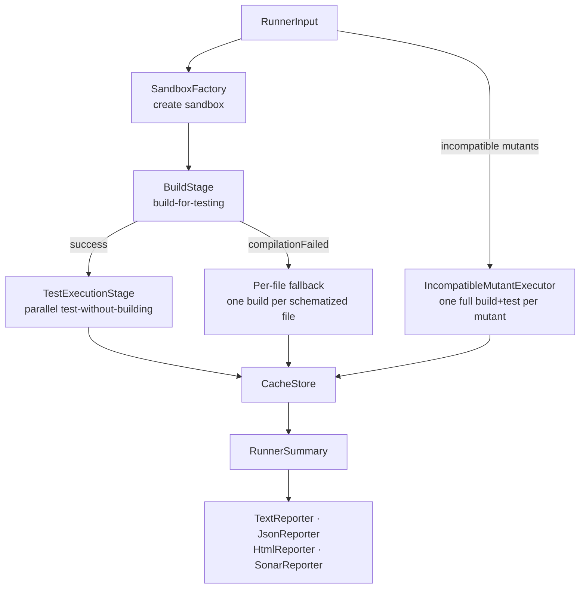
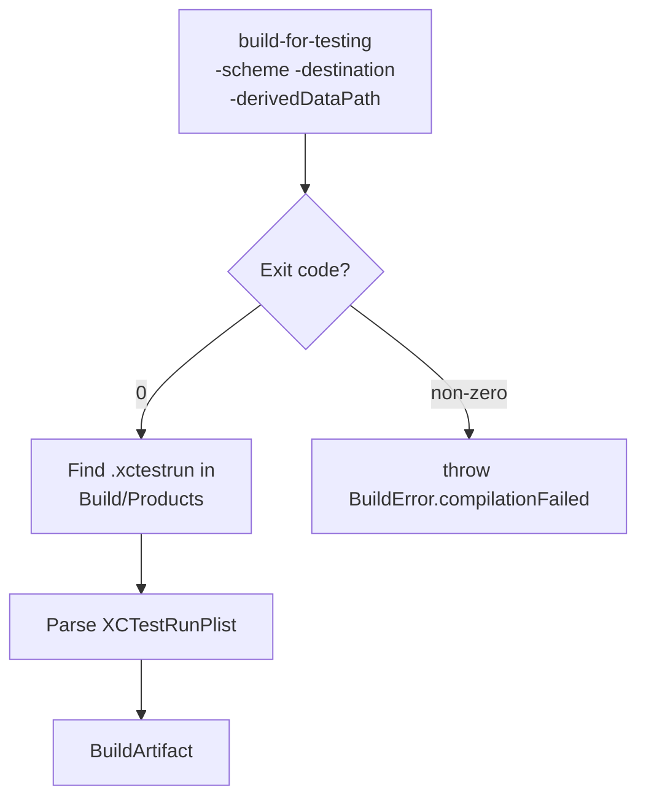
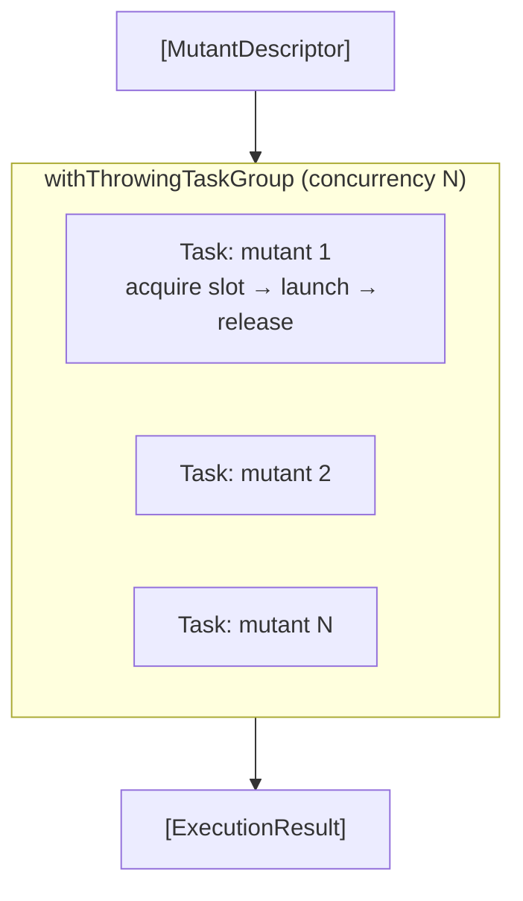
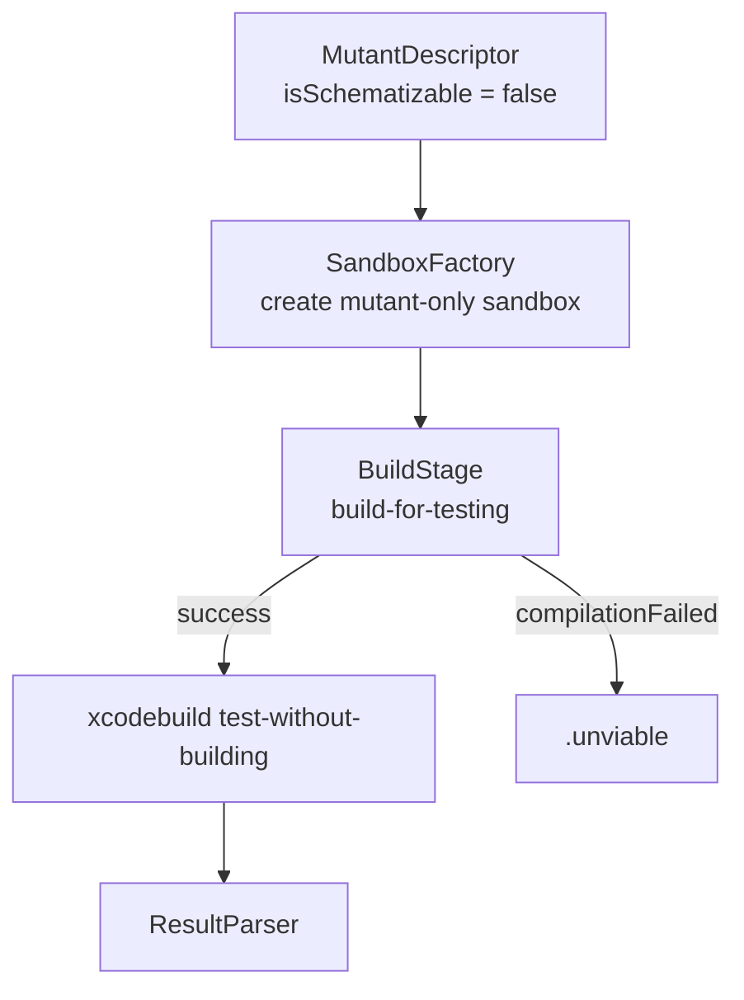

# Execution Pipeline

← [Discovery Pipeline](02-discovery.md) | Next: [Configuration →](04-configuration.md)

---

## Design

`MutantExecutor` is the entry point for the execution pipeline. It separates mutants into two populations — schematizable and incompatible — and routes each through the appropriate path.



## SandboxFactory

Creates an isolated copy of the Xcode project in `$TMPDIR/xmr-<UUID>/` before every build.

**Copy strategy:**
- Skips `.build`, `DerivedData`, and directories prefixed with `.xmr-`
- For `.xcodeproj`: creates fresh `xcuserdata`, copies `xcshareddata`, symlinks everything else
- For source files in `schematizedFiles`: writes the schematized content directly
- For all other files: creates symlinks to the originals (fast, space-efficient)
- Writes `__SMTSupport.swift` (or appends to the first schematized file if no `Sources/` directory exists)
- Disables SwiftLint `PBXShellScriptBuildPhase` entries by patching `project.pbxproj`
- Inserts `break` statements into empty `switch case` bodies to prevent compiler errors in schematized code

The original project is never touched. Cleanup removes the entire `xmr-*` directory when execution completes.

## BuildStage

Runs `xcodebuild build-for-testing` once for all schematizable mutants.



| | |
|---|---|
| Input | `Sandbox`, scheme, destination, timeout |
| Output | `BuildArtifact` — derived data path + `.xctestrun` URL + parsed plist |

`MutantExecutor` catches `BuildError.compilationFailed` and falls back to the per-file build path rather than aborting. Any other thrown error propagates up.

## SimulatorPool

`SimulatorPool` is an `actor` that manages a pool of simulator slots for parallel test execution.

| Destination | Behaviour |
|---|---|
| `platform=macOS` | Single slot, no simulator needed; `setUp` and `tearDown` are no-ops |
| iOS / tvOS / watchOS | Clones the base simulator N times (one per concurrency slot); boots each clone on `setUp`; shuts down and deletes on `tearDown` |

`acquire()` returns an available `SimulatorSlot` or suspends the caller until one is released. A `withTaskCancellationHandler` wraps the suspension — if the owning task is cancelled, the slot is released immediately to avoid a permanent deadlock.

## TestExecutionStage

Runs `xcodebuild test-without-building` for each mutant in parallel via `withThrowingTaskGroup`.



**Per-mutant execution:**

1. Check cache — return cached result immediately if `noCache` is false and a match exists
2. Activate the mutant: `XCTestRunPlist.activating(_:)` injects the mutant ID into `EnvironmentVariables.__SWIFT_MUTATION_TESTING_ACTIVE` in a fresh `.xctestrun` copy
3. Acquire a simulator slot from the pool
4. Run `xcodebuild test-without-building -xctestrun <path> -resultBundlePath <xcresult>`
5. Release the simulator slot
6. Parse the result via `ResultParser`
7. Store status in `CacheStore`

**Dynamic concurrency:** the task group seeds N tasks initially, then adds one new task for each completed task, maintaining exactly N active tasks at all times.

## IncompatibleMutantExecutor

Handles mutants that cannot be schematized — mutations outside function bodies (e.g. in stored property initializers or global scope). Each incompatible mutant requires a full build + test cycle.



Incompatible mutants run sequentially. Each creates its own sandbox via `SandboxFactory.create(projectPath:mutatedFilePath:mutatedContent:)`, which applies the single mutation directly without schematization.

## ResultParser

Determines the `ExecutionStatus` of a completed test run.

| Condition | Status |
|---|---|
| Exit code `-1` (killed by timeout) | `.timedOut` |
| Exit code `0` + no test failures detected | `.survived` |
| Exit code non-zero + test failure patterns in output | `.killed(let reason)` |
| Exit code non-zero + no parseable failure | `.killed(.other)` |

`ResultParser` first inspects stdout/stderr for XCTest and Swift Testing failure patterns, then parses the `.xcresult` bundle via `xcresulttool` for detailed failure information. The `.xcresult` bundle is deleted after parsing.

**Failure patterns detected:**

| Framework | Pattern |
|---|---|
| XCTest | `Test Case '-[…]' failed` |
| Swift Testing | `Test "…" failed` |

## CacheStore

`CacheStore` is an `actor` that persists `ExecutionStatus` results across runs, keyed by a SHA256-derived `MutantCacheKey`.

```
MutantCacheKey
├── fileContentHash   — SHA256 of the source file content
├── testFilesHash     — SHA256 of all test file contents
├── utf8Offset        — mutation position
├── originalText      — token before mutation
├── mutatedText       — token after mutation
└── operatorIdentifier
```

Cache is stored at `<project>/.swift-mutation-testing-cache/results.json`. A cached result is used only if `noCache` is false. The cache is invalidated automatically when the source file or any test file changes.

## Reporting

### Progress Reporting

`ConsoleProgressReporter` (actor) streams build events and per-mutant results to stdout during execution. `SilentProgressReporter` is a no-op substitute used when `--quiet` is active.

### Final Reports

`RunnerSummary` aggregates all `ExecutionResult` values and computes the mutation score.

**Score formula:**

```
score = killed / (killed + survived + timedOut + noCoverage) × 100
```

| Reporter | Format | Activated by |
|---|---|---|
| `TextReporter` | Human-readable console summary | Always |
| `JsonReporter` | Stryker JSON schema | `--output <path>` |
| `HtmlReporter` | Interactive HTML dashboard | `--html-output <path>` |
| `SonarReporter` | SonarQube generic coverage format | `--sonar-output <path>` |

## Concurrency Model

| Component | Model |
|---|---|
| `SimulatorPool` | `actor` — manages slot availability and pending acquire requests |
| `CacheStore` | `actor` — serialises reads and writes to the result cache |
| `MutationCounter` | `actor` — tracks the current progress index |
| `ConsoleProgressReporter` | `actor` — serialises output to stdout |
| `TestExecutionStage` | `withThrowingTaskGroup` — N tasks, dynamically refilled |
| `ProcessLauncher` | `withTaskCancellationHandler` + `withCheckedThrowingContinuation` — kills process on cancel |
| All data types | `Sendable` value types — safe to cross actor boundaries |

---

← [Discovery Pipeline](02-discovery.md) | Next: [Configuration →](04-configuration.md)
