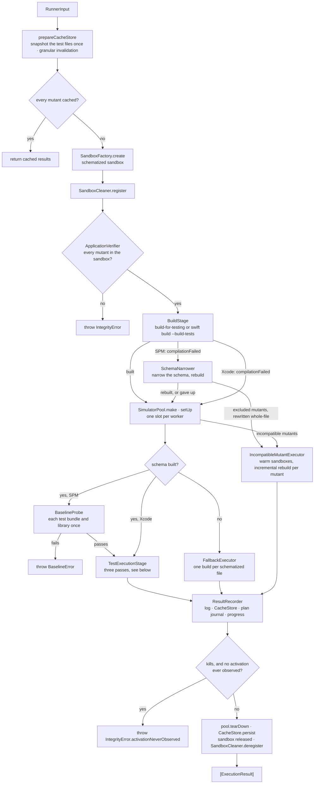
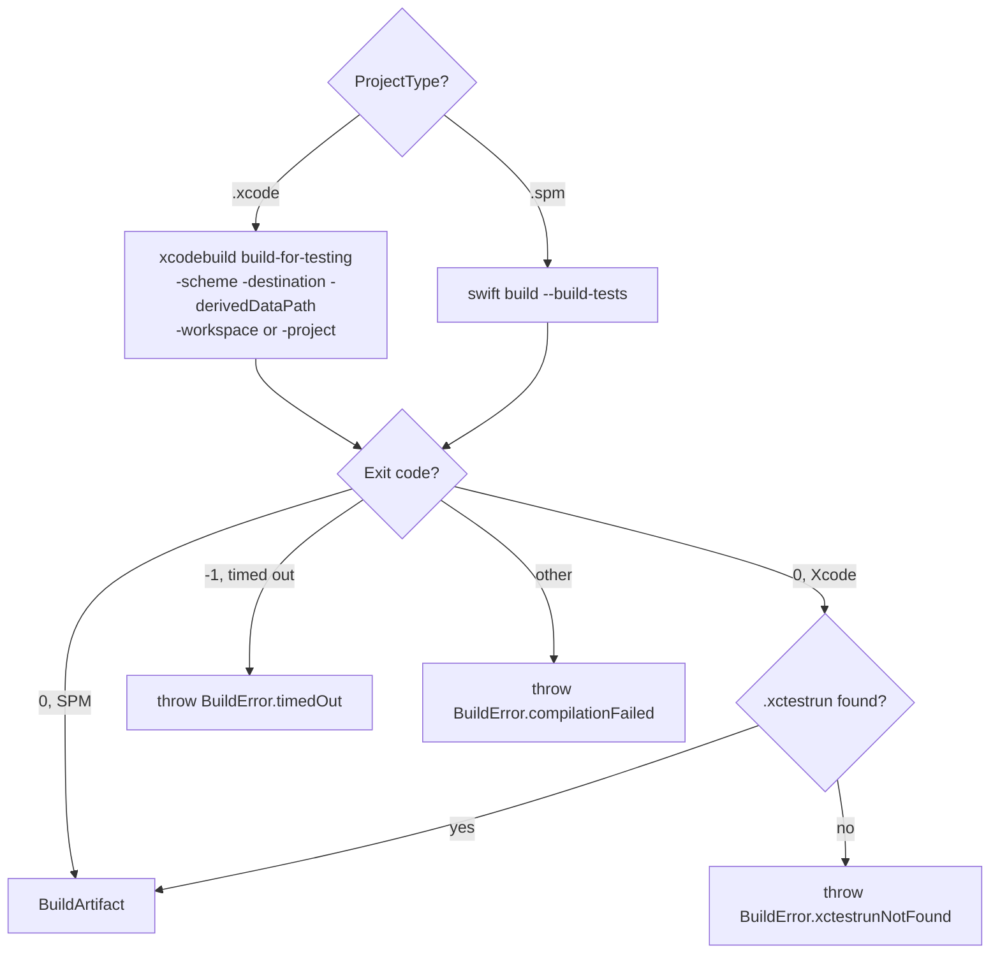
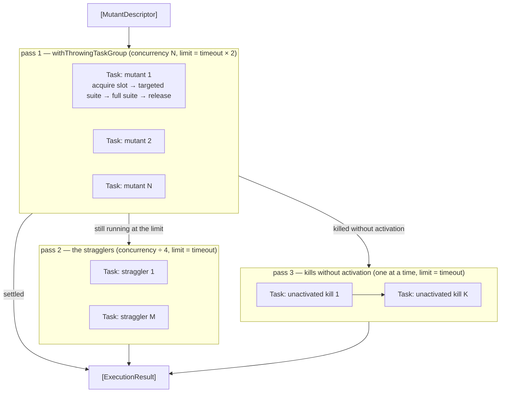
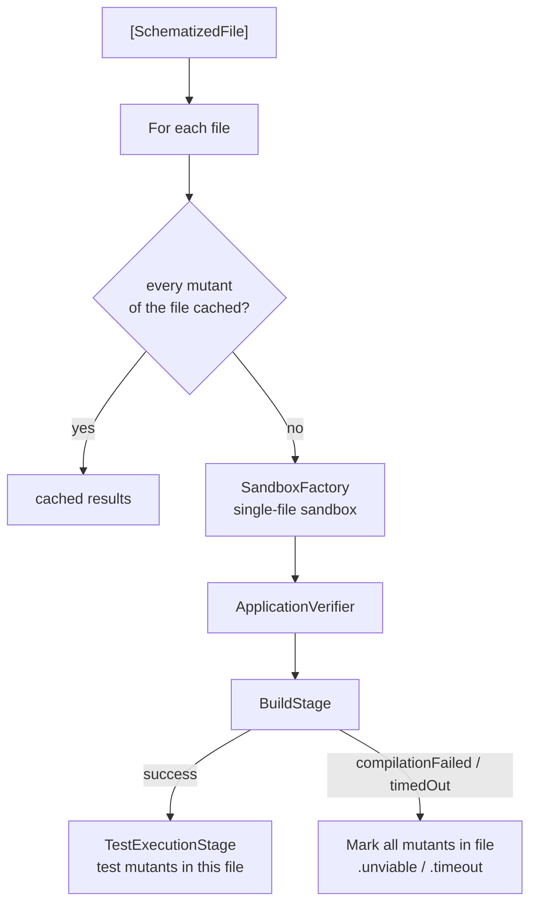
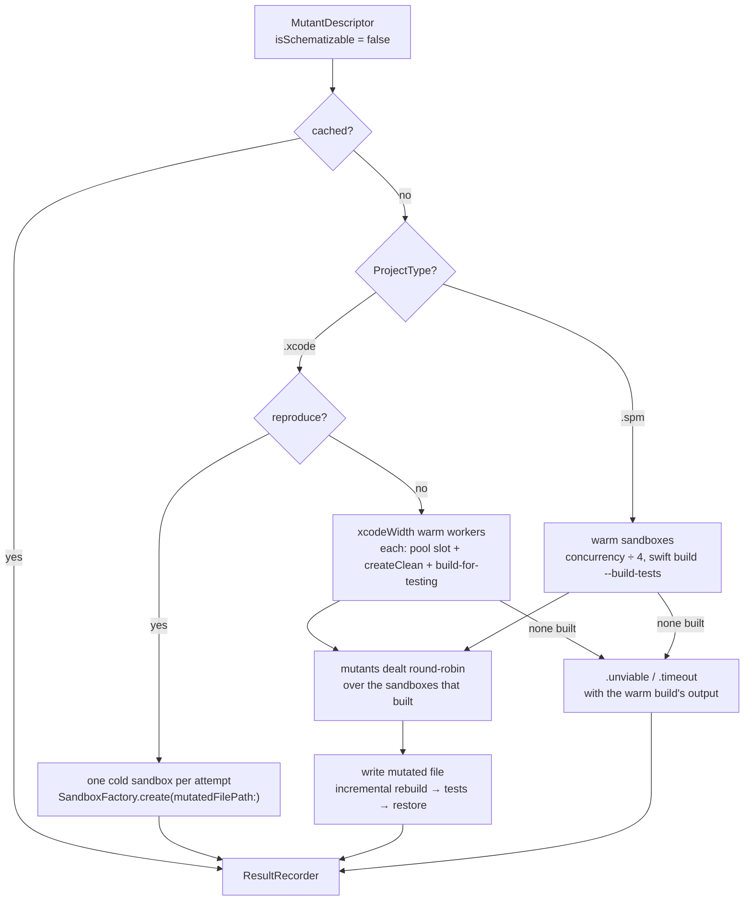
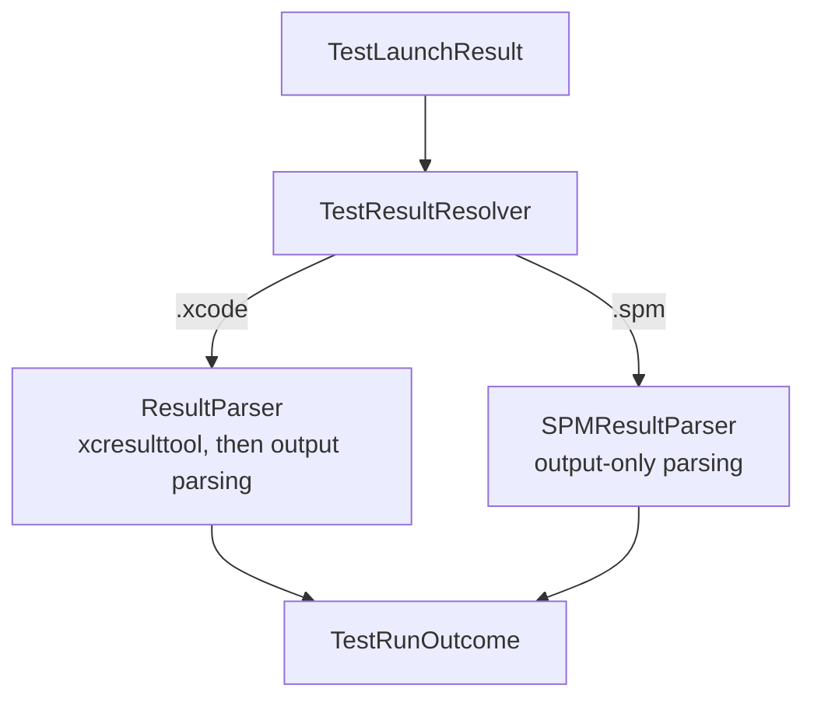

# Execution Pipeline

← [Discovery Pipeline](02-discovery.md) | Next: [Configuration →](04-configuration.md)

---

## Design

`MutantExecutor` is the entry point for the execution pipeline. It separates mutants into two populations — schematizable and incompatible — and routes each through the appropriate path. The executor supports both Xcode (`xcodebuild`) and SPM (`swift build` and the built test bundles) project types via `ProjectType`. Reports are not its job: it returns `[ExecutionResult]`, and the command that called it hands them to `RunConclusion`.


```mermaid
flowchart TD
    IN[RunnerInput] --> PREP["prepareCacheStore\nsnapshot the test files once · granular invalidation"]
    PREP --> ALLCACHED{every mutant cached?}
    ALLCACHED -- yes --> RETURN[return cached results]
    ALLCACHED -- no --> SF["SandboxFactory.create\nschematized sandbox"]
    SF --> REG[SandboxCleaner.register]
    REG --> VERIFY{"ApplicationVerifier\nevery mutant in the sandbox?"}
    VERIFY -- no --> INTEGRITY[throw IntegrityError]
    VERIFY -- yes --> BS["BuildStage\nbuild-for-testing or swift build --build-tests"]
    BS -- "SPM: compilationFailed" --> NARROW["SchemaNarrower\nnarrow the schema, rebuild"]
    BS -- built --> POOL
    NARROW -- "rebuilt, or gave up" --> POOL
    BS -- "Xcode: compilationFailed" --> POOL
    POOL["SimulatorPool.make · setUp\none slot per worker"] --> ART{schema built?}
    ART -- "yes, SPM" --> PROBE["BaselineProbe\neach test bundle and library once"]
    PROBE -- fails --> ABORT[throw BaselineError]
    PROBE -- passes --> TES["TestExecutionStage\nthree passes, see below"]
    ART -- "yes, Xcode" --> TES
    ART -- no --> FBP["FallbackExecutor\none build per schematized file"]
    NARROW -- "excluded mutants, rewritten whole-file" --> IME
    POOL -- incompatible mutants --> IME["IncompatibleMutantExecutor\nwarm sandboxes, incremental rebuild per mutant"]
    TES --> REC["ResultRecorder\nlog · CacheStore · plan journal · progress"]
    FBP --> REC
    IME --> REC
    REC --> OBS{"kills, and no activation\never observed?"}
    OBS -- yes --> NEVER["throw IntegrityError.activationNeverObserved"]
    OBS -- no --> DOWN["pool.tearDown · CacheStore.persist\nsandbox released · SandboxCleaner.deregister"]
    DOWN --> OUT["[ExecutionResult]"]
```

## SandboxFactory

Creates an isolated copy of the project in `$TMPDIR/swift-mutation-testing/xmr-<pid>-<UUID>/` (`SandboxName`) before every build. Supports both Xcode and SPM projects. The copy runs on a dispatch queue rather than the cooperative pool, since it is blocking file-system work.

**Factory methods:**
- `create(projectPath:schematizedFiles:)` — full sandbox with schematized files (normal path, and one per file on the fallback path)
- `createClean(projectPath:disablingSwiftLint:)` — clean sandbox without mutations: the warm sandboxes of `IncompatibleMutantExecutor`, SPM and Xcode (the Xcode ones with SwiftLint disabled)
- `create(projectPath:mutatedFilePath:mutatedContent:)` — sandbox with a single mutated file: the cold sandbox of an incompatible Xcode mutant under `reproduce`

**Copy strategy:**
- Skips `.build`, `DerivedData`, and directories prefixed with `.xmr-`
- For `.xcodeproj`: creates fresh `xcuserdata`, copies `xcshareddata`, symlinks everything else; a workspace's `xcshareddata` is copied too
- For source files being replaced (schematized or mutated): writes the new content directly
- For all other files: creates symlinks to the originals (fast, space-efficient)
- `create(projectPath:schematizedFiles:)`, and `createClean` when asked, disable SwiftLint `PBXShellScriptBuildPhase` entries by patching the `project.pbxproj` of **every** `.xcodeproj` in the sandbox, at any depth — a workspace's projects included; `.build`, `DerivedData` and `Pods/` are not looked into

The original project is never touched. When execution completes, `Sandbox.release(keepingFor:)` removes the entire `xmr-*` directory — unless the run is a reproduction, which keeps it and prints its path.

Right after the sandbox is created, and before anything is built, `ApplicationVerifier` checks that it holds every mutant: each schematized copy differs from its original and ends with the per-file support declarations, each schematizable mutant has its `case` in the copy, and each incompatible mutant has content that differs from the original. A mutant that did not make it ends the run with `IntegrityError` — a verdict on a mutation that is not in the build says nothing. See [Application Check](05-schematization.md#application-check).

## SandboxCleaner

Handles cleanup of orphaned sandbox directories and signal-based cleanup of the active sandbox.

**Orphaned cleanup (`removeOrphaned`):** Called through `SandboxCleaner.clearLeftovers()` by `RunCommand` just before `MutantExecutor` runs, and by `ReproduceCommand` — never on the `--version`, `--help`, `init`, `plan` or `merge` paths. Scans `$TMPDIR/swift-mutation-testing/` (or a provided directory) for directories prefixed with `xmr-` and removes the ones whose owning process is gone. This cleans up sandboxes from previous interrupted runs that were never cleaned up normally.

**Orphaned processes (`OrphanedProcessReaper`):** Runs right before the directory sweep. Lists the processes of the current user, reads each one's arguments (`sysctl(KERN_PROCARGS2)`), and kills — with its descendants — any process whose arguments point into an `xmr-<pid>-<UUID>` sandbox whose owner is gone. This is what cleans up after a run that could not clean up itself: killed with `SIGKILL`, or crashed, while a mutant was stuck in a loop. It works from the arguments rather than the directory because the sandbox may already have been deleted while the test binary kept running.

**Signal cleanup (`installSignalHandlers`):** Called first thing in `main`. For `SIGINT`, `SIGTERM` and `SIGHUP` it replaces the default action with a handler that does nothing, and installs a `DispatchSource` signal source per signal on a global queue; the source's event handler runs `terminate`, which kills every test process group still in flight (`ProcessGroupRegistry`), removes the active sandbox directory (if registered) and calls `_exit(1)`. The work runs as ordinary code on a dispatch queue rather than inside a C signal handler, so it is not limited to async-signal-safe calls. Test processes lead their own process groups, so without this a terminal's Ctrl-C would end the tool and leave a looping mutant running. The active path lives in `SandboxRegistry` as a C string behind an `Atomic`, and every operation takes the pointer out with a single exchange, so the signal path and a normal deregister never free it twice.

**Lifecycle:** `MutantExecutor` calls `register(sandbox)` after creating the sandbox and `deregister()` after releasing it (both on the success and error paths). This ensures the signal handler always has the correct path.

## BuildStage

Runs a single build for all schematizable mutants.

**Xcode path:** `xcodebuild build-for-testing` → find `.xctestrun` in `Build/Products` → parse plist → `BuildArtifact`

**SPM path:** `swift build --build-tests` → `BuildArtifact` (no `.xctestrun` needed)


```mermaid
flowchart TD
    A{ProjectType?}
    A -- .xcode --> B["xcodebuild build-for-testing\n-scheme -destination -derivedDataPath\n-workspace or -project"]
    A -- .spm --> C["swift build --build-tests"]
    B --> D{Exit code?}
    C --> D
    D -- "0, SPM" --> E[BuildArtifact]
    D -- "0, Xcode" --> X{".xctestrun found?"}
    X -- yes --> E
    X -- no --> XN[throw BuildError.xctestrunNotFound]
    D -- "-1, timed out" --> T[throw BuildError.timedOut]
    D -- other --> F[throw BuildError.compilationFailed]
```

| | |
|---|---|
| Input | `Sandbox`, project type, the resolved `XcodeContainer`, `--build-timeout` |
| Output | `BuildArtifact` — derived data path + `.xctestrun` URL and plist (Xcode) or the sandbox's `.build` (SPM) |

The container's relative path is passed as `-workspace` or `-project`, from the sandbox root. The same arguments go to the per-mutant `xcodebuild` calls of `IncompatibleMutantExecutor`, which used to pass none and so built whatever `xcodebuild` found on its own.

**`ToolRequests`** builds every `swift` and `xcodebuild` request of a run — `swift build --build-tests`, `swift test --skip-build [--filter]`, `xcodebuild build-for-testing` and the other `xcodebuild` calls — so the schematized, fallback, incompatible and baseline paths build and test a sandbox the same way, with one derived data directory, `<sandbox>/.xmr-derived-data`. The incompatible Xcode path used `.derived-data` before. Every `xcodebuild test-without-building` also passes `ToolRequests.noTestDiagnostics`, `-collect-test-diagnostics never`, so no run of a mutant pays for diagnostics nobody reads.

`BuildError` conforms to `LocalizedError`, providing structured error descriptions. On `BuildError.compilationFailed`, `MutantExecutor` hands an SPM build to `SchemaNarrower`, which takes out the mutants whose `case` the compiler blamed, regenerates their files' schemas and rebuilds until the build compiles. The mutants it took out are rewritten as whole-file mutants (`MutationRewriter`) and run on the incompatible path, or recorded `unviable` when the rewrite changes nothing. When it can blame no `case` it gives up — and on the Xcode path a failed build always does — and `FallbackExecutor` takes over with per-file rebuilds rather than aborting. A build that times out or yields no `.xctestrun`, and any other thrown error, propagate up and end the run.

## SimulatorPool

`SimulatorPool` is an `actor` that manages a pool of worker slots for parallel test execution, one per resolved worker (`--concurrency`). `SimulatorPool.make(for:launcher:)` picks the pool from the configuration's destination: simulator clones when `SimulatorManager.requiresSimulatorPool(for:)` says so — a destination naming a `Simulator` platform, or no platform at all — plain slots otherwise. The pool is set up after the schema build and shared by every path of the run: normal, fallback and incompatible.

| Destination | Behaviour |
|---|---|
| `platform=macOS` and SPM | One plain slot per worker, no simulator; `setUp` creates the slots and `tearDown` is a no-op |
| iOS / tvOS / watchOS / visionOS simulator | Removes orphaned clones, shuts the base simulator down, clones it N times (one per worker), boots each clone on `setUp`; shuts down and deletes the clones on `tearDown`, and on a failed `setUp` |

**The pool size is the worker count.** `ConfigurationResolver.effectiveConcurrency` resolves `--concurrency` before the pool is made: an SPM run keeps the requested count, and an Xcode run keeps it only for a destination that needs a simulator pool and a testing framework other than XCTest — one worker otherwise — rather than reporting a number the run will not honour. `usesSimulators` lets the reporter say "worker" instead of claiming simulators that do not exist.

**Clone names.** Each clone is named `XMR-<pid>-<session>-<n>` (`CloneName`): the tool's process id, an eight-hex-digit session id per pool, and the slot index. Before cloning, `setUp` lists the simulators (`simctl list devices --json`) and deletes every clone whose owning process is gone — or that carries the older `XMR-<session>-<n>` name, which has no owner to ask — so a run that was killed before its `tearDown` does not leave simulators behind for good.

`acquire()` returns an available `SimulatorSlot` or suspends the caller until one is released. A `withTaskCancellationHandler` wraps the suspension — if the owning task is cancelled, the slot is released immediately to avoid a permanent deadlock.

`SimulatorError` conforms to `LocalizedError` and covers three failure modes: `deviceNotFound(destination:)`, `bootTimeout(udid:)`, and `cloneFailed(udid:)`. Each provides a structured `errorDescription` for diagnostics.

## Baseline Validation (SPM)

Before the first mutant runs, the suite is run once with no mutant selected. `__swiftMutationTestingID_<hash>` is empty, so every schema falls through to its `default` branch and the original code executes.

The run continues only if that suite passes. A suite that already fails without a mutation kills every mutant it reaches, so every verdict it produces is worthless — and nothing in the report would reveal it. `BaselineProbe` throws `BaselineError` instead, naming the failing tests, the timeout that stopped the suite, or the output it failed with (written to `baseline.log` under `--keep-logs`).

**The baseline and the library probe are the same run.** A package builds one test bundle per test target. Each bundle is invoked once with each testing library against the unmutated sandbox, and that single invocation answers both questions: a bundle and library reporting no tests — exit 69 from SwiftPM's helper, `Executed 0 tests` from `xctest` — is dropped from every mutant's run, and one that does have tests must pass them. A bundle with tests in neither library is dropped altogether, unless no bundle has any, in which case every bundle keeps both libraries. Only when no bundle was produced does the baseline fall back to a separate `swift test --skip-build`. `--target` naming a bundle narrows the run to that bundle (`TestTargetSelection`); otherwise it is passed on as a filter. The probe runs the suite to the end; mutants stop at their first failing test.

The Xcode path does not validate a baseline yet and has the same exposure.

## TestExecutionStage

Runs each mutant's tests in parallel via `withThrowingTaskGroup` — `xcodebuild test-without-building` on the Xcode path, the test bundles directly on the SPM one — in three passes.


```mermaid
flowchart TD
    MUTANTS["[MutantDescriptor]"] --> TG
    subgraph TG["pass 1 — withThrowingTaskGroup (concurrency N, limit = timeout × 2)"]
        T1["Task: mutant 1\nacquire slot → targeted suite → full suite → release"] & T2["Task: mutant 2"] & T3["Task: mutant N"]
    end
    TG -- settled --> RESULTS["[ExecutionResult]"]
    TG -- still running at the limit --> SG
    subgraph SG["pass 2 — the stragglers (concurrency ÷ 4, limit = timeout)"]
        S1["Task: straggler 1"] & S2["Task: straggler M"]
    end
    SG --> RESULTS
    TG -- killed without activation --> RG
    subgraph RG["pass 3 — kills without activation (one at a time, limit = timeout)"]
        R1["Task: unactivated kill 1"] --> R2["Task: unactivated kill K"]
    end
    RG --> RESULTS
```

**Per-mutant execution, Xcode path:**

1. Check cache — return cached result immediately if `noCache` is false and a match exists (`ResultRecorder.cached`, which reads `CacheStore.cachedResult(for:)`)
2. Activate the mutant: `XCTestRunPlist.activating(_:activationFile:)` injects the mutant ID and the activation marker path into the `EnvironmentVariables` of every test target, in a fresh `.xctestrun` copy
3. Acquire a simulator slot from the pool
4. Run `xcodebuild test-without-building -xctestrun <path> -destination <slot> -resultBundlePath <xcresult> -derivedDataPath <dir> -collect-test-diagnostics never [-only-testing <target>]`
5. Release the simulator slot
6. Parse the result via `ResultParser`, then delete the `.xcresult` bundle
7. Record the verdict through `ResultRecorder`: mutant log, `CacheStore`, plan journal, progress

**Per-mutant execution, SPM path:** the mutant id travels in the environment rather than in a plist, and the bundle is invoked directly instead of through `swift test`. Two things happen before the whole suite is asked:

1. If a suite is named after the mutated file — `FooTests` for `Foo.swift`, and it declares a type of that name (`TargetedSuites`, read from the run's one snapshot of the test files) — it runs alone first, in the bundle of the test target that declares it. A failure there settles the verdict, and the rest of the suite is not run.
2. Otherwise, or if that run let the mutant live, the whole suite runs: every bundle in name order, each with only the libraries the probe found tests in, stopping at the first failing test.

Either run stops at its first failing test: a mutant is killed by one test, and `TestOutputParser` reports that one. See `ProcessRunner` in [09 — Reporting & Infrastructure](../CodeBase/09-reporting-infrastructure.md) for the mechanism. A reproduction skips the targeted suite and runs everything to the end.

Both paths hand each test process an activation marker path. A passing suite whose marker was never written is reported as `noCoverage` rather than `survived`; a kill without the marker is run once more, and a kill or a timeout without the marker in the final run keeps its verdict and becomes an integrity warning. See [Activation Marker](05-schematization.md#activation-marker).

**Three passes.** The first runs every mutant with `concurrency` workers and a limit of twice `--timeout`; a mutant still running at that point is not recorded, it is set aside. Once the group drains, the stragglers run again with a quarter of the workers (at least one) and the configured `--timeout`, and that second outcome is the one reported. A verdict that settles under load is the verdict the mutant gets alone, so the wider limit only spares the second run — and the second pass has no contention to blame for a timeout.

**Rerun of kills without activation.** A mutant killed in the first pass without its marker is set aside too. After the timeout pass, each one runs once more, alone, under the configured `--timeout`, and that run decides. A flaky test usually passes the second time; a kill that repeats without activation is systematic and stays an integrity warning.

**Dynamic concurrency:** each pass seeds its workers, then adds one new task for each completed task, keeping exactly that many active at all times.

## FallbackExecutor

When the build for all schematized files fails and cannot be narrowed (`BuildError.compilationFailed`), `MutantExecutor` delegates to `FallbackExecutor`. This executor rebuilds one schematized file at a time — if one file causes a compilation error, the others can still be tested.


```mermaid
flowchart TD
    FILES["[SchematizedFile]"] --> LOOP["For each file"]
    LOOP --> CACHED{"every mutant\nof the file cached?"}
    CACHED -- yes --> DONE[cached results]
    CACHED -- no --> SF["SandboxFactory\nsingle-file sandbox"]
    SF --> AV[ApplicationVerifier]
    AV --> BS[BuildStage]
    BS -- success --> TES["TestExecutionStage\ntest mutants in this file"]
    BS -- "compilationFailed / timedOut" --> UNVIABLE["Mark all mutants in file\n.unviable / .timeout"]
```

For each schematized file, `FallbackExecutor` creates a sandbox containing only that file's schematization, checks it, builds it, and runs the test suite against its mutants, through the same three passes and the shared pool. Files whose builds fail to compile have all their mutants marked as `.unviable` (`.timeout` when the build timed out), each with a mutant log holding the build error; any other error — cancellation included — is rethrown and recorded as no verdict, since the journal would carry it into a resumed run. Verdicts are recorded through `ResultRecorder`.

## IncompatibleMutantExecutor

Handles mutants that cannot be schematized — mutations outside function bodies (e.g. in stored property initializers or global scope) — and the mutants `SchemaNarrower` took out of the schema. Each incompatible mutant requires its own rebuild before its tests can run, which makes these the most expensive mutants in a run. Both project types therefore run them in **warm sandboxes**: clean copies of the project, each built once up front, so that every mutant after the first costs an incremental rebuild rather than a cold one.


```mermaid
flowchart TD
    MUTANT["MutantDescriptor\nisSchematizable = false"] --> CACHE{cached?}
    CACHE -- yes --> REC[ResultRecorder]
    CACHE -- no --> PT{ProjectType?}
    PT -- .xcode --> REPRO{reproduce?}
    REPRO -- yes --> COLD["one cold sandbox per attempt\nSandboxFactory.create(mutatedFilePath:)"]
    REPRO -- no --> XW["xcodeWidth warm workers\neach: pool slot + createClean + build-for-testing"]
    PT -- .spm --> SW["warm sandboxes\nconcurrency ÷ 4, swift build --build-tests"]
    XW -- none built --> UNVIABLE[".unviable / .timeout\nwith the warm build's output"]
    SW -- none built --> UNVIABLE
    XW --> DEAL["mutants dealt round-robin\nover the sandboxes that built"]
    SW --> DEAL
    DEAL --> WRITE["write mutated file\nincremental rebuild → tests → restore"]
    COLD --> REC
    WRITE --> REC
    UNVIABLE --> REC
```

Cache hits and every verdict — a mutation that could not be applied and a failed build included — go through `ResultRecorder`, as on the other paths.

**Activation:** each mutant is first built with a call that records when its mutated code runs, and tested with the activation marker, so an unreached survivor is `noCoverage` and a kill without activation is run once more, as on the schematized path. If that copy does not build, the plain mutant is built and tested unmeasured. See [Activation Marker](05-schematization.md#activation-marker).

**Xcode path:** `xcodeWidth` workers — a quarter of `--concurrency`, never more than the pool's slots or the mutants, never fewer than one. Each worker acquires a pool slot, creates a clean sandbox (`createClean`, SwiftLint disabled) and runs `build-for-testing` for the slot's destination, the workers in parallel. Mutants are dealt round-robin over the workers whose warm build succeeded; for each, the mutated source is written into the worker's sandbox, `build-for-testing` rebuilds incrementally, `xcodebuild test-without-building` runs with `-parallel-testing-enabled NO` and `-collect-test-diagnostics never`, and the original file is restored and the `.xcresult` bundles removed. The slots go back to the pool when every mutant is done. Under `reproduce`, each attempt instead builds in a cold sandbox of its own (`SandboxFactory.create(projectPath:mutatedFilePath:mutatedContent:)`), which the reproduction keeps.

**SPM path:** a quarter of `--concurrency` warm sandboxes (`SandboxFactory.createClean(projectPath:)`), never fewer than one and never more than there are mutants, built in parallel. Mutants are dealt round-robin over the sandboxes that built; for each, the mutated source is written into its sandbox, the package is rebuilt, and `swift test --skip-build` runs the file's own suite first — `FooTests` for `Foo.swift`, as on the schematized path — then the whole suite, each stopping at the first failing test; the original file is then restored.

On both paths a sandbox whose warm build failed is left out, and only when none built are the mutants reported unviable (or timed out) with that build's output.

## TestResultResolver

`TestResultResolver` determines the `TestRunOutcome` of a completed test run. It delegates to the appropriate parser based on project type; `TestExecutionStage` and the SPM incompatible path call the parsers directly.


```mermaid
flowchart TD
    TLR[TestLaunchResult] --> TR[TestResultResolver]
    TR -- .xcode --> RP["ResultParser\nxcresulttool, then output parsing"]
    TR -- .spm --> SP["SPMResultParser\noutput-only parsing"]
    RP --> OUT[TestRunOutcome]
    SP --> OUT
```

**Xcode path (`ResultParser`):** On a non-zero exit, reads the `.xcresult` bundle via `xcresulttool get test-results tests` for the failing test; when that cannot be read, it falls back to the XCTest and Swift Testing failure patterns in stdout/stderr (`TestOutputParser`). The caller deletes the bundle afterwards.

**SPM path (`SPMResultParser`):** Parses exit code and stdout/stderr output only (no `.xcresult` bundles). Uses `TestOutputParser` to detect failure patterns.

| Condition | Outcome |
|---|---|
| Exit code `-1` (killed by timeout) | `.timedOut` |
| Exit code `0` | `.testsSucceeded` (survived) |
| Exit code non-zero + test failure pattern | `.testsFailed(failingTest:)` (killed) |
| Exit code non-zero + a fatal error, or test output with no failure | `.crashed` |
| Exit code non-zero + empty output (SPM) | `.crashed` |
| Exit code non-zero + no test output at all | `.unviable` |

**Failure patterns detected:**

| Framework | Pattern |
|---|---|
| XCTest | `Test Case '-[…]' failed` |
| Swift Testing | `Test "…" failed`, `Test "…" recorded an issue` (a known issue is not a failure) |

## CacheStore

`CacheStore` is an `actor` that persists `ExecutionStatus` results across runs, keyed by `MutantCacheKey`. It supports granular per-file cache invalidation.

```
MutantCacheKey
├── filePath           — source file path
├── fileContentHash    — SHA-256 of the unmutated source file content
├── operatorIdentifier — mutation operator name
├── utf8Offset         — mutation position
├── originalText       — token before mutation
└── mutatedText        — token after mutation
```

Cache is stored at `<project>/.swift-mutation-testing-cache/results.json`, with its metadata (`metadata.json`: test file hashes, test selection, format version) beside it. A cached result is used only if `noCache` is false; under `--no-cache` nothing is read or written. A timeout is never cached: it says as much about the machine as about the mutant.

**Granular invalidation:** Instead of invalidating the entire cache when any test file changes, `CacheStore` tracks which test file killed each mutant via `killerTestFile` metadata. On each run, `MutantExecutor.prepareCacheStore` takes one snapshot of the test files (`TestFilesHasher.snapshot`: their paths, contents and per-file hashes) — the same snapshot later feeds `KillerTestFileResolver` and `TargetedSuites`, so no test file is read twice — compares the hashes against the stored ones via `changedTestFiles(current:)` to produce a `TestFileDiff`, and calls `invalidate(diff:)` with status-aware rules:

| Change | `.killed` | `.survived` / `.noCoverage` / `.killedByCrash` | `.unviable` |
|---|---|---|---|
| Test file **added** | kept | invalidated | kept (permanent) |
| Test file **modified** | invalidated if killer matches | invalidated | kept (permanent) |
| Test file **removed** | invalidated if killer matches | invalidated | kept (permanent) |

A kill with no recorded killer file is invalidated by any change. `.unviable` is permanent because it is a property of the mutant: a mutant that does not compile stays uncompilable however the tests change. Everything else is a statement about what happened when the tests ran, and is re-measured — including `.killedByCrash`, which used to be grouped with `.unviable` and so could never be cleared once recorded.

Each entry also remembers whether the mutated code ran, so a cached `noCoverage` stays `noCoverage` and a cached kill without activation is still reported as a warning. The format is versioned (`formatVersion` 3: 2 added activation, 3 measured it for incompatible mutants); a cache in an older format is discarded once, with a warning. Every stored verdict is also appended to `journal.jsonl`, so an interrupted run loses none; see [Resuming](06-plans.md#resuming).

**Test selection:** the metadata also records what the tests ran against — the Xcode scheme, destination and container, `--target` and the testing library (`CacheTestSelection`). When a run's selection differs from the cache's, every cached verdict and the journal are discarded first, with a note on stderr: a verdict from one test target says nothing about another. The console and Markdown summaries show `Verdicts from cache: N of M` whenever some verdicts were reused, so a reused verdict is never invisible.

Source changes are handled separately, by the key rather than by the diff: `MutantCacheKey.fileContentHash` is the hash of the unmutated file, so editing the code under test produces different keys and the old verdicts are simply not found.

`KillerTestFileResolver` maps test names back to source file paths by matching XCTest class names and Swift Testing function names against the project's test file list.

## ResultRecorder

Every verdict, whichever path reached it, goes through `ResultRecorder.record(...)`: the mutant's log (`MutantLogWriter`, under `--keep-logs`), the cache and its journal — and the plan journal of a planned run — the killer test file, the progress count and the `mutantFinished` event. A cached verdict comes back through `cached(_:)`, counted and reported the same way. Before it, each executor repeated those steps and some skipped the log: a fallback build failure or a mutation that could not be applied now leaves a mutant log like any other verdict.

## Reporting

### Progress Reporting

`ConsoleProgressReporter` (actor) streams discovery, build, worker and per-mutant events (`RunnerEvent`) to stdout during execution. `SilentProgressReporter` is a no-op substitute used when `--quiet` is active.

### Final Reports

`RunnerSummary` aggregates all `ExecutionResult` values and computes the mutation score. `RunConclusion` prints it with `TextReporter`, evaluates the quality gate, has `ReportWriter` write the requested files, then prints the gate (`GateReporter`) and writes `--write-baseline`.

**Score formula:**

```
detected   = killed + killedByCrash + timedOut
undetected = survived + noCoverage
score      = detected / (detected + undetected) × 100   (100 when nothing is testable)
```

| Reporter | Format | Activated by |
|---|---|---|
| `TextReporter` | Human-readable console summary | Always |
| `JsonReporter` | Stryker mutation-testing-report schema, plus the run's identity in `config` and each mutant's `fingerprint` and `activated` | `--output <path>` |
| `HtmlReporter` | HTML dashboard: score, totals, a row per file | `--html-output <path>` |
| `SonarReporter` | SonarQube generic issue import format: survivors `MAJOR`, no-coverage `MINOR` | `--sonar-output <path>` |
| `SarifReporter` | SARIF 2.1.0 of the undetected mutants, one rule per operator, for GitHub code scanning (at most 25,000 results) | `--sarif-output <path>` |
| `MarkdownReporter` | Markdown summary, with the quality gate, for CI job summaries | `--markdown-output <path>` |

`ReportWriter` writes every requested report file from one table (`ReportFormat`: label, flag, file key) and warns through `StandardError` when one cannot be written. Every reporter is given the project root, and the JSON, HTML, Sonar and SARIF reporters resolve it once per report (`ProjectRelativePath.Resolver`) rather than once per mutant; the paths in every file are project-relative, with no leading slash. The HTML report escapes every value it embeds. Columns are 1-based UTF-8 columns: the JSON and Sonar end column adds the UTF-8 byte length of the original text, and SARIF converts both to the UTF-16 columns its consumers expect.

## Concurrency Model

| Component | Model |
|---|---|
| `SimulatorPool` | `actor` — manages slot availability and pending acquire requests |
| `CacheStore` | `actor` — serialises reads and writes to the result cache |
| `MutationCounter` | `actor` — tracks the current progress index |
| `ConsoleProgressReporter` | `actor` — serialises output to stdout |
| `TestExecutionStage` | `withThrowingTaskGroup` — N tasks, dynamically refilled |
| `IncompatibleMutantExecutor` | `withThrowingTaskGroup` — one task per warm sandbox, each working through its share of the mutants in turn |
| `ProcessRunner` | `withTaskCancellationHandler` + `withCheckedThrowingContinuation` — kills process on cancel |
| `SPMProcessLauncher` | `RunnerLaunching` (`ProcessLaunching`) conformance backed by `ProcessRunner`; on timeout it kills the process group and the descendants `ProcessTree` snapshotted before the first signal |
| `XcodeProcessLauncher` | `RunnerLaunching` conformance backed by `ProcessRunner`; on timeout `SIGTERM` to the process group, escalated to `SIGKILL` (`TimeoutEscalation`) |
| `SandboxFactory` | copies the project on a global dispatch queue, off the cooperative pool |
| `SandboxCleaner` | one `DispatchSource` signal source per handled signal, on a global queue |
| `SandboxRegistry` | `Atomic` holding a C string for the signal path; each operation takes the pointer out with one `exchange` |
| `ProcessGroupRegistry` | Fixed array of `Atomic<pid_t>` slots holding the test process groups in flight; the signal path kills them with no lock taken |
| All data types | `Sendable` value types — safe to cross actor boundaries |

---

← [Discovery Pipeline](02-discovery.md) | Next: [Configuration →](04-configuration.md)
