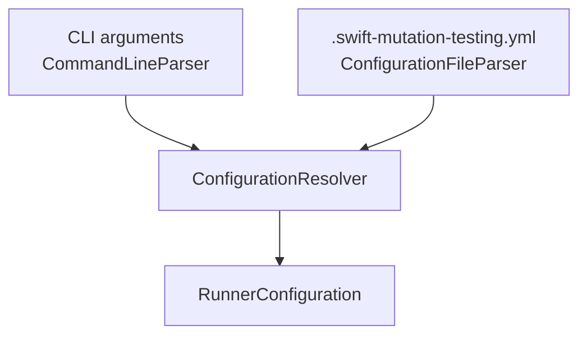
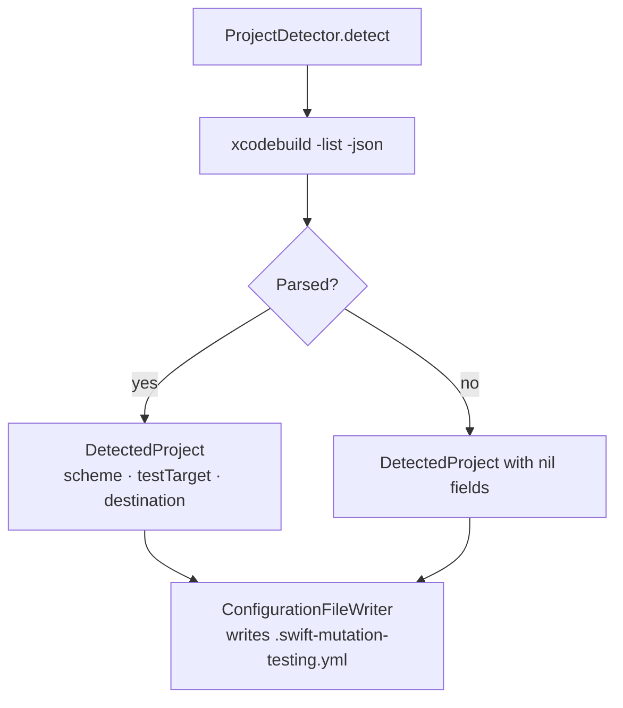

# Configuration

← [Execution Pipeline](03-execution.md) | Next: [Schematization →](05-schematization.md)

---

## Configuration File

`swift-mutation-testing` reads `.swift-mutation-testing.yml` from the project root. `ConfigurationFileParser` looks for the file at `<project-path>/.swift-mutation-testing.yml`. If the file is absent, all values default to their built-in defaults and required options must be supplied via CLI.

`swift-mutation-testing init` generates a starter configuration file by running `ProjectDetector` to auto-detect the scheme, test target, and destination.

```yaml
scheme: MyApp
destination: platform=iOS Simulator,name=iPhone 16
# testTarget: MyAppTests
timeout: 60
# concurrency: 4
# noCache: true
# output: mutation-report.json
# htmlOutput: mutation-report.html
# sonarOutput: sonar-report.json
# sourcesPath: Sources/
# exclude:
#   - "**/Generated/**"

# Mutation operators — set active: false to disable
mutators:
  - name: RelationalOperatorReplacement
    active: true
  - name: BooleanLiteralReplacement
    active: true
  - name: LogicalOperatorReplacement
    active: true
  - name: ArithmeticOperatorReplacement
    active: true
  - name: NegateConditional
    active: true
  - name: SwapTernary
    active: true
  - name: RemoveSideEffects
    active: true
```

The `mutators:` block is the format generated by `init`. An alternative allowlist form is also supported:

```yaml
operators:
  - RelationalOperatorReplacement
  - BooleanLiteralReplacement
```

## Configuration Model

```
RunnerConfiguration
├── projectPath         — absolute path to the Xcode project root
├── scheme              — Xcode scheme (required)
├── destination         — xcodebuild destination specifier (required)
├── testTarget          — optional -only-testing filter
├── timeout             — per-mutant test timeout in seconds (default: 60)
├── concurrency         — parallel workers (default: ProcessInfo.activeProcessorCount - 1)
├── noCache             — disable result caching (default: false)
├── output              — path for JSON report (optional)
├── htmlOutput          — path for HTML report (optional)
├── sonarOutput         — path for Sonar report (optional)
├── sourcesPath         — root directory for source file discovery (default: projectPath)
├── excludePatterns     — glob patterns for files to exclude
├── operators           — active mutation operator identifiers
└── quiet               — suppress progress output (default: false)
```

## CLI Arguments

All options correspond directly to `RunnerConfiguration` fields. CLI values override file values.

```
swift-mutation-testing [<project-path>] [options]
swift-mutation-testing [<project-path>] init

OPTIONS:
  --scheme <scheme>             Xcode scheme to build and test (required)
  --destination <destination>   xcodebuild destination specifier (required)
  --target <test-target>        Limit test execution to this target
  --timeout <seconds>           Per-mutant test timeout (default: 60)
  --concurrency <n>             Parallel workers (default: CPUs - 1)
  --no-cache                    Disable result caching
  --output <json-path>          Write JSON report to path
  --html-output <html-path>     Write HTML report to path
  --sonar-output <json-path>    Write Sonar report to path
  --quiet                       Suppress progress output
  --sources-path <path>         Root for Swift source discovery (default: project path)
  --exclude <pattern>           Exclude files matching pattern (repeatable)
  --operator <id>               Active mutation operator (repeatable, default: all)
  --disable-mutator <id>        Disable a mutation operator (repeatable)
  --version                     Print version and exit
  --help                        Print usage and exit
```

## Resolution Order

`ConfigurationResolver` merges CLI arguments and file values. CLI always wins.



Required fields (`scheme`, `destination`) throw `UsageError` if absent in both sources. Optional fields fall back to their built-in defaults when absent in both.

## Project Detection

`ProjectDetector` runs `xcodebuild -list` against the project to discover available schemes and test targets. `swift-mutation-testing init` uses it to pre-populate the generated configuration file.



`DetectedProject` carries the best-guess scheme (first scheme found), first test target, and the default destination inferred from the project type. Fields are `nil` when detection fails, producing a template file with placeholder comments.

## Mutation Operators Reference

| Identifier | Short description |
|---|---|
| `RelationalOperatorReplacement` | Replaces `>`, `>=`, `<`, `<=`, `==`, `!=` with their complements |
| `BooleanLiteralReplacement` | Flips `true` ↔ `false` |
| `LogicalOperatorReplacement` | Swaps `&&` ↔ `\|\|` |
| `ArithmeticOperatorReplacement` | Swaps `+` ↔ `-` and `*` ↔ `/` |
| `NegateConditional` | Wraps a condition in `!()` |
| `SwapTernary` | Swaps the true and false branches of a ternary |
| `RemoveSideEffects` | Removes standalone function call statements |

---

← [Execution Pipeline](03-execution.md) | Next: [Schematization →](05-schematization.md)
