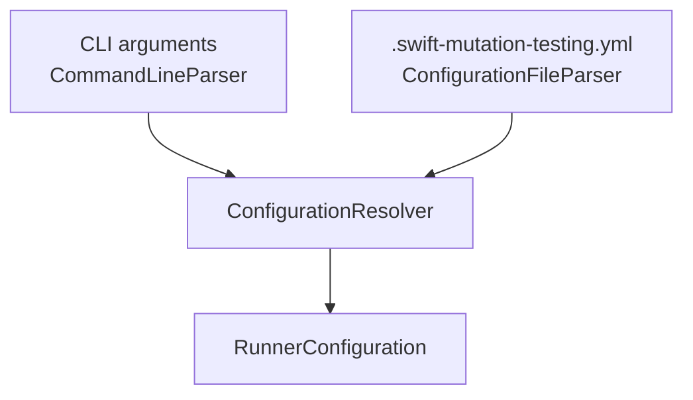
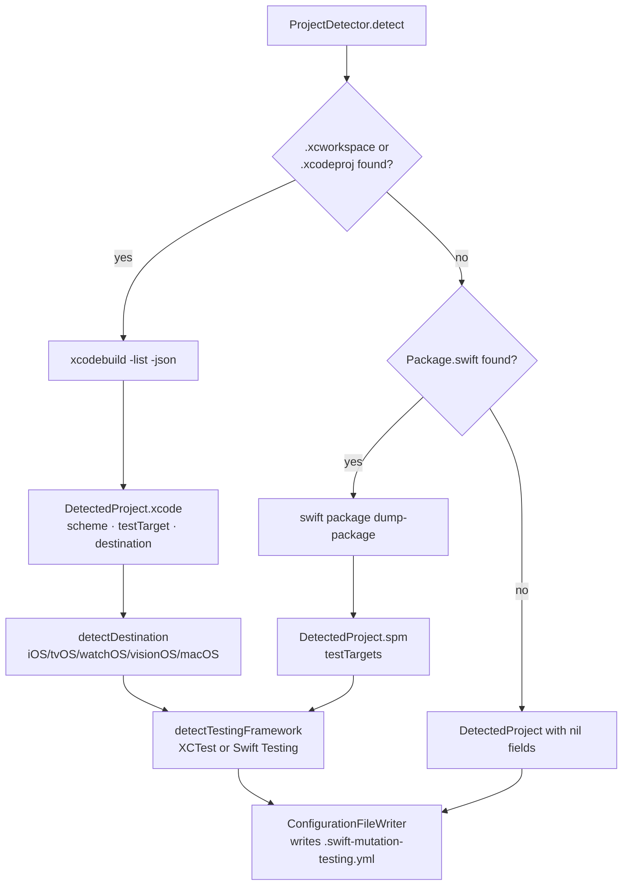

# Configuration

← [Execution Pipeline](03-execution.md) | Next: [Schematization →](05-schematization.md)

---

## Configuration File

`swift-mutation-testing` reads `.swift-mutation-testing.yml` from the project root. `ConfigurationFileParser` looks for the file at `<project-path>/.swift-mutation-testing.yml`. If the file is absent, all values default to their built-in defaults and required options must be supplied via CLI.

`swift-mutation-testing init` generates a starter configuration file by running `ProjectDetector` to auto-detect the project type, scheme, test targets, destination, and testing framework.

```yaml
scheme: MyApp
destination: platform=iOS Simulator,name=iPhone 16
# test-target: MyAppTests
timeout: 60 # seconds
# concurrency: 4
# no-cache: true
# output: mutation-report.json
# html-output: mutation-report.html
# sonar-output: sonar-mutation-report.json
# sources-path: Sources/
# exclude:
#   - "**/Generated/**"

# Mutation operators — set active: false to disable
mutators:
  - name: RelationalOperatorReplacement
    active: true
  - name: BooleanLiteralReplacement
    active: true
  - name: LogicalOperatorReplacement
    active: true
  - name: ArithmeticOperatorReplacement
    active: true
  - name: NegateConditional
    active: true
  - name: SwapTernary
    active: true
  - name: RemoveSideEffects
    active: true
```

Keys are kebab-case. A `#` that starts a line or follows whitespace, outside quotes, starts a comment. A value that does not parse — a timeout that is not a positive number, a concurrency below 1, a flag that is neither true nor false — is a usage error naming the file, and a key the tool does not know is reported as a warning and ignored.

The `mutators:` block is the format generated by `init`. An alternative allowlist form is also supported:

```yaml
operators:
  - RelationalOperatorReplacement
  - BooleanLiteralReplacement
```

## Configuration Model

`RunnerConfiguration` is organized into three nested option groups:

```
RunnerConfiguration
├── projectPath           — absolute path to the project root
├── build: BuildOptions
│   ├── projectType       — ProjectType (.xcode(scheme:destination:) or .spm)
│   ├── testTarget        — optional test target filter
│   ├── timeout           — per-mutant test timeout (Xcode default: 120s, SPM default: 30s)
│   ├── concurrency       — parallel workers (default: ProcessInfo.processorCount - 1)
│   ├── noCache           — disable result caching (default: false)
│   └── testingFramework  — TestingFramework (.xctest or .swiftTesting, default: .swiftTesting)
├── reporting: ReportingOptions
│   ├── outputs           — report path per ReportFormat (JSON, HTML, Sonar, SARIF, Markdown)
│   ├── keepLogsPath      — where each mutant's test output is written (optional)
│   └── quiet             — suppress progress output (default: false)
└── filter: FilterOptions
    ├── sourcesPath       — root directory for source file discovery (default: projectPath)
    ├── excludePatterns   — globs or path fragments for files to exclude
    └── operators         — active mutation operator identifiers
```

### ProjectType

```swift
enum ProjectType: Sendable, Equatable {
    case xcode(scheme: String, destination: String)
    case spm
}
```

Xcode projects require a scheme and destination. SPM projects are detected automatically when a `Package.swift` exists and no `.xcodeproj` or `.xcworkspace` is found.

### XcodeContainer

```swift
enum XcodeContainer: Sendable, Equatable {
    case workspace(String)   // relative to the project root
    case project(String)
}
```

The container `xcodebuild` is given, resolved once in `ConfigurationResolver` and kept in `RunnerConfiguration.build.xcodeContainer`: `nil` for a package. `XcodeContainerLocator` decides it, the same way for every run and for `init`:

1. `--workspace` / `--project` on the command line, else the `workspace` / `project` keys — the command line replaces the file's container as a whole; both kinds at once is a usage error. The path must exist under the root, with the right extension; it may be in a subdirectory.
2. Otherwise the root: exactly one `.xcworkspace` is the container; else exactly one `.xcodeproj`; more than one of the kind that decides is a usage error naming them all. With none at the root, the subdirectories are searched a few levels down (not bundles, hidden directories, `DerivedData`, `Pods`, `Carthage`, `node_modules`): anything found is a usage error suggesting it, since which subdirectory holds the app is the user's call; nothing found is no container. A directory with two containers never runs with one chosen silently, and a root with its project one level down never runs with none.
3. A workspace whose `contents.xcworkspacedata` reaches a project outside the root (`group:../…`, resolved through nested groups) is a usage error: the sandbox only holds the root.

Naming a container makes the run an Xcode run even beside a `Package.swift`, so `--scheme` is then required.

**Decision — the container lives next to the project type, not inside it.** The spec proposed `ProjectType.xcode(XcodeProject)` carrying the container. The container is resolved once, from the root, and only `xcodebuild` reads it; carrying it in `BuildOptions` gives every call site the same value without rewriting the forty-odd pattern matches on `.xcode(scheme:destination:)`, none of which needs it.

### TestingFramework

```swift
enum TestingFramework: String, Sendable {
    case xctest
    case swiftTesting = "swift-testing"
}
```

`ProjectDetector` automatically detects the testing framework by scanning test target source files for `import Testing` (Swift Testing) or `import XCTest` patterns. The detected framework influences test output parsing.

## CLI Arguments

All options correspond directly to `RunnerConfiguration` fields. CLI values override file values.

```
swift-mutation-testing [<project-path>] [options]
swift-mutation-testing init [<project-path>]

OPTIONS:
  --scheme <scheme>             Xcode scheme to build and test (Xcode projects only)
  --destination <destination>   xcodebuild destination specifier (Xcode projects only)
  --workspace <path>            The .xcworkspace to build, relative to the project (Xcode only)
  --project <path>              The .xcodeproj to build, relative to the project (Xcode only)
  --testing-framework <fw>       Testing framework: xctest or swift-testing (default: swift-testing)
  --target <test-target>        Test target name
  --timeout <seconds>           Per-mutant test timeout in seconds (default: 120 Xcode, 30 SPM)
  --build-timeout <seconds>     Build timeout in seconds (default: 120)
  --concurrency <n>             Parallel test workers (default: CPUs - 1). Simulator
                                destinations only; SPM and macOS runs use one worker
  --no-cache                    Disable the result cache — nothing is read or written
  --output <json-path>          Write mutation report JSON to path
  --html-output <html-path>     Write HTML report to path
  --sonar-output <json-path>    Write a SonarQube generic issue import report to path
  --sarif-output <sarif-path>   Write a SARIF 2.1.0 report of undetected mutants to path
  --markdown-output <md-path>   Write a Markdown summary, for CI job summaries, to path
  --keep-logs <directory>       Write each mutant's captured test output to <directory>
  --quiet                       Suppress progress output
  --sources-path <path>         Root directory to discover Swift source files (default: project path)
  --exclude <pattern>           Exclude files matching pattern (repeatable)
  --operator <id>               Mutation operator to apply (repeatable, default: all)
  --disable-mutator <id>        Disable a specific mutation operator (repeatable)
  --version                     Print version and exit
  --help                        Print this help and exit

QUALITY GATE (a failed gate exits with code 2):
  --min-score <0-100>           Fail when the mutation score is below this
  --baseline <path>             Baseline to compare with, relative to the project
  --max-score-drop <points>     Fail when the score drops more than this below the baseline's
  --max-new-survivors <n>       Fail when more than n undetected mutants are not in the baseline
  --max-integrity-warnings <n>  Fail when more than n mutants were killed or timed out without
                                the mutated code running
  --write-baseline <path>       Write this run's baseline, relative to the project
```

## Resolution Order

`ConfigurationResolver` merges CLI arguments and file values. CLI always wins.


```mermaid
flowchart TD
    CLI[CLI arguments\nCommandLineParser] --> R[ConfigurationResolver]
    FILE[.swift-mutation-testing.yml\nConfigurationFileParser] --> R
    R --> CFG[RunnerConfiguration]
```

For Xcode projects, `scheme` and `destination` are required and throw `UsageError` if absent in both sources. SPM projects require neither — `ProjectType.spm` is used automatically. Optional fields fall back to their built-in defaults when absent in both.

## Project Detection

`ProjectDetector` auto-detects the project type, scheme, test targets, destination, and testing framework.


```mermaid
flowchart TD
    A[ProjectDetector.detect] --> B{.xcworkspace or\n.xcodeproj found?}
    B -- yes --> C[xcodebuild -list -json]
    C --> D[DetectedProject.xcode\nscheme · testTarget · destination]
    B -- no --> E{Package.swift found?}
    E -- yes --> F[swift package dump-package]
    F --> G[DetectedProject.spm\ntestTargets]
    E -- no --> H[DetectedProject with nil fields]
    D --> I[detectDestination\niOS/tvOS/watchOS/visionOS/macOS]
    I --> J[detectTestingFramework\nXCTest or Swift Testing]
    G --> J
    J --> K[ConfigurationFileWriter\nwrites .swift-mutation-testing.yml]
    H --> K
```

**Detection steps:**
1. `XcodeContainerLocator` — the container a run would build, by the rules above. When it would choose none — several at the root, a workspace reaching outside it, or containers only below the root (unless a `Package.swift` makes it a package) — `DetectedProject` keeps the reason and the candidates, and no `xcodebuild -list` runs on a container picked at random
2. If chosen: `listProject` queries `xcodebuild -list` on it for schemes and test targets → `DetectedProject.xcode`, with `xcodeContainer` set; `ConfigurationFileWriter` writes it as `workspace:` or `project:`, or, with no choice, the reason and every candidate commented out
3. If not found: `listSPMTestTargets` queries `swift package dump-package` for test targets → `DetectedProject.spm`
4. `detectDestination` — reads the `SDKROOT` of the project the container builds (the project itself, or the first one the workspace references) and tries the `simulatorPlatforms` table in order — iOS, tvOS, watchOS, visionOS, one entry each with its `SDKROOT` and device choice — taking the first platform with an available simulator; anything else is `platform=macOS`
5. `detectTestingFramework` — scans test target source files for `import Testing` vs `import XCTest` to determine `TestingFramework`

Every file-system call of detection — the project path, the container listings, the `Package.swift` check — goes through an injected `FileSystem` (`Infrastructure/FileSystem.swift`), as in `ConfigurationResolver`, `XcodeContainerLocator` and `CacheStore`, so a test can describe a project tree without writing one. `FileSystem.projectPath(_:)` is the one resolution of a project path: `.` or empty is the current directory, anything else is standardized.

`DetectedProject` carries the best-guess scheme (first scheme found), test targets, destination, and testing framework. Fields are `nil` when detection fails, producing a template file with placeholder comments.

## Mutation Operators Reference

| Identifier | Short description |
|---|---|
| `RelationalOperatorReplacement` | Replaces `>`, `>=`, `<`, `<=`, `==`, `!=` with their complements |
| `BooleanLiteralReplacement` | Flips `true` ↔ `false` |
| `LogicalOperatorReplacement` | Swaps `&&` ↔ `\|\|` |
| `ArithmeticOperatorReplacement` | Swaps `+` ↔ `-` and `*` ↔ `/` |
| `NegateConditional` | Wraps a condition in `!()` |
| `SwapTernary` | Swaps the true and false branches of a ternary |
| `RemoveSideEffects` | Removes standalone function call statements |

---

← [Execution Pipeline](03-execution.md) | Next: [Schematization →](05-schematization.md)
