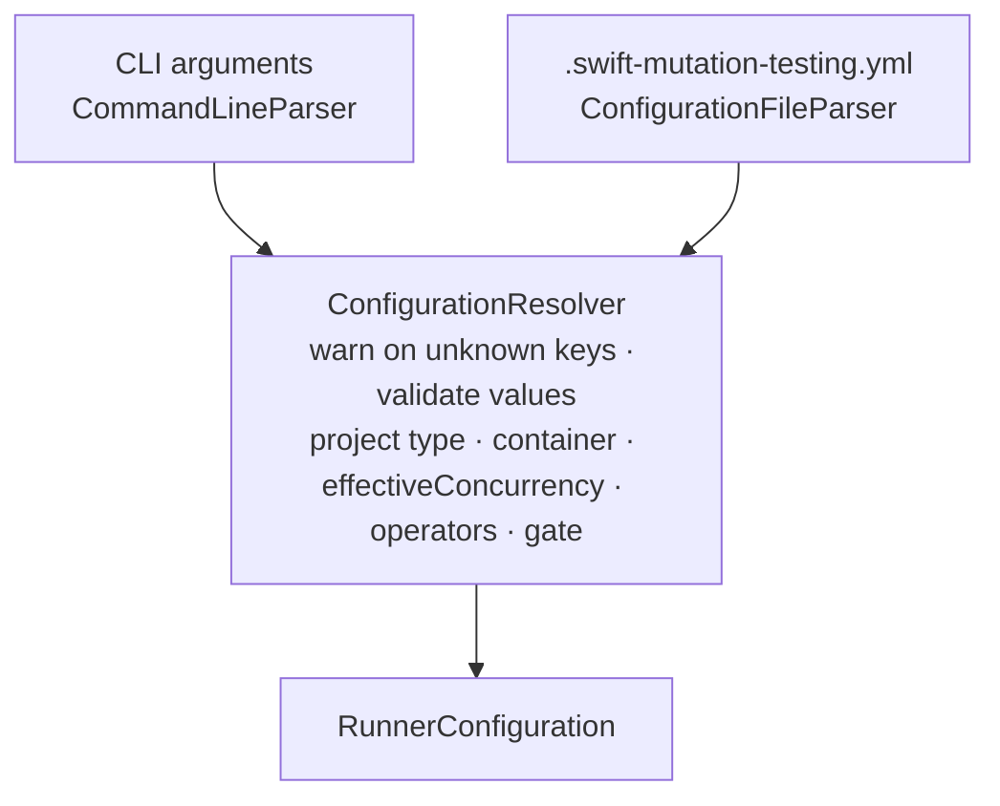
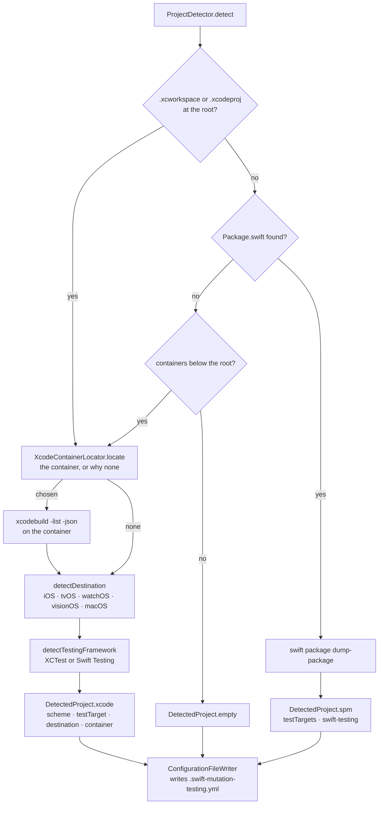

# Configuration

← [Execution Pipeline](03-execution.md) | Next: [Schematization →](05-schematization.md)

---

## Configuration File

`swift-mutation-testing` reads `.swift-mutation-testing.yml` from the project root. `ConfigurationFileParser` looks for the file at `<project-path>/.swift-mutation-testing.yml` and returns its values as flat strings, which `ConfigurationResolver` validates. If the file is absent, all values default to their built-in defaults and required options must be supplied via CLI.

`swift-mutation-testing init` generates a starter configuration file by running `ProjectDetector` to auto-detect the container, scheme, test targets, destination, and testing framework; `ConfigurationFileWriter` writes it and refuses to overwrite an existing one. For an Xcode project it looks like this:

```yaml
# swift-mutation-testing configuration
# All settings are optional. CLI flags override file values.

workspace: MyApp.xcworkspace
scheme: MyApp
destination: platform=iOS Simulator,OS=latest,name=iPhone 16 Pro

# Testing framework: xctest or swift-testing (default: swift-testing)
testing-framework: swift-testing

# Limit test execution to a specific target (recommended when the project has UI tests)
test-target: MyAppTests

# Per-mutant test timeout in seconds (default: 120)
timeout: 120

# Build timeout in seconds (default: 120)
# build-timeout: 240

# Number of parallel workers (default: max(1, CPU count - 1))
concurrency: 4

# Disable result cache (re-runs all mutants on every execution)
# no-cache: true

# Report output paths
output: mutation-report.json
# html-output: mutation-report.html
# sonar-output: sonar-mutation-report.json
# sarif-output: mutation-report.sarif
# markdown-output: mutation-summary.md

# Files to leave out: a glob (**/Generated/**) or a fragment of the path (/Generated/)
exclude:
  - "/MyAppTests/"

# Quality gate — a failed gate exits with code 2
# min-score: 80
# Baseline written by --write-baseline, relative to the project
# baseline: .swift-mutation-testing-baseline.json
# max-score-drop: 2
# max-new-survivors: 0
# Mutants killed or timed out without the mutated code running
# max-integrity-warnings: 0

# Operators up to this tier run: conservative, default or experimental.
# operator-tier: default

# Mutation operators — set active: false to disable
mutators:
  - name: RelationalOperatorReplacement
    active: true
  - name: BooleanLiteralReplacement
    active: true
  - name: LogicalOperatorReplacement
    active: true
  - name: ArithmeticOperatorReplacement
    active: true
  - name: NegateConditional
    active: true
  - name: SwapTernary
    active: true
  - name: RemoveSideEffects
    active: true
```

For a package the file has no container, scheme, destination, testing framework or concurrency, and its timeout is `30`. When detection could not choose a container, the file says why and lists every candidate commented out.

The keys the tool knows are `ConfigurationResolver.fileKeys`, all kebab-case: `scheme`, `destination`, `workspace`, `project`, `test-target`, `timeout`, `build-timeout`, `concurrency`, `no-cache`, `testing-framework`, `keep-logs`, `quiet`, `sources-path`, `exclude` (or `exclude-patterns`), `operators`, `disabled-mutators`, `operator-tier`, `min-score`, `max-score-drop`, `max-new-survivors`, `max-integrity-warnings`, `baseline`, and one per report format (`ReportFormat.fileKey`: `output`, `html-output`, `sonar-output`, `sarif-output`, `markdown-output`). `--write-baseline` is a command-line option only.

**Parsing and validation.** A `#` that starts a line or follows whitespace, outside quotes, starts a comment, so `timeout: 60 # seconds` reads `60`; surrounding quotes are stripped from values and list items. Every value is then checked as the matching flag would be, and a value that does not parse is a `UsageError` naming the key and the file:

| Values | Rule |
|---|---|
| `timeout`, `build-timeout` | a positive number |
| `concurrency` | an integer, at least 1 |
| `no-cache`, `quiet` | `true`/`false`, `yes`/`no` or `on`/`off`, in any case |
| `testing-framework` | `xctest` or `swift-testing` |
| `operator-tier` | `conservative`, `default` or `experimental` |
| `min-score` | a number from 0 to 100 |
| `max-score-drop`, `max-new-survivors`, `max-integrity-warnings` | a number, at least 0; the first two need a `baseline`, which must exist |

A key the tool does not know is reported on stderr as a warning — `unknown key '…' in .swift-mutation-testing.yml is ignored` — and ignored, so a misspelt key no longer passes silently.

The `mutators:` block is the format generated by `init`: each entry with `active: false` is collected into `disabled-mutators`, which narrows the tier's set. An alternative allowlist form is also supported; it names the operators to run, whatever their tier:

```yaml
operators:
  - RelationalOperatorReplacement
  - BooleanLiteralReplacement
```

## Configuration Model

`RunnerConfiguration` is organized into four nested option groups:

```
RunnerConfiguration
├── projectPath           — absolute path to the project root
├── build: BuildOptions
│   ├── projectType       — ProjectType (.xcode(scheme:destination:) or .spm)
│   ├── xcodeContainer    — XcodeContainer (nil for a package)
│   ├── testTarget        — optional test target filter
│   ├── timeout           — per-mutant test timeout (Xcode default: 120s, SPM default: 30s)
│   ├── buildTimeout      — build timeout (default: 120s)
│   ├── concurrency       — parallel workers, after effectiveConcurrency (default: max(1, CPUs - 1))
│   ├── noCache           — disable result caching (default: false)
│   ├── testingFramework  — TestingFramework (.xctest or .swiftTesting, default: .swiftTesting)
│   └── reproduction      — set by reproduce: keep sandboxes, run every test to the end
├── reporting: ReportingOptions
│   ├── outputs           — report path per ReportFormat (JSON, HTML, Sonar, SARIF, Markdown)
│   ├── keepLogsPath      — where each mutant's test output is written (optional)
│   └── quiet             — suppress progress output (default: false)
├── filter: FilterOptions
│   ├── sourcesPath       — root directory (or file) for source discovery (default: projectPath)
│   ├── excludePatterns   — globs or path fragments for files to exclude
│   └── operators         — the operator identifiers that run, tier and disabled operators resolved
└── gate: GateOptions
    ├── policy            — GatePolicy (min score, max score drop, max new survivors, max integrity warnings)
    ├── baselinePath      — baseline to compare with, project-relative paths made absolute
    └── writeBaselinePath — where to write this run's baseline
```

A run from a plan (`run --plan`, `merge`, `reproduce --plan`) takes the project type, test target, container and scope from the plan instead (`RunnerConfiguration.applying(_:)`); see [Plans](06-plans.md).

### ProjectType

```swift
enum ProjectType: Sendable, Equatable {
    case xcode(scheme: String, destination: String)
    case spm
}
```

Xcode projects require a scheme and destination. A run is an SPM run when neither a scheme, a destination nor a container is given — on the command line or in the file — and a `Package.swift` exists at the root; otherwise it is an Xcode run.

### XcodeContainer

```swift
enum XcodeContainer: Sendable, Equatable {
    case workspace(String)   // relative to the project root
    case project(String)
}
```

The container `xcodebuild` is given, resolved once in `ConfigurationResolver` and kept in `RunnerConfiguration.build.xcodeContainer`: `nil` for a package. `XcodeContainerLocator` decides it, the same way for every run and for `init`:

1. `--workspace` / `--project` on the command line, else the `workspace` / `project` keys — the command line replaces the file's container as a whole; both kinds at once is a usage error. The path must exist under the root, with the right extension; it may be in a subdirectory.
2. Otherwise the root: exactly one `.xcworkspace` is the container; else exactly one `.xcodeproj`; more than one of the kind that decides is a usage error naming them all. With none at the root, the subdirectories are searched three levels down (not the containers themselves, hidden directories, `DerivedData`, `Pods`, `Carthage`, `node_modules`, `Build`): anything found is a usage error suggesting it, since which subdirectory holds the app is the user's call; nothing found is no container. A directory with two containers never runs with one chosen silently, and a root with its project one level down never runs with none.
3. A workspace whose `contents.xcworkspacedata` reaches a project outside the root (`group:../…`, resolved through nested groups) is a usage error: the sandbox only holds the root.

Naming a container makes the run an Xcode run even beside a `Package.swift`, so `--scheme` is then required.

**Decision — the container lives next to the project type, not inside it.** The spec proposed `ProjectType.xcode(XcodeProject)` carrying the container. The container is resolved once, from the root, and only `xcodebuild` reads it; carrying it in `BuildOptions` gives every call site the same value without rewriting the forty-odd pattern matches on `.xcode(scheme:destination:)`, none of which needs it.

### TestingFramework

```swift
enum TestingFramework: String, Sendable {
    case xctest
    case swiftTesting = "swift-testing"
}
```

`ProjectDetector` detects the testing framework of an Xcode project by scanning the test target's source files for `import Testing` (Swift Testing) and `import XCTest`: XCTest only when no file imports Testing. A package is always written as `swift-testing`. The framework decides two things: on Xcode, `.xctest` forces one worker (`ConfigurationResolver.effectiveConcurrency`); on SPM, it decides which library `TestBundleInvocation` runs first in each bundle.

## CLI Arguments

All options correspond directly to `RunnerConfiguration` fields. CLI values override file values. The flags are parsed by `CommandLineParser`, which reads a leading `plan`, `merge`, `reproduce`, `init` or `run` as the command; anything else is a `run`.

```
swift-mutation-testing [run] [<project-path>] [options]
swift-mutation-testing init [<project-path>]
swift-mutation-testing plan [<project-path>] --output <plan.json> [options]
swift-mutation-testing run [<project-path>] --plan <plan.json> [--shard <i/n>] [options]
swift-mutation-testing merge <result.json>... --plan <plan.json> [--project-path <path>] [options]
swift-mutation-testing reproduce <mutant> [<project-path>] [--plan <plan.json>] [options]

PLANS:
  --plan <plan.json>            Run (or merge, or reproduce) from this plan instead of discovering;
                                the run refuses a plan whose files changed since it was made
  --shard <i/n>                 Run the i-th of n slices of the plan, split by file (run only)
  --project-path <path>         The project a merge reports on (merge only; default: .)

OPTIONS:
  --scheme <scheme>             Xcode scheme to build and test (Xcode projects only)
  --destination <destination>   xcodebuild destination specifier (Xcode projects only)
  --workspace <path>            The .xcworkspace to build, relative to the project (Xcode only)
  --project <path>              The .xcodeproj to build, relative to the project (Xcode only).
                                Without either, the one container at the root; two are an error
  --testing-framework <fw>      Testing framework: xctest or swift-testing (default: swift-testing)
  --target <test-target>        Test target name
  --timeout <seconds>           Per-mutant test timeout in seconds (default: 120 Xcode, 30 SPM)
  --build-timeout <seconds>     Build timeout in seconds (default: 120)
  --concurrency <n>             Parallel test workers (default: CPUs - 1). An Xcode
                                run on macOS or with XCTest uses one worker
  --no-cache                    Disable the result cache — nothing is read or written
  --output <json-path>          Write mutation report JSON to path
  --html-output <html-path>     Write HTML report to path
  --sonar-output <json-path>    Write a SonarQube generic issue import report to path
  --sarif-output <sarif-path>   Write a SARIF 2.1.0 report of undetected mutants to path
  --markdown-output <md-path>   Write a Markdown summary, for CI job summaries, to path
  --keep-logs <directory>       Write each mutant's captured test output to <directory>
  --quiet                       Suppress progress output
  --sources-path <path>         Root directory to discover Swift source files (default: project path)
  --exclude <pattern>           Leave out files matching a glob (**/Generated/**) or containing a
                                path fragment (/Generated/) (repeatable)
  --operator-tier <tier>        Run the operators up to this tier: conservative, default or
                                experimental (default: default)
  --operator <id>               Run only this operator, whatever its tier (repeatable)
  --disable-mutator <id>        Leave this operator out of the tier's set (repeatable)
  --version                     Print version and exit
  --help, -h                    Print this help and exit

QUALITY GATE (a failed gate exits with code 2):
  --min-score <0-100>           Fail when the mutation score is below this
  --baseline <path>             Baseline to compare with, relative to the project
  --max-score-drop <points>     Fail when the score drops more than this below the baseline's
  --max-new-survivors <n>       Fail when more than n undetected mutants are not in the baseline
  --max-integrity-warnings <n>  Fail when more than n mutants were killed or timed out without
                                the mutated code running
  --write-baseline <path>       Write this run's baseline, relative to the project
```

Under `plan`, `--output` names the plan file (default `plan.json`) rather than a JSON report. `--shard` outside `run` and `--project-path` outside `merge` are usage errors, as are an unknown option, a missing value, a non-positive `--timeout` or `--build-timeout` and a `--concurrency` below 1.

## Resolution Order

`ConfigurationResolver` validates the file's values and merges them with the CLI arguments. CLI always wins.


```mermaid
flowchart TD
    CLI["CLI arguments\nCommandLineParser"] --> R
    FILE[".swift-mutation-testing.yml\nConfigurationFileParser"] --> R
    R["ConfigurationResolver\nwarn on unknown keys · validate values\nproject type · container · effectiveConcurrency · operators · gate"] --> CFG[RunnerConfiguration]
```

For Xcode projects, `scheme` and `destination` are required and throw `UsageError` if absent in both sources. SPM projects require neither — `ProjectType.spm` is used automatically. Optional fields fall back to their built-in defaults when absent in both. `--concurrency` is then resolved to the worker count the run will use: kept for SPM and for an Xcode simulator destination with Swift Testing, one otherwise. The operators are `--operator` / `operators` when given, else the tier's set minus `--disable-mutator` and `disabled-mutators`.

## Project Detection

`ProjectDetector` auto-detects the project type, container, scheme, test targets, destination, and testing framework.


```mermaid
flowchart TD
    A[ProjectDetector.detect] --> B{".xcworkspace or .xcodeproj\nat the root?"}
    B -- yes --> L["XcodeContainerLocator.locate\nthe container, or why none"]
    B -- no --> P{Package.swift found?}
    P -- no --> N{"containers below the root?"}
    N -- yes --> L
    N -- no --> H["DetectedProject.empty"]
    P -- yes --> F[swift package dump-package]
    F --> G["DetectedProject.spm\ntestTargets · swift-testing"]
    L -- chosen --> C["xcodebuild -list -json\non the container"]
    L -- none --> I
    C --> I["detectDestination\niOS · tvOS · watchOS · visionOS · macOS"]
    I --> J["detectTestingFramework\nXCTest or Swift Testing"]
    J --> D["DetectedProject.xcode\nscheme · testTarget · destination · container"]
    D --> K["ConfigurationFileWriter\nwrites .swift-mutation-testing.yml"]
    G --> K
    H --> K
```

**Detection steps:**
1. `XcodeContainerLocator` — the container a run would build, by the rules above. When it would choose none — several at the root, a workspace reaching outside it, or containers only below the root (unless a `Package.swift` makes it a package) — `DetectedProject` keeps the reason and the candidates, and no `xcodebuild -list` runs on a container picked at random
2. If chosen: `listProject` queries `xcodebuild -list` on it for schemes and test targets → `DetectedProject.xcode`, with `xcodeContainer` set; `ConfigurationFileWriter` writes it as `workspace:` or `project:`, or, with no choice, the reason and every candidate commented out
3. If not found: `listSPMTestTargets` queries `swift package dump-package` for test targets → `DetectedProject.spm`
4. `detectDestination` — reads the `SDKROOT` of the project the container builds (the project itself, or the first one the workspace references) and tries the `simulatorPlatforms` table in order — iOS, tvOS, watchOS, visionOS, one entry each with its `SDKROOT` and device choice — taking the first platform with an available simulator; anything else is `platform=macOS`
5. `detectTestingFramework` — scans the test target's source files for `import Testing` vs `import XCTest` to determine `TestingFramework` (Xcode only)

Every file-system call of detection — the project path, the container listings, the `Package.swift` check — goes through an injected `FileSystem` (`Infrastructure/FileSystem.swift`), as in `ConfigurationResolver`, `XcodeContainerLocator` and `CacheStore`, so a test can describe a project tree without writing one. `FileSystem.projectPath(_:)` is the one resolution of a project path: `.` or empty is the current directory, anything else is standardized.

`DetectedProject` carries the best-guess scheme, test targets, destination, and testing framework. Fields are `nil` when detection fails, producing a template file with placeholder comments.

## Mutation Operators Reference

| Identifier | Tier | Short description |
|---|---|---|
| `RelationalOperatorReplacement` | experimental | Replaces each of `>`, `>=`, `<`, `<=` with a boundary and an opposite variant (`>` → `>=`, `<`), and `==` ↔ `!=` |
| `BooleanLiteralReplacement` | experimental | Flips `true` ↔ `false` |
| `LogicalOperatorReplacement` | conservative | Swaps `&&` ↔ `\|\|` |
| `ArithmeticOperatorReplacement` | experimental | Swaps `+` ↔ `-` and `*` ↔ `/` |
| `NegateConditional` | conservative | Wraps a condition in `!()` |
| `SwapTernary` | conservative | Swaps the true and false branches of a ternary |
| `RemoveSideEffects` | experimental | Removes standalone function call statements |

---

← [Execution Pipeline](03-execution.md) | Next: [Schematization →](05-schematization.md)
