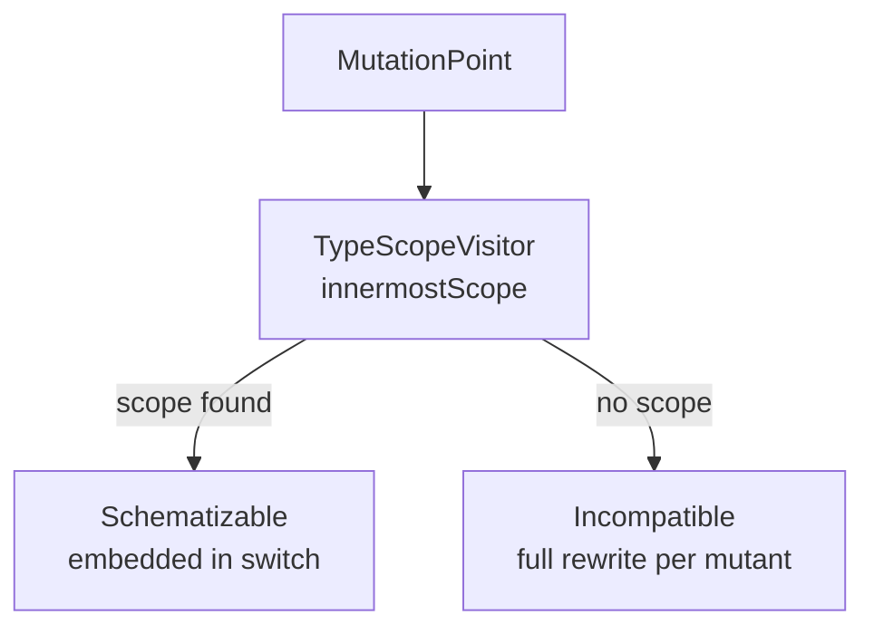
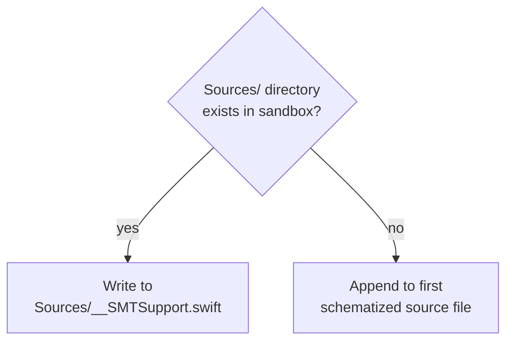
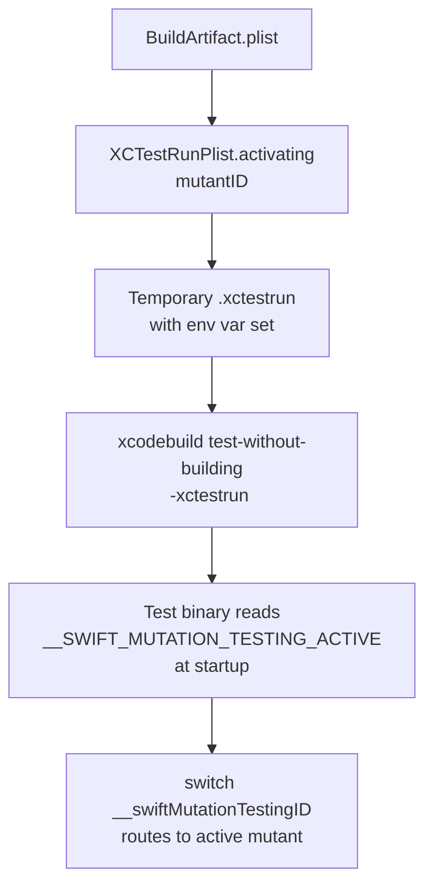

# Schematization

← [Configuration](04-configuration.md) | [Index →](README.md)

---

## Purpose

Schematization is the key technique that allows `swift-mutation-testing` to run `xcodebuild build-for-testing` exactly once for all schematizable mutants. Instead of creating a separate binary per mutant, all mutations for a given function body are embedded into the same binary behind a runtime `switch` statement. The active mutant is selected at test time by setting an environment variable.

## Schematizable vs Incompatible Mutants

A mutation is **schematizable** when it falls inside a function body — anywhere `TypeScopeVisitor` can determine an enclosing function scope. Mutations outside function bodies (stored property initializers, global-scope expressions) are **incompatible** and require a separate full build + test cycle via `IncompatibleMutantExecutor`.



## SchemataGenerator

`SchemataGenerator` rewrites each function body to contain a `switch __swiftMutationTestingID` block. Mutations are grouped by the innermost enclosing scope. For each group:

1. Extract the original statement text (from `statementsStartOffset` to `statementsEndOffset`)
2. For each mutant in the group, apply the mutation to produce a mutated copy of the statements
3. Build a `switch` block with one `case` per mutant and a `default` for the original code
4. Replace the function body `{...}` with the new `switch` block

```swift
{
    switch __swiftMutationTestingID {
    case "swift-mutation-testing_0":
        return a - b
    case "swift-mutation-testing_1":
        return a + b
    default:
        return a + b
    }
}
```

Mutant IDs follow the pattern `swift-mutation-testing_<index>`, where index is the global sequential position of the mutant across all files.

Multiple scopes within the same file are processed in reverse order by `bodyStartOffset` to preserve correct byte offsets as the content grows.

## MutationRewriter

For **incompatible** mutants, `MutationRewriter` applies the single mutation directly to the source file's raw text using UTF-8 byte offsets, producing a complete replacement source file stored in `MutantDescriptor.mutatedSourceContent`.

Both `MutationRewriter` and `SchemataGenerator` use force-unwrapped UTF-8 conversions (`data(using: .utf8)!`, `String(data:encoding: .utf8)!`) because Swift source code is guaranteed to be valid UTF-8. This avoids unreachable error-handling paths.

## TypeScopeVisitor

`TypeScopeVisitor` walks the SwiftSyntax AST and records every `FunctionBodyScope` — the UTF-8 byte range of each function body's `{`, its statements, and its closing `}`. It visits function declarations, initializers, deinitializers, and property/subscript accessors.

```
FunctionBodyScope
├── bodyStartOffset       — byte offset of opening {
├── bodyEndOffset         — byte offset after closing }
├── statementsStartOffset — byte offset of first statement
└── statementsEndOffset   — byte offset after last statement
```

`innermostScope(containing:)` returns the tightest scope that contains a given UTF-8 offset, enabling correct handling of nested functions and closures.

`isSchematizable(utf8Offset:)` is the Boolean interface used by `SchematizationStage` to classify each mutation point.

## Support File

`SchematizationStage` generates a fixed support file content that declares the `__swiftMutationTestingID` global:

```swift
import Foundation

var __swiftMutationTestingID: String {
    ProcessInfo.processInfo.environment["__SWIFT_MUTATION_TESTING_ACTIVE"] ?? ""
}
```

`SandboxFactory.injectSupportFile` places this content into the sandbox:



The declaration is intentionally a **computed property**, not a stored global. For Xcode targets that run on macOS (SPM, command-line, macOS app), a computed property is valid Swift 6. For Xcode targets (iOS, tvOS, watchOS), `SandboxFactory` transforms the computed form to a `nonisolated(unsafe)` stored variable at sandbox creation time to satisfy the Swift 6 actor isolation model:

```swift
// injected form (computed)
var __swiftMutationTestingID: String {
    ProcessInfo.processInfo.environment["__SWIFT_MUTATION_TESTING_ACTIVE"] ?? ""
}

// transformed form (stored, for Xcode targets)
nonisolated(unsafe) var __swiftMutationTestingID: String
    = ProcessInfo.processInfo.environment["__SWIFT_MUTATION_TESTING_ACTIVE"] ?? ""
```

The global is **never** present in any `SchematizedFile.schematizedContent` — it is injected exclusively through `__SMTSupport.swift`.

## Runtime Activation

At test execution time, `XCTestRunPlist.activating(_:)` injects the mutant ID into the `.xctestrun` plist under `EnvironmentVariables.__SWIFT_MUTATION_TESTING_ACTIVE` for every test target in the run. A fresh copy of the `.xctestrun` is written for each mutant.



When no environment variable is set (baseline run or passive execution), `__swiftMutationTestingID` returns `""`, which matches no `case` and the `default` branch executes — the original code runs unmodified.

## Empty Case Body Fix

Swift requires `case` blocks in `switch` statements to contain at least one statement. When a mutated statement set is empty (e.g. `RemoveSideEffects` removes the only statement in a function body), the generated `case` block would be empty and fail to compile. `SandboxFactory.fixEmptySwitchCaseBodies` post-processes schematized files and inserts a `break` statement into any empty `case "..."` block before the build runs.

---

← [Configuration](04-configuration.md) | [Index →](README.md)
