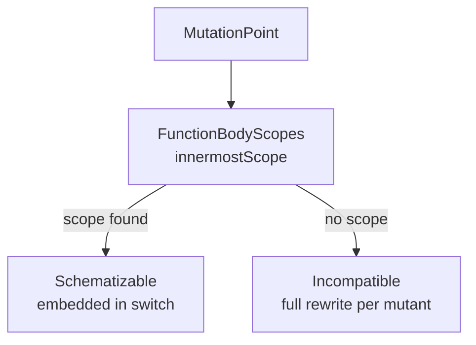
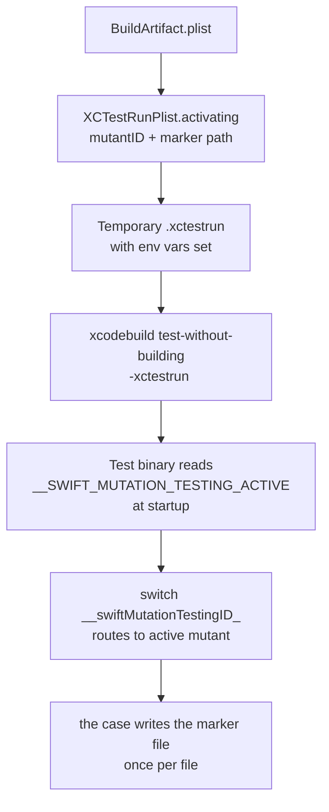

# Schematization

← [Configuration](04-configuration.md) | Next: [Plans →](06-plans.md)

---

## Purpose

Schematization is the key technique that allows `swift-mutation-testing` to run `xcodebuild build-for-testing` exactly once for all schematizable mutants. Instead of creating a separate binary per mutant, all mutations for a given function body are embedded into the same binary behind a runtime `switch` statement. The active mutant is selected at test time by setting an environment variable.

## Schematizable vs Incompatible Mutants

A mutation is **schematizable** when it falls inside a function body — anywhere `TypeScopeVisitor` can determine an enclosing function scope. Mutations outside function bodies (stored property initializers, global-scope expressions) are **incompatible** and require a separate full build + test cycle via `IncompatibleMutantExecutor`.


```mermaid
flowchart TD
    MP[MutationPoint] --> TSV[FunctionBodyScopes\ninnermostScope]
    TSV -- scope found --> SCHEMA[Schematizable\nembedded in switch]
    TSV -- no scope --> INCOMPAT[Incompatible\nfull rewrite per mutant]
```

## SchemataGenerator

`SchemataGenerator` rewrites each function body to contain a `switch __swiftMutationTestingID_<hash>` block, the hash naming the file (see [Per-file support declarations](#per-file-support-declarations)). Mutations are grouped by the innermost enclosing scope, and groups are rewritten innermost first: a nested function's body gets its own `switch`, and the enclosing body is read *after* that rewrite, so its `default` branch — and every one of its `case` branches, each a copy of the body with one mutation applied — carries the nested `switch` inside it. Offsets of the enclosing scope are shifted by the edits already made inside it. For each group:

1. Extract the original statement text (from `statementsStartOffset` to `statementsEndOffset`)
2. For each mutant in the group, apply the mutation to produce a mutated copy of the statements
3. Build a `switch` block with one `case` per mutant and a `default` for the original code
4. Replace the function body `{...}` with the new `switch` block

```swift
{
    switch __swiftMutationTestingID_<hash> {
    case "swift-mutation-testing_0":
        return a - b
    case "swift-mutation-testing_1":
        return a + b
    default:
        return a + b
    }
}
```

Mutant IDs follow the pattern `swift-mutation-testing_<index>`, where index is the global sequential position of the mutant across all files. `MutantID` owns the format: it builds the id, reads the index back and orders results by it.

Multiple scopes within the same file are processed in reverse order by `bodyStartOffset` to preserve correct byte offsets as the content grows.

## MutationRewriter

For **incompatible** mutants, `MutationRewriter` applies the single mutation directly to the source file's raw text using UTF-8 byte offsets, producing a complete replacement source file stored in `MutantDescriptor.mutatedSourceContent`.

`MutationRewriter`, `SchemataGenerator` and `ActivationInstrumenter` make every byte splice through `UTF8Splice`, which reads, replaces or inserts on the string's UTF-8 bytes and answers `nil` — instead of trapping — when a range lies outside the text or cuts through a character. Each caller decides what `nil` means: the rewriter keeps the source unchanged, the generator discards the mutation (or leaves the body as it was), and the instrumenter leaves the mutant unmeasured.

## TypeScopeVisitor

`TypeScopeVisitor` walks the SwiftSyntax AST and records every `FunctionBodyScope` — the UTF-8 byte range of each function body's `{`, its statements, and its closing `}`. It visits function declarations, initializers, deinitializers, and property/subscript accessors.

```
FunctionBodyScope
├── bodyStartOffset       — byte offset of opening {
├── bodyEndOffset         — byte offset after closing }
├── statementsStartOffset — byte offset of first statement
└── statementsEndOffset   — byte offset after last statement
```

The scopes are kept, once per file, on `ParsedSource.functionScopes` (`FunctionBodyScopes`). Its `innermostScope(containing:)` returns the tightest scope that contains a given UTF-8 offset, enabling correct handling of nested functions and closures, and its `isSchematizable(utf8Offset:)` is the Boolean interface `MutantIndexingStage` uses to classify each mutation point.

## Per-file support declarations

Every schematized file ends with a block of its own, appended by `SchemataGenerator` (`SupportDeclarations.perFile(for:)`, through `SupportDeclarations.appended(to:path:syntax:style:)`, the same call `ActivationInstrumenter` makes), where `<hash>` is the first eight hex digits of the SHA-256 of the file's path:

```swift
@usableFromInline
internal enum __SwiftMutationTesting_<hash> {
    @usableFromInline nonisolated static let id: String =
        ProcessInfo.processInfo.environment["__SWIFT_MUTATION_TESTING_ACTIVE"] ?? ""
    nonisolated(unsafe) static var activationRecorded = false

    @usableFromInline nonisolated static func activated() { … }

    @discardableResult @usableFromInline nonisolated static func activating<T>(_ value: T) -> T {
        activated()
        return value
    }
}

@usableFromInline nonisolated internal var __swiftMutationTestingID_<hash>: String {
    __SwiftMutationTesting_<hash>.id
}
```

`activating(_:)` serves incompatible mutants, whose rewritten file gets the same block; see [Activation Marker](#activation-marker).

Each piece of it is there for a reason:

- **One block per file, named after the file.** A single `internal` declaration in one module — what a shared `__SMTSupport.swift` used to be — is invisible to schematized files in any other module, so their schema did not compile and their mutants fell to one build each. A block in every schematized file is visible exactly where the schema is and needs no file of its own — which also matters for Xcode projects, which compile only the files their `project.pbxproj` lists. The hash in the names keeps two files of one module from declaring the same thing. The same holds across the projects of an Xcode workspace: each project's modules carry their own blocks, so one `build-for-testing` of the workspace's scheme compiles the schema of every project — `Fixtures/CalcWorkspace` and its integration test pin it, with every mutant of both projects measured and none unviable. Which container that build is given is decided in configuration ([XcodeContainer](04-configuration.md#xcodecontainer)).
- **`@usableFromInline internal`, not `private`.** An `@inlinable` body — every public function of `swift-algorithms`, for one — may only reference declarations that are `public` or `@usableFromInline`; a `private` block made every schema in such a file fail to build, and its mutants fell to one build each. `@usableFromInline` requires `internal`, which is why the names must differ per file.
- **A `static let`, not a global.** A stored global declared in `main.swift` is initialized when top-level code reaches its line; a function called before that reads uninitialized memory and crashes. A static stored property is initialized on first use wherever it is declared, so the block can sit at the end of any file, `main.swift` included, without shifting the line numbers of the code above it.
- **Read once.** `ProcessInfo.processInfo.environment` builds a dictionary of the whole environment; reading it once per file, instead of on every function call, keeps the schema's cost to a string comparison.
- **`nonisolated`.** Under Swift 6.2's default `MainActor` isolation, which app targets opt into, an unmarked global or static is main-actor isolated and a nonisolated function cannot read it. Both declarations opt out, and the same block compiles in Swift 5 mode, Swift 6 mode and under default isolation.
- **An import in the project's own style, only when the file has none.** The block needs Foundation. A file that already imports it, with whatever access level and even inside the active clause of an `#if`, gets nothing more. A file that does not gets `import Foundation` — or `internal import Foundation` when any file of the project puts an access level on an import (`ImportStyle`, decided once per run and carried in `RunnerInput.importStyle` for the retry that regenerates a schema). The style matters: a bare import next to an `internal import` of the same module elsewhere is rejected as ambiguous, in both directions — `swift-argument-parser` imports Foundation as `internal` in every file, and this repository imports it bare in every file — while `public import` is accepted next to either but warns when the import is unused in public declarations, which `-warnings-as-errors` turns fatal. The block's `@usableFromInline` bodies are not inlined, so an internal import serves them.

The block is part of `SchematizedFile.schematizedContent`. That is what makes the retry after a failed schema build correct for free: the narrowed schema comes from the same generator and carries the same declarations.

## Runtime Activation

At test execution time, `XCTestRunPlist.activating(_:activationFile:)` injects the mutant ID into the `.xctestrun` plist under `EnvironmentVariables.__SWIFT_MUTATION_TESTING_ACTIVE` for every test target in the run, and the SPM path puts the same variable in the test process's environment. A fresh copy of the `.xctestrun` is written for each mutant.


```mermaid
flowchart TD
    PLIST[BuildArtifact.plist] --> ACT[XCTestRunPlist.activating\nmutantID + marker path]
    ACT --> XCTESTRUN[Temporary .xctestrun\nwith env vars set]
    XCTESTRUN --> XCB[xcodebuild test-without-building\n-xctestrun <path>]
    XCB --> BINARY[Test binary reads\n__SWIFT_MUTATION_TESTING_ACTIVE\nat startup]
    BINARY --> SWITCH[switch __swiftMutationTestingID_<hash>\nroutes to active mutant]
    SWITCH --> MARK[the case writes the marker file\nonce per file]
```

When no environment variable is set (baseline run or passive execution), `__swiftMutationTestingID_<hash>` returns `""`, which matches no `case` and the `default` branch executes — the original code runs unmodified.

## Activation Marker

A verdict is only meaningful if the mutated code ran, so every `case` records that it did. The runner names a marker file for each test run, `<sandbox>/.xmr-activation/<mutant id>-<UUID>`, and passes it in `__SWIFT_MUTATION_TESTING_ACTIVATION_FILE`. The first time a file's `case` runs, `__SwiftMutationTesting.activated()` creates that file; a flag in the same private enum makes every later call a bool read. After the run, `ActivationMarker.wasWritten()` reads and removes it. The targeted run and the full run get markers of their own, and either counts.

How the call sits in the `case` depends on the body's shape, recorded by `TypeScopeVisitor` as `FunctionBodyShape`:

| Body | Case | Why |
|---|---|---|
| Statements | `let _ = __SwiftMutationTesting_<hash>.activated()` then the statements | A second statement is harmless; `let _ =` keeps result builders (`@ViewBuilder`) from rejecting a bare call |
| One expression in a value-returning body, `func add(_ a: Int, _ b: Int) -> Int { a + b }` | `(__SwiftMutationTesting_<hash>.activated(), a - b).1` | The body is an implicit return, so the whole `switch` is an expression and each branch must stay one expression. The tuple evaluates the activation first and has the expression's type, `try`, `await`, closures and `Never` included |
| One expression in a `Void` body, an `init`, a `deinit` or a setter — `{ print(1) }`, `{ self.init() }` | treated as statements | Nothing is returned, so the tuple buys nothing, and `self.init` cannot be nested in another expression |
| One `if` or `switch` expression in a value-returning body | `let _ = …` then `return if …`, and `return` in `default` too | An `if` expression cannot sit in a tuple; an explicit `return` makes the outer `switch` a statement again |
| One `if` or `switch` *statement* — a branch that `return`s, an `if` without `else` | treated as statements | `return switch …` would turn the statement into an expression, and `return` cannot leave a `switch` expression; `TypeScopeVisitor` calls a conditional an expression only when every branch is one expression |
| One `if` or `switch` in a `Void` body, `init` or setter | `let _ = …` then the statement | Nothing to return |

What the marker decides:

| Verdict | Marker | Reported as |
|---|---|---|
| tests passed | written | `survived` |
| tests passed | not written | `noCoverage` |
| a test failed, or the process crashed | written | `killed` / `killedByCrash` |
| a test failed, or the process crashed | not written | run once more, alone; the second run decides, and a repeated kill stays, plus an integrity warning |
| timed out | not written | unchanged, plus an integrity warning |
| a mutant that could not be instrumented | no call in its code | unchanged; counted as "activation not measured" |

A kill without activation is run a second time because a flaky test usually passes then; a kill that repeats is systematic, and the warning keeps its verdict and makes the anomaly visible. `--max-integrity-warnings` lets the quality gate fail on them. **Incompatible mutants.** A mutant outside a function body has no `case` to start with the call, so `ActivationInstrumenter` puts the call in its code instead. The smallest whole expression around the mutation is wrapped in `__SwiftMutationTesting_<hash>.activating(…)`, a generic identity function that records the activation and returns its argument: `var timeout: Double = 60 - 1` becomes `var timeout: Double = __SwiftMutationTesting_<hash>.activating(60 - 1)`. A generic `T` keeps the literal's contextual type, and the operators are folded first, so in `flag && count - 1 > 2` only `count - 1` is wrapped and the marker means that operator ran. A removed statement is replaced by the call itself. Enum raw values, attribute and macro arguments and `#if` conditions cannot take a call, so those mutants stay unmeasured, and so does one whose instrumented copy fails to build: it is built again without the call, at the cost of a second build. The support block and, if needed, the Foundation import in the project's style are appended to the rewritten file, as for a schematized one. On the Xcode path the marker path reaches the tests as `TEST_RUNNER___SWIFT_MUTATION_TESTING_ACTIVATION_FILE`, which `xcodebuild` passes to the test runner without its prefix.

When mutants were killed and no mutant's code was ever seen running, the run stops instead (`IntegrityError.activationNeverObserved`): either the marker cannot be written here or the suite fails on its own, and every verdict is suspect.

## Application Check

`SchemataGenerator` returns the mutations it could not place (`SchemaGeneration.discarded`) and writes no `case` for them. Before the first build, `ApplicationVerifier` proves that the sandbox holds what discovery produced: every schematized file differs from its original and ends with the support declarations, every schematizable mutant has its `case` in the sandbox copy, and every incompatible mutant's content differs from the original. Anything missing ends the run with an `IntegrityError` naming it, before a build is paid for. The check runs again for each per-file sandbox of the fallback path.

---

← [Configuration](04-configuration.md) | Next: [Plans →](06-plans.md)
