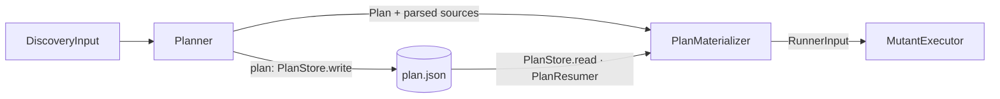

# Plans

← [Schematization](05-schematization.md) | [Index →](README.md)

---

A run is two decisions followed by work: *what* to mutate, then *whether each mutant survives*. Until plans, both happened in one process with nothing in between, so a run could not be split across machines, resumed after an interruption, audited before the hour was spent, or repeated for one mutant. A **plan** is the first decision written down.

## The plan

`Plan` (`Plan/Plan.swift`, `formatVersion` 1) holds the project (type, scheme, destination, test target, and the Xcode container as `workspace` or `xcodeProject`), the scope (sources path, exclusions, operators), every source file in scope with the SHA-256 of its content, and every mutant with its file, UTF-8 range, line, column, operator, change, description, whether it is schematizable, and its fingerprint.

Three properties are the point:

| Property | How |
|---|---|
| **No absolute path** | Every path is relative to the project root (`Planner.relative`); the root is given again at run time. The same code in two directories, or on two machines, gives the same plan |
| **No execution option** | Timeout, concurrency, cache, reports and gate are the run's; a plan says what, not how fast |
| **Deterministic bytes** | Mutants are in file-then-offset order, files in path order, and `PlanStore.encode` (`VersionedJSON.encode`, shared with the baseline) writes sorted keys without escaped slashes and one trailing newline. `PlanStore.sha256(of:)` over those bytes is the plan's identity |

The schematized content is not in the plan: the run regenerates it from the mutants, which keeps a plan readable in a pull request.

## One path from mutants to a run

`Planner` runs discovery up to indexing — files, parsing, operators, mutation points, fingerprints — and produces the plan, handing over the parsed sources so the direct flow does not parse twice. `PlanMaterializer` turns a plan into a `RunnerInput`: it rebuilds every `IndexedMutationPoint` from the plan (the index is the mutant's position in the plan, so the report ids — `MutantID.make(index:)` — are the same ones a plain run gives), runs `SchematizationStage` and `IncompatibleRewritingStage` over the sources, and assembles the input. The `plan` command (`PlanCommand`) stops after `Planner` and writes the plan with `PlanStore.write`. `DiscoveryPipeline.run` and a plain `run` (`RunCommand`) are `Planner` followed by `PlanMaterializer` on the sources just parsed; `run --plan` is `PlanStore.read` followed by `PlanMaterializer` on the sources read from disk, through `PlanResumer`. **There is one materialization, so the two flows cannot drift**, and a test pins that a plan written and read back materializes to the direct flow's input.

## Staleness

Before `run --plan` builds anything, `PlanMaterializer.load` hashes every file of the plan again and compares; a changed or missing file ends the run with `PlanError.stale` or `.missingFile`, naming it. Then each mutant's `original` text is checked at its range (`PlanError.corrupt`), which catches a corrupt plan for free. A plan's project type, test target, container and scope replace the configuration's (`RunnerConfiguration.applying(_:)`), so a shard runs what the plan says whatever its own file says. A plan only ever runs over the code it describes; a shard on another machine that checked out the wrong commit finds out before it builds.

The `toolVersion` is recorded, not required: a plan says which tool made it, and `formatVersion` says whether this tool can read it.

## Shards

`Shard` is `i/n`, `1 ≤ i ≤ n`. `ShardSelector` partitions a plan **by file**: every mutant of a file goes to one shard, so a shard builds one schema holding only its mutants and no file is built twice. Files are taken in path order and each goes to the shard with the fewest mutants so far, ties to the lowest index; the partition is a pure function of the plan and `n`. A file heavier than its share still goes whole to one shard, so the balance is approximate. `run --plan --shard i/n` materializes only the shard's mutants, with their plan ids.

## Results and merge

Every JSON report carries `config.planSha256` and, for a shard, `config.shard` (`RunIdentity`), and every mutant carries its `fingerprint` and `activated`. A plain run has an identity too, since it made a plan in memory.

`ResultMerger` joins reports into one result set under three rules, each an error (`MergeError`): every report must name the same plan; no fingerprint may have a verdict in two reports; every mutant of the plan must have a verdict. Missing mutants are listed and no score is given — `discovered == planned + skipped` is the discipline, and a score over part of the plan would not be a single run's number. The merged `ExecutionResult`s are rebuilt from the plan's mutants and the reports' verdicts, so `merge` (`MergeCommand`) ends in `RunConclusion` like a run: the console summary, every report file it is asked for, and the quality gate run over them unchanged.

## Resuming

Two layers.

1. **The cache's journal**, for every run. `CacheStore` appends every verdict to `journal.jsonl` (through `JSONLines`, which `PlanJournal` shares) as soon as it is stored and replays the journal on `load()`, folding it into `results.json` on `persist()`. The cache's metadata (the test files' hashes) is written at the start of the run, so an interrupted run's journal is read back against the test files it ran with. Under `--no-cache` there is none.
2. **The plan's journal**, for `run --plan`. `PlanJournal` is a JSON-lines file per plan and shard, `.swift-mutation-testing-cache/plans/<planSha256>[-<i>-of-<n>].jsonl`, with each verdict's fingerprint, status, killer test file, activation and duration. `CacheStore.store` feeds it before its own `noCache` and timeout guards, so it records every final verdict, timeouts included, whatever the cache does. `run --plan` reads it first (`PlanResumer.discover`), materializes only the mutants with no entry, rebuilds the others' results from the plan (`PlanMaterializer.descriptor(of:at:in:projectPath:)`, the same as the merge), and removes the journal once the run has its results. A journal therefore only ever holds what an interrupted run of that plan and shard reached, which is why `--no-cache` does not switch it off: a finished run leaves nothing to replay.

A test sends a real `SIGINT` to the built tool in the middle of a `run --plan --no-cache`, then runs the plan again and checks that exactly the mutants without a journaled verdict are tested and that the report holds every mutant with the journaled verdicts unchanged.

## Reproduce

`Reproducer` runs one mutant of a plan — `--plan`, or one made in memory — by report id, full fingerprint, or a prefix of at least six characters that fits one mutant. It sets `RunnerConfiguration.build.reproduction`, with no cache, one worker and no progress output: the whole suite rather than the targeted suites first, no `OutputStopRule`, and every sandbox left in place, each executor handing it to the `Reproduction` (`Sandbox.release(keepingFor:)`) instead of deleting it. An incompatible mutant on Xcode is built in one cold sandbox per attempt rather than a warm one, so the kept sandbox holds exactly that mutant. It prints the kept sandboxes, the line before and after the mutation (from `MutationRewriter`), the full test output (from `MutantLogWriter`'s log, under `--keep-logs` or a directory of its own) and the verdict with its reason, and exits `1` when the mutant reached no verdict. The next run's sweep of orphaned sandboxes removes the kept ones.

## Decisions

Three points where the implementation departs from the text of the spec that proposed plans, each kept on purpose.

- **The run's identity goes in the report's `config` object, not in a separate results file.** The spec leaned towards a results file of the tool's own (`--results-output`) as the input of `merge`, to keep the Stryker report a third-party format. But the Stryker schema reserves `config` as a free-form object for the tool, so `planSha256`, `shard` and `toolVersion` there break no Stryker reader; and everything `merge` needs — status, `killedBy`, `statusReason`, `duration`, `fingerprint`, `activated` — is already in the report. A second file per shard would duplicate it and give CI two artifacts to carry instead of one.
- **Every JSON report gains `config` and, per mutant, `activated`.** The plain run is the same command with the same console output, but its JSON report has two additions: both extra properties the schema allows, both ignored by readers that do not know them. `activated` was already measured and shown in logs and integrity warnings; the merge needs it to rebuild a verdict faithfully.
- **One pull request for the four phases.** The spec planned a pull request per phase. The repository's rule is one branch and one pull request per piece of work, and the phases share the plan, the materializer and the report identity, so they shipped together, each phase still in its own commits.

## Invariants

| Invariant | Enforcement |
|---|---|
| A plan has no absolute path | `Planner.relative` on every path; a test plans the same code in two directories and compares the bytes |
| Two plans of the same code are the same bytes | ordered mutants and files, `PlanStore.encode` with sorted keys |
| A plan never runs over other code | `PlanMaterializer.load` hashes every file before anything is built |
| The direct flow and `run --plan` give the same input | one `PlanMaterializer`; a test compares the two |
| Shards partition the plan | `ShardSelector` tests: union is the plan, intersection is empty |
| A merge is complete or it has no score | `ResultMerger` throws `MergeError.missing` |
| An interrupted run loses no verdict | both journals are written per verdict, before any report; a `SIGINT` test on the built tool |
| Shards merged are the single run | a test runs a plan whole and as 4 shards, each on its own copy of the package, and compares the merged report with the single one field by field, durations aside |
