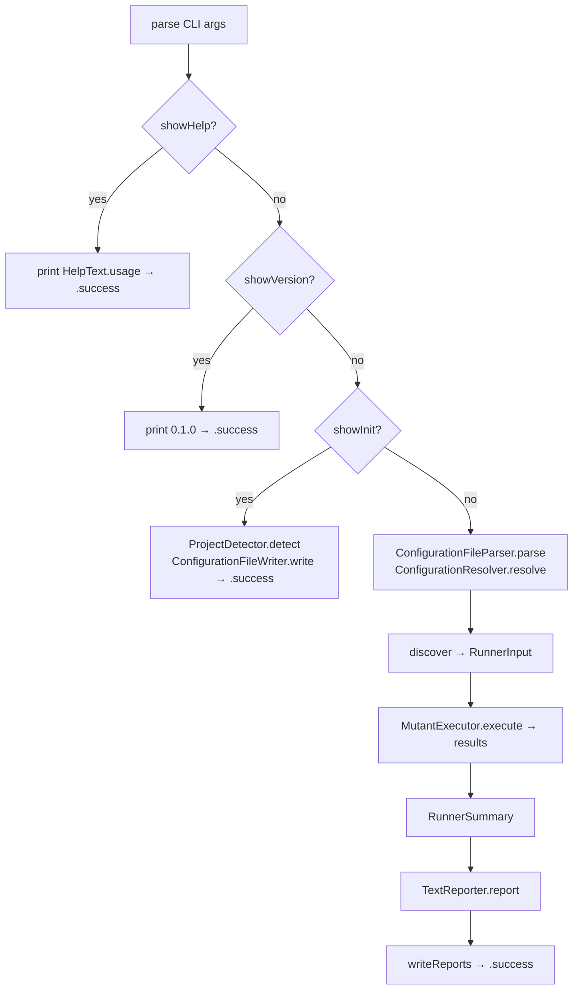

# Entry Point

← [Index](README.md) | Next: [Configuration →](02-configuration.md)

---

## SwiftMutationTesting.swift

```swift
@main
struct SwiftMutationTesting {
    static func main() async
    static func run(args: [String], launcher: (any ProcessLaunching)? = nil) async -> ExitCode
    private static func execute(args: [String], launcher: (any ProcessLaunching)?) async throws -> ExitCode
    private static func discover(configuration: RunnerConfiguration) async throws -> (RunnerInput, TimeInterval)
    static func writeReports(_ summary: RunnerSummary, configuration: RunnerConfiguration)
    static func defaultLauncher(for projectType: ProjectType) -> any ProcessLaunching
}
```

The program entry point. `main()` drops `CommandLine.arguments[0]` (the executable name) and delegates to `run(args:launcher:)`.

`run` catches two error categories before returning an exit code:
- `UsageError` — prints `message` to stderr
- Any other `Error` — prints `localizedDescription` to stderr (errors conforming to `LocalizedError`, such as `SimulatorError` and `BuildError`, provide structured descriptions)

`defaultLauncher(for:)` returns the appropriate process launcher based on project type: `XcodeProcessLauncher` for `.xcode`, `SPMProcessLauncher` for `.spm`. Used when no launcher is injected via the `launcher` parameter.

`execute` is the primary execution path:



`discover` runs `DiscoveryPipeline` and, when `quiet` is false, emits `.discoveryFinished` to a `ConsoleProgressReporter`.

`writeReports` writes `JsonReporter`, `HtmlReporter`, and `SonarReporter` outputs when the corresponding output path is configured. Each reporter failure prints a warning to stderr without aborting.

---

## CLI/ExitCode.swift

```swift
enum ExitCode: Int32 {
    case success = 0
    case error   = 1
}
```

Passed directly to `exit(_:)` as `rawValue`. All error conditions (usage, build, unexpected) map to `.error`.

---

## CLI/HelpText.swift

```swift
enum HelpText {
    static let usage: String
}
```

A static multi-line string printed when `--help` is passed. Describes all CLI options and subcommands. Not reproduced here — see the source file.

---

## CLI/UsageError.swift

```swift
struct UsageError: Error, Sendable {
    let message: String
}
```

Thrown by `CommandLineParser` for unknown flags and by `ConfigurationResolver` when required fields are absent in both CLI and file values (e.g. `scheme` and `destination` for Xcode projects).

| Field | Type | Description |
|---|---|---|
| `message` | `String` | Human-readable description printed to stderr |

---

← [Index](README.md) | Next: [Configuration →](02-configuration.md)
