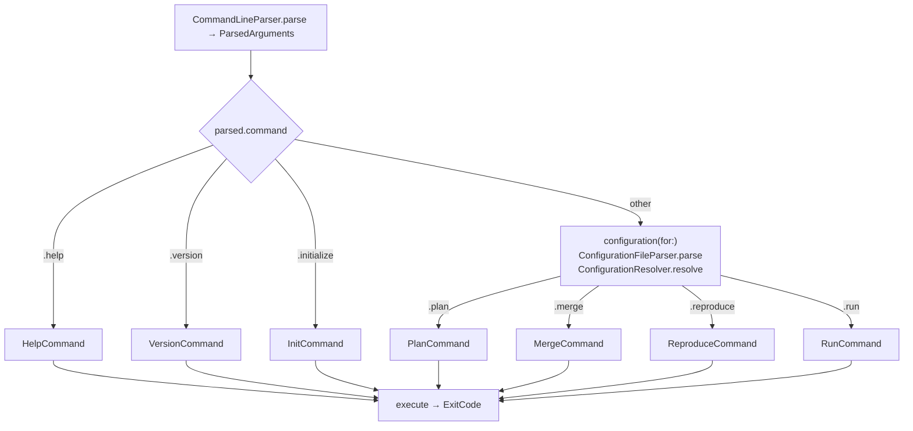
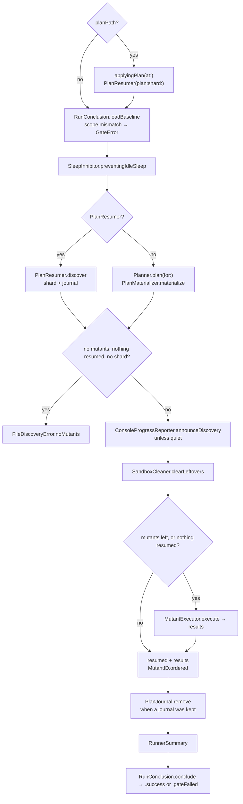

# Entry Point

← [Index](README.md) | Next: [Configuration →](02-configuration.md)

---

## swift-mutation-testing/main.swift

```swift
import SwiftMutationTesting

await SwiftMutationTesting.main()
```

The executable target's only file, under `Sources/swift-mutation-testing/`. Everything else lives in the `SwiftMutationTesting` library target, which the tests import.

---

## SwiftMutationTesting.swift

```swift
public struct SwiftMutationTesting {
    public static func main() async
    static func run(args: [String], launcher: (any ProcessLaunching)? = nil) async -> ExitCode
    static func command(for parsed: ParsedArguments, launcher: (any ProcessLaunching)?) throws -> any Command
    private static func configuration(for parsed: ParsedArguments) throws -> RunnerConfiguration
}
```

The program entry point. `main()` installs signal handlers for sandbox cleanup (`SandboxCleaner.installSignalHandlers()`), then drops `CommandLine.arguments[0]` (the executable name), delegates to `run(args:launcher:)` and passes the result to `exit(_:)`.

`run` parses the arguments, asks `command(for:launcher:)` for the `Command` they name and executes it. It catches two error categories before returning an exit code, both written through `StandardError`:
- `UsageError` — writes `message`
- Any other `Error` — writes `Error: ` followed by `localizedDescription` (errors conforming to `LocalizedError`, such as `SimulatorError` and `BuildError`, provide structured descriptions)

`command(for:launcher:)` is the dispatch table: one `Command` per `ParsedArguments.Command` case. `help`, `version` and `init` are built without a configuration, so they never read `.swift-mutation-testing.yml`; every other command first resolves one with `configuration(for:)` (`ConfigurationFileParser.parse` then `ConfigurationResolver.resolve`).


```mermaid
flowchart TD
    A[CommandLineParser.parse → ParsedArguments] --> B{parsed.command}
    B -- .help --> HELP[HelpCommand]
    B -- .version --> VER[VersionCommand]
    B -- .initialize --> INIT[InitCommand]
    B -- other --> CFG["configuration(for:)\nConfigurationFileParser.parse\nConfigurationResolver.resolve"]
    CFG -- .plan --> PLAN[PlanCommand]
    CFG -- .merge --> MERGE[MergeCommand]
    CFG -- .reproduce --> REPRO[ReproduceCommand]
    CFG -- .run --> RUN[RunCommand]
    HELP & VER & INIT & PLAN & MERGE & REPRO & RUN --> EX[execute → ExitCode]
```

---

## CLI/Commands/

```swift
protocol Command: Sendable {
    func execute() async throws -> ExitCode
}
```

One thing the tool was asked to do, with everything it needs to do it. Each command is a small struct built by `SwiftMutationTesting.command(for:launcher:)`.

| Type | Fields | What `execute()` does |
|---|---|---|
| `HelpCommand` | — | Writes `HelpText.usage`; `.success` |
| `VersionCommand` | — | Writes `Version.current`; `.success` |
| `InitCommand` | `projectPath`, `launcher` | `ProjectDetector.detect` then `ConfigurationFileWriter.write`; `.success`. The launcher defaults to `XcodeProcessLauncher()` |
| `PlanCommand` | `configuration`, `path` | `Planner().plan(for:)`, throws `FileDiscoveryError.noMutants(for:)` for an empty plan, writes it with `PlanStore`, announces discovery; `.success`. `path` defaults to `plan.json` |
| `MergeCommand` | `options: PlanOptions`, `configuration` | Requires `--plan`, applies it, loads the baseline, joins the result files with `ResultMerger` and hands the summary to `RunConclusion.conclude` |
| `ReproduceCommand` | `options: PlanOptions`, `configuration`, `launcher` | Takes the plan given or makes one, clears leftovers and runs `Reproducer` under `SleepInhibitor` |
| `RunCommand` | `configuration`, `planPath`, `shard: Shard?`, `launcher` | The default command: discover, execute, conclude (below) |

`RunCommand.execute` applies the plan when `--plan` was given (wrapping it in a `PlanResumer` with the shard), loads the baseline through `RunConclusion.loadBaseline` before anything runs, then holds a `SleepInhibitor` assertion for the rest of the run so an unattended run does not stop while the machine sleeps:


```mermaid
flowchart TD
    P{planPath?} -- yes --> AP["applyingPlan(at:)\nPlanResumer(plan:shard:)"]
    P -- no --> LB
    AP --> LB["RunConclusion.loadBaseline\nscope mismatch → GateError"]
    LB --> S[SleepInhibitor.preventingIdleSleep]
    S --> D{PlanResumer?}
    D -- yes --> DR["PlanResumer.discover\nshard + journal"]
    D -- no --> DP["Planner.plan(for:)\nPlanMaterializer.materialize"]
    DR & DP --> Z{"no mutants, nothing resumed, no shard?"}
    Z -- yes --> ERR[FileDiscoveryError.noMutants]
    Z -- no --> AN["ConsoleProgressReporter.announceDiscovery\nunless quiet"]
    AN --> CL[SandboxCleaner.clearLeftovers]
    CL --> R{"mutants left, or nothing resumed?"}
    R -- yes --> G["MutantExecutor.execute → results"]
    R -- no --> O
    G --> O["resumed + results\nMutantID.ordered"]
    O --> J["PlanJournal.remove\nwhen a journal was kept"]
    J --> H[RunnerSummary]
    H --> C["RunConclusion.conclude → .success or .gateFailed"]
```

`SandboxCleaner.clearLeftovers()` kills test processes still running from the sandboxes of dead runs (`OrphanedProcessReaper().reap()`) and then sweeps those sandboxes (`removeOrphaned()`); doing it in the commands that build rather than in `main()` keeps `--help`, `--version` and `init` from paying for a directory listing they do not need. A run whose every mutant was resumed from the journal skips `MutantExecutor` entirely.

---

## CLI/RunConclusion.swift

```swift
struct RunConclusion: Sendable {
    let configuration: RunnerConfiguration
    let baseline: Baseline?

    func conclude(_ summary: RunnerSummary, identity: RunIdentity) throws -> ExitCode
    static func loadBaseline(for configuration: RunnerConfiguration) throws -> Baseline?
    static func evaluateGate(_ summary: RunnerSummary, configuration: RunnerConfiguration, baseline: Baseline?) -> GateResult?
    static func applyGate(_ gate: GateResult?, summary: RunnerSummary, configuration: RunnerConfiguration, now: Date = Date()) throws -> ExitCode
}
```

How a run or a merge ends. `conclude` prints the `TextReporter` report, evaluates the gate, writes the report files through `ReportWriter` and applies the gate. The Markdown summary includes the gate result, which is why the gate is evaluated before the reports are written. A report that cannot be written produces a warning on `StandardError` without aborting.

`loadBaseline` reads the baseline named by `--baseline` before anything runs and compares its scope with the run's (`BaselineScope.differences`). A missing, unreadable or out-of-scope baseline throws `GateError`, so the run ends with `.error` before a single mutant is built.

`evaluateGate` returns `nil` when the gate is inactive, and `QualityGate`'s result otherwise. `applyGate` runs after the reports: it prints that result with `GateReporter` and returns `.gateFailed` if a check failed; then, when `--write-baseline` was given, it writes this run's baseline whatever the outcome. See [10 — Quality Gate](10-quality-gate.md).

---

## CLI/CommandSupport.swift

Extensions the commands share, each turning a `RunnerConfiguration` into what another layer takes:

| Member | Purpose |
|---|---|
| `Planner.plan(for: RunnerConfiguration)` | A plan of the configuration's sources, with its operators, test target and Xcode container |
| `DiscoveryInput.init(_ configuration:)` | The discovery input a configuration describes (`sourcesPath` falls back to `projectPath`) |
| `PlanMaterializer.ExecutionOptions.init(_ configuration:)` | Timeout, concurrency and `noCache` from the build options |
| `RunnerConfiguration.applyingPlan(at:)` | Reads the plan with `PlanStore` and returns it with the configuration under it (`applying(_:)`) |
| `FileDiscoveryError.noMutants(for:)` | The no-mutants error for the configuration's sources path |
| `ProjectType.defaultLauncher` | `XcodeProcessLauncher` for `.xcode`, `SPMProcessLauncher` for `.spm`; used when no launcher is injected |
| `ConsoleProgressReporter.announceDiscovery(mutantCount:schematizableCount:duration:unless:)` | Emits `.discoveryFinished` unless the run is quiet |
| `SandboxCleaner.clearLeftovers()` | `OrphanedProcessReaper().reap()` then `removeOrphaned()` |

---

## CLI/ExitCode.swift

```swift
enum ExitCode: Int32 {
    case success    = 0
    case error      = 1
    case gateFailed = 2
}
```

Passed directly to `exit(_:)` as `rawValue`. All error conditions (usage, build, baseline, unexpected) map to `.error`. `.gateFailed` means the run completed and its reports were written, but the quality gate did not pass, so CI can tell a failed gate from a broken run.

---

## CLI/HelpText.swift

```swift
enum HelpText {
    static let usage: String
}
```

A static multi-line string `HelpCommand` prints for `--help` or `-h`. Describes all CLI options and subcommands; the report-path lines are interpolated from `ReportFormat.allCases.map(\.helpLine)`, so a new format lists itself. Not reproduced here — see the source file.

---

## Version.swift

```swift
enum Version {
    static let name: String
    static let number: String
    static var current: String { get }
}
```

`name` is `swift-mutation-testing` and `number` is `0.0.0-dev` in the repository, replaced with the tag's version by the release workflow. `current` is `<name> <number> [<architecture>-<os>]`, e.g. `swift-mutation-testing 0.0.0-dev [arm64-macos26]` — the architecture (`arm64`, `x86_64`) and the macOS major version (`macos<major>`, or `linux`) come from compile-time checks and `ProcessInfo`, `unknown` for anything else. `VersionCommand` prints it. `number` alone is what files record as the tool's version: `Plan.toolVersion` (`Planner`) and the baseline's `toolVersion` (`RunConclusion.applyGate`).

---

## CLI/UsageError.swift

```swift
struct UsageError: Error, Sendable, Equatable {
    let message: String
}
```

The error for a request the tool cannot carry out as given. Thrown by `CommandLineParser` (unknown flags, missing or malformed values, misplaced positionals, `--shard` or `--project-path` outside their command), by `ConfigurationResolver` (a required field absent in both CLI and file values, such as `scheme` and `destination` for Xcode projects, or an invalid value), by `XcodeContainerLocator.locate`, which declares `throws(UsageError)`, by `ConfigurationFileWriter` when the file already exists, and by `MergeCommand` without `--plan`. `run` writes its `message` alone, without the `Error: ` prefix other errors get.

| Field | Type | Description |
|---|---|---|
| `message` | `String` | Human-readable description written to stderr through `StandardError` |

---

← [Index](README.md) | Next: [Configuration →](02-configuration.md)
