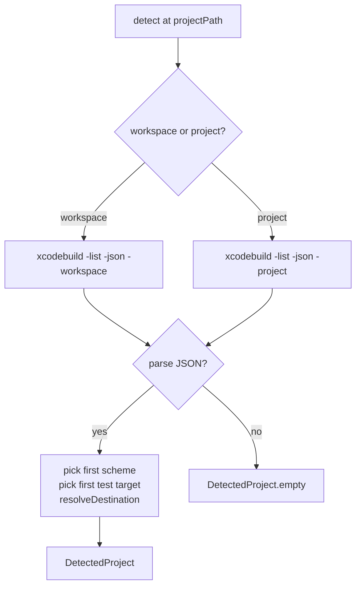

# Configuration

← [Entry Point](01-entry-point.md) | Next: [Discovery Pipeline →](03-discovery-pipeline.md)

---

## CLI/CommandLineParser.swift

```swift
struct CommandLineParser: Sendable {
    func parse(_ args: [String]) throws -> ParsedArguments
}
```

Iterates `args` left-to-right, dispatching each token to an internal `applyFlag` method. Stores intermediate state in a private `FlagValues` struct. Throws `UsageError` for unrecognised flags.

Multi-value flags (`--exclude`, `--operator`, `--disable-mutator`) accumulate into arrays. Boolean flags (`--no-cache`, `--help`, `--version`, `init`, `--quiet`) set a single Bool. All other flags consume the next token as their value.

---

## CLI/ParsedArguments.swift

```swift
struct ParsedArguments: Sendable {
    let projectPath: String
    var showHelp: Bool
    var showVersion: Bool
    var showInit: Bool
    var scheme: String?
    var destination: String?
    var testTarget: String?
    var timeout: Double?
    var concurrency: Int?
    var noCache: Bool
    var output: String?
    var htmlOutput: String?
    var sonarOutput: String?
    var sourcesPath: String?
    var excludePatterns: [String]
    var operators: [String]
    var disabledMutators: [String]
    var quiet: Bool
}
```

| Field | Default | Description |
|---|---|---|
| `projectPath` | `"."` | First positional argument, or `"."` if absent |
| `showHelp` | `false` | Set by `--help` |
| `showVersion` | `false` | Set by `--version` |
| `showInit` | `false` | Set by the `init` subcommand |
| `scheme` | `nil` | `--scheme <value>` |
| `destination` | `nil` | `--destination <value>` |
| `testTarget` | `nil` | `--target <value>` |
| `timeout` | `nil` | `--timeout <seconds>` |
| `concurrency` | `nil` | `--concurrency <n>` |
| `noCache` | `false` | `--no-cache` |
| `output` | `nil` | `--output <path>` |
| `htmlOutput` | `nil` | `--html-output <path>` |
| `sonarOutput` | `nil` | `--sonar-output <path>` |
| `sourcesPath` | `nil` | `--sources-path <path>` |
| `excludePatterns` | `[]` | `--exclude <pattern>`, repeatable |
| `operators` | `[]` | `--operator <id>`, repeatable |
| `disabledMutators` | `[]` | `--disable-mutator <id>`, repeatable |
| `quiet` | `false` | `--quiet` |

---

## Configuration/RunnerConfiguration.swift

```swift
struct RunnerConfiguration: Sendable {
    let projectPath: String
    let scheme: String
    let destination: String
    let testTarget: String?
    let timeout: Double
    let concurrency: Int
    let noCache: Bool
    let output: String?
    let htmlOutput: String?
    let sonarOutput: String?
    let sourcesPath: String?
    let excludePatterns: [String]
    let operators: [String]
    let quiet: Bool

    static let defaultTimeout: Double
    static let defaultConcurrency: Int
}
```

Fully resolved configuration passed to both pipelines. All fields are immutable after construction.

| Constant | Value |
|---|---|
| `defaultTimeout` | `60.0` |
| `defaultConcurrency` | `max(1, ProcessInfo.activeProcessorCount - 1)` |

---

## Configuration/ConfigurationResolver.swift

```swift
struct ConfigurationResolver: Sendable {
    func resolve(cliArguments: ParsedArguments, fileValues: [String: String]) throws -> RunnerConfiguration
}
```

Merges `ParsedArguments` (CLI, higher priority) with `[String: String]` from the YAML parser (lower priority). CLI values always win.

Throws `UsageError` if `scheme` or `destination` is absent in both sources.

**Operator resolution** (`resolveOperators`):

1. If `--operator` flags were passed, use only those identifiers
2. Otherwise start from all operators, then remove any disabled via `--disable-mutator` (CLI) or `mutators` block with `active: false` (file)

---

## Configuration/ConfigurationFileParser.swift

```swift
struct ConfigurationFileParser: Sendable {
    func parse(at projectPath: String) throws -> [String: String]
}
```

Reads `.swift-mutation-testing.yml` from `<projectPath>/.swift-mutation-testing.yml`. Returns an empty dictionary if the file does not exist.

Parses YAML line-by-line. Handles top-level scalar values and a `mutators:` block where each entry can have an `active: false` sub-key. Disabled mutator names are collected under the key `"disabledMutators"` (comma-separated) in the returned dictionary.

---

## Configuration/ConfigurationFileWriter.swift

```swift
struct ConfigurationFileWriter: Sendable {
    func write(to projectPath: String, project: DetectedProject) throws
}
```

Writes `.swift-mutation-testing.yml` at `<projectPath>/.swift-mutation-testing.yml`. Throws if the file already exists.

Generates YAML content using `DetectedProject` values where available, falling back to placeholder comments. The `operators:` section is populated from `DiscoveryPipeline.allOperatorNames`.

---

## Configuration/ProjectDetector.swift

```swift
struct ProjectDetector: Sendable {
    init(launcher: any ProcessLaunching)
    func detect(at projectPath: String) async -> DetectedProject
}
```

Runs `xcodebuild -list -json` to discover schemes and test targets.



`resolveDestination` queries `xcrun simctl list devices --json` and picks the first booted or available simulator for the detected platform. Falls back to hardcoded default destinations if detection fails.

---

## Configuration/DetectedProject.swift

```swift
struct DetectedProject: Sendable {
    let scheme: String?
    let allSchemes: [String]
    let testTarget: String?
    let destination: String?

    static let empty: DetectedProject
}
```

| Field | Description |
|---|---|
| `scheme` | First scheme found by `xcodebuild -list`, or `nil` |
| `allSchemes` | All schemes found |
| `testTarget` | First test target found, or `nil` |
| `destination` | Best-guess destination string, or `nil` |
| `empty` | Static instance with all fields `nil` / empty |

---

← [Entry Point](01-entry-point.md) | Next: [Discovery Pipeline →](03-discovery-pipeline.md)
