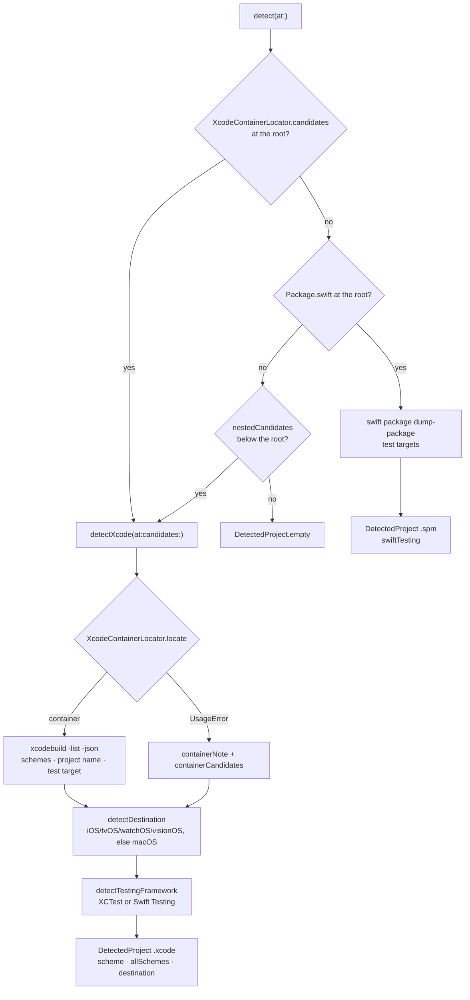

# Configuration

← [Entry Point](01-entry-point.md) | Next: [Discovery Pipeline →](03-discovery-pipeline.md)

---

## CLI/CommandLineParser.swift

```swift
struct CommandLineParser: Sendable {
    func parse(_ arguments: [String]) throws -> ParsedArguments
}
```

No arguments at all yield the default `ParsedArguments` — `run` on `.`. `--help` (or `-h`) and `--version` as the first word yield `.help` and `.version` at once; `init` yields `.initialize` with the next word as its project path unless it starts with `-`, and reads nothing after it. Otherwise the first word may be a command — `run` (the default when none is given), `plan`, `merge` or `reproduce` — then the words before the first flag are the command's positionals (the project path for `run` and `plan`; the result files for `merge`; the mutant and an optional project path for `reproduce`), then the flags. Iterates the flags left-to-right, dispatching each token to an internal `applyFlag` method that writes straight into the `ParsedArguments` it returns. Throws `UsageError` for unrecognised flags, for a flag without its value, for more positionals than the command takes, for `merge` without result files and `reproduce` without a mutant, for `--shard` outside `run` and for a shard that is not `i/n` — `--shard` is parsed into a `Shard` on the spot, with `PlanError.invalidShard`'s message. For `plan`, `--output` is the plan's path, not a report's. `--project-path <path>` sets the project path of `merge`, whose positionals are the result files, and is refused elsewhere. `--workspace` and `--project` name the Xcode container.

Multi-value flags (`--exclude`, `--operator`, `--disable-mutator`) accumulate into arrays. Boolean flags (`--no-cache`, `--quiet`) set a single Bool. All other flags consume the next token as their value: `--timeout` and `--build-timeout` must be positive numbers, `--min-score` and `--max-score-drop` numbers of at least 0, and `--concurrency`, `--max-new-survivors` and `--max-integrity-warnings` integers; their range is checked later, by `ConfigurationResolver`.

---

## CLI/ParsedArguments.swift

```swift
struct ParsedArguments: Sendable {
    enum Command: Sendable, Equatable { case run, plan, merge, reproduce, initialize, help, version }

    var command: Command = .run
    var projectPath: String = "."
    var plan: PlanOptions = PlanOptions()
    var build: BuildOptions = BuildOptions()
    var reporting: ReportingOptions = ReportingOptions()
    var filter: FilterOptions = FilterOptions()
    var gate: GateOptions = GateOptions()

    struct BuildOptions: Sendable {
        var scheme: String?
        var destination: String?
        var testTarget: String?
        var timeout: Double?
        var buildTimeout: Double?
        var concurrency: Int?
        var noCache: Bool = false
        var testingFramework: String?
        var workspace: String?
        var xcodeProject: String?
    }

    struct ReportingOptions: Sendable {
        var outputs: [ReportFormat: String] = [:]
        var keepLogsPath: String?
        var quiet: Bool = false
    }

    struct FilterOptions: Sendable {
        var sourcesPath: String?
        var excludePatterns: [String] = []
        var operators: [String] = []
        var disabledMutators: [String] = []
        var operatorTier: String?
    }

    struct PlanOptions: Sendable {
        var path: String?
        var shard: Shard?
        var results: [String] = []
        var mutant: String?
        var projectPath: String?
    }

    struct GateOptions: Sendable {
        var minScore: Double?
        var baseline: String?
        var maxScoreDrop: Double?
        var maxNewSurvivors: Int?
        var maxIntegrityWarnings: Int?
        var writeBaseline: String?
    }
}
```

| Field | Default | Description |
|---|---|---|
| `command` | `.run` | The first word: `plan`, `merge`, `reproduce`, `init` (`.initialize`), or `--help`/`-h` and `--version` (`.help`, `.version`) |
| `projectPath` | `"."` | The project positional of `run`, `plan`, `init` and `reproduce` (its second), or `--project-path` for `merge`; `"."` if absent |
| `plan.path` | `nil` | `--plan <plan.json>`; for `plan`, its `--output` instead |
| `plan.shard` | `nil` | `--shard <i/n>`, parsed into a `Shard` |
| `plan.results` | `[]` | `merge`'s positionals, the result files to join |
| `plan.mutant` | `nil` | `reproduce`'s first positional, a fingerprint or a mutant id |
| `plan.projectPath` | `nil` | `--project-path <path>`, `merge` only |
| `build.scheme` | `nil` | `--scheme <value>` |
| `build.destination` | `nil` | `--destination <value>` |
| `build.testTarget` | `nil` | `--target <value>` |
| `build.testingFramework` | `nil` | `--testing-framework <xctest\|swift-testing>` |
| `build.timeout` | `nil` | `--timeout <seconds>` |
| `build.buildTimeout` | `nil` | `--build-timeout <seconds>` |
| `build.concurrency` | `nil` | `--concurrency <n>` |
| `build.noCache` | `false` | `--no-cache` |
| `build.workspace` | `nil` | `--workspace <path>` |
| `build.xcodeProject` | `nil` | `--project <path>` |
| `reporting.outputs[format]` | none | each `ReportFormat`'s flag: `--output`, `--html-output`, `--sonar-output`, `--sarif-output`, `--markdown-output` `<path>` — read off `ReportFormat.named(flag:)`, so a new format needs no parser case |
| `reporting.keepLogsPath` | `nil` | `--keep-logs <directory>` |
| `reporting.quiet` | `false` | `--quiet` |
| `filter.sourcesPath` | `nil` | `--sources-path <path>` |
| `filter.excludePatterns` | `[]` | `--exclude <pattern>`, repeatable |
| `filter.operators` | `[]` | `--operator <id>`, repeatable |
| `filter.disabledMutators` | `[]` | `--disable-mutator <id>`, repeatable |
| `filter.operatorTier` | `nil` | `--operator-tier <tier>` |
| `gate.minScore` | `nil` | `--min-score <0-100>` |
| `gate.baseline` | `nil` | `--baseline <path>` |
| `gate.maxScoreDrop` | `nil` | `--max-score-drop <points>`, `0` allowed |
| `gate.maxNewSurvivors` | `nil` | `--max-new-survivors <n>` |
| `gate.maxIntegrityWarnings` | `nil` | `--max-integrity-warnings <n>` |
| `gate.writeBaseline` | `nil` | `--write-baseline <path>` |

`CommandLineParser` applies each flag through one function per option group — build, reporting, filter, gate and plan — and reports an unknown option when none of them takes it.

---

## Configuration/RunnerConfiguration.swift

```swift
struct RunnerConfiguration: Sendable {
    let projectPath: String
    var build: BuildOptions
    var reporting: ReportingOptions
    var filter: FilterOptions
    var gate: GateOptions = GateOptions()

    static let defaultXcodeTimeout: Double   // 120.0
    static let defaultSPMTimeout: Double     // 30.0
    static let defaultBuildTimeout: Double   // 120.0
    static let defaultConcurrency: Int       // concurrency(forProcessors: processorCount)
    static func concurrency(forProcessors processorCount: Int) -> Int   // max(1, processorCount - 1)

    struct BuildOptions: Sendable {
        var projectType: ProjectType
        var xcodeContainer: XcodeContainer?
        var testTarget: String?
        var timeout: Double
        var buildTimeout: Double
        var concurrency: Int
        var noCache: Bool
        var testingFramework: TestingFramework  // default: .swiftTesting
        var reproduction: Reproduction?
        var reproducing: Bool { get }
    }

    struct ReportingOptions: Sendable {
        var outputs: [ReportFormat: String] = [:]  // the CLI path, else the file's `format.fileKey`
        var keepLogsPath: String?
        var quiet: Bool
    }

    struct FilterOptions: Sendable {
        var sourcesPath: String?
        var excludePatterns: [String]
        var operators: [String]
    }

    struct GateOptions: Sendable {
        var policy: GatePolicy          // default: no policy
        var baselinePath: String?
        var writeBaselinePath: String?
        var isActive: Bool { get }      // a policy is set, or a baseline is given
    }
}
```

Fully resolved configuration passed to both pipelines. Organized into four nested option groups: build, reporting, filter and gate. `gate` defaults to an inactive gate, so a run without gate settings behaves as it did before the gate existed.

The groups are `var` so that a plan can replace what it fixes: `applying(_:)` (`RunnerConfiguration+Plan.swift`, see [11 — Plans](11-plans.md)) sets the project type, test target, Xcode container, sources path, exclusions and operators from the plan. `xcodeContainer` is the `.xcworkspace` or `.xcodeproj` the build names, `nil` for SPM. `reproduction` is set only by `Reproducer`: the executors then keep each sandbox for it instead of removing it, and `reproducing` (`reproduction != nil`) makes an SPM test run skip the targeted suite and go on past the first failure.

| Constant | Value |
|---|---|
| `defaultXcodeTimeout` | `120.0` |
| `defaultSPMTimeout` | `30.0` |
| `defaultBuildTimeout` | `120.0` |
| `defaultConcurrency` | `concurrency(forProcessors: ProcessInfo.processInfo.processorCount)`, i.e. `max(1, processorCount - 1)` |

`concurrency(forProcessors:)` takes the processor count as a parameter so a test can check the formula without depending on the machine it runs on.

---

## Configuration/ProjectType.swift

```swift
enum ProjectType: Sendable, Equatable {
    case xcode(scheme: String, destination: String)
    case spm
}
```

Xcode projects carry a scheme and destination. SPM projects require neither — `swift build` and `swift test` use the `Package.swift` manifest directly.

---

## Configuration/XcodeContainer.swift and Configuration/XcodeContainerLocator.swift

```swift
enum XcodeContainer: Sendable, Equatable {
    case workspace(String)
    case project(String)
    var path: String
    var arguments: [String]   // ["-workspace", path] or ["-project", path]
    var key: String           // "workspace" or "project", for the file and the flags
}

enum XcodeContainerLocator {
    struct Candidates: Sendable, Equatable { let workspaces: [String]; let projects: [String] }
    static func locate(in root: URL, workspace: String?, project: String?, fileSystem: FileSystem = FileSystem()) throws(UsageError) -> XcodeContainer?
    static func candidates(in root: URL, fileSystem: FileSystem = FileSystem()) -> Candidates
    static func nestedCandidates(in root: URL, depth: Int = 3, fileSystem: FileSystem = FileSystem()) -> Candidates
    static func projects(referencedBy workspace: String, in root: URL) -> [String]
}
```

`locate` takes an explicit container after checking it exists under the root with the right extension, else decides from the root — one workspace, else one project — and throws `UsageError` (a typed `throws(UsageError)`, so `ProjectDetector` reads the message without a cast) on two of a kind, on both flags at once, on a workspace that references a project outside the root, and on a root with no container whose subdirectories have some (`nestedCandidates`, three levels, bundles, hidden and dependency directories skipped), which it lists as suggestions. `projects(referencedBy:)` reads `contents.xcworkspacedata` into memory first — an unreadable file references nothing — and parses it with `XMLParser`, resolving `group:`, `container:` and `absolute:` locations through nested groups. Directory listings and existence checks go through the `FileSystem` given, so a test can describe a tree without creating it. The rules are in [Architecture — Configuration](../Architecture/04-configuration.md#xcodecontainer).

---

## Configuration/TestingFramework.swift

```swift
enum TestingFramework: String, Sendable {
    case xctest
    case swiftTesting = "swift-testing"
}
```

Detected by `ProjectDetector` for an Xcode project from the test sources' imports, and written by `init`; `ConfigurationResolver` takes `--testing-framework`, else `testing-framework`, else `.swiftTesting`. `.xctest` forces one worker on Xcode (`ConfigurationResolver.effectiveConcurrency`); on SPM the framework decides which test library `TestBundleInvocation` runs first.

---

## Configuration/ConfigurationResolver.swift

```swift
struct ConfigurationResolver: Sendable {
    static let fileName: String            // ".swift-mutation-testing.yml"
    static let fileKeys: Set<String>
    var fileSystem = FileSystem()
    var warn: @Sendable (String) -> Void = StandardError.write

    func resolve(cliArguments: ParsedArguments, fileValues: [String: String]) throws -> RunnerConfiguration
    static func effectiveConcurrency(requested: Int, projectType: ProjectType, testingFramework: TestingFramework) -> Int
}
```

Merges `ParsedArguments` (CLI, higher priority) with `[String: String]` from the YAML parser (lower priority). CLI values always win; a repeatable flag given at least once replaces the file's list instead of adding to it. `fileName` is the one spelling of the file name in messages, and `fileKeys` every key the file may hold, the report keys taken from `ReportFormat.allCases.map(\.fileKey)`. The project path is made absolute with `fileSystem.projectPath(_:)` (`.` or empty is the current directory), and the `Package.swift` and baseline existence checks go through the same `FileSystem`.

The project is SPM when neither `scheme` nor `destination` is given, no container is named (`--workspace`/`--project`, else `workspace`/`project`; a CLI pair replaces the file's) and a `Package.swift` exists at the root. Otherwise it is Xcode, and `UsageError` is thrown if `scheme` or `destination` is absent in both sources; the container is then resolved with `XcodeContainerLocator.locate`.

`timeout` defaults to `defaultXcodeTimeout` or `defaultSPMTimeout` by project type, `build-timeout` to `defaultBuildTimeout`, `concurrency` to `defaultConcurrency`; `--concurrency` below 1 is a `UsageError` too, and `--testing-framework` must be `xctest` or `swift-testing`. `effectiveConcurrency` then decides the workers: SPM keeps the requested count, and Xcode keeps it only for a destination that needs a simulator pool (`SimulatorManager.requiresSimulatorPool`) and a framework other than `.xctest` — one worker otherwise. Exclusions come from `--exclude`, else `exclude`, else `exclude-patterns`.

**File values are checked, not dropped.** A value the file gets wrong used to fall back to the default without a word: `timeout: 0` was accepted, `timeout: soon` became the default, `quiet: yes` was false, and a misspelled key did nothing. Now `timeout` and `build-timeout` must be positive numbers and `concurrency` an integer of at least 1 — the same rules as their flags, in an error that names the file rather than the flag — and `quiet` and `no-cache` accept `true`/`yes`/`on` and `false`/`no`/`off` in any case and reject anything else. Every key outside `fileKeys` is reported through `warn` as `Warning: unknown key '<key>' in .swift-mutation-testing.yml is ignored`; it is a warning rather than an error so that a file written for a newer version still runs. 
**Operator resolution** (`resolveOperators`), which always yields the full list of identifiers to run:

1. An explicit list — `--operator` (CLI) or `operators` (file), CLI first — is used as is, whatever the operators' tiers
2. Otherwise the tier is resolved — `--operator-tier`, else `operator-tier`, else `.standard` (`default`); a name that is no tier is a `UsageError` — and `OperatorRegistry.operatorNames(upTo:)` gives its set, minus the identifiers disabled by `--disable-mutator` (CLI), `disabled-mutators` or the `mutators` block with `active: false` (file), both removed together

**Gate resolution** (`resolveGate`): each policy comes from its flag or, failing that, from `min-score`, `max-score-drop`, `max-new-survivors` and `max-integrity-warnings` in the file. `baseline` and `--write-baseline` are resolved against the project path unless absolute. Throws `UsageError` when `min-score` is outside 0–100, a maximum is negative, a file value is not a number, `max-score-drop` or `max-new-survivors` is set without a baseline, or the baseline file does not exist.

---

## Configuration/ConfigurationFileParser.swift

```swift
struct ConfigurationFileParser: Sendable {
    func parse(at projectPath: String) throws -> [String: String]
    static func strippingComment(_ line: String) -> String
}
```

Reads `.swift-mutation-testing.yml` from `<projectPath>/.swift-mutation-testing.yml`. Returns an empty dictionary if the file does not exist.

Parses YAML line-by-line. Handles top-level scalar values (surrounding quotes removed), indented `- item` lists under the last key, joined with commas (`exclude`, `operators`), and a `mutators:` block where each entry can have an `active: false` sub-key. Disabled mutator names are collected under the key `"disabled-mutators"` (comma-separated) in the returned dictionary. A key with no value and no list is left out.

Every line first goes through `strippingComment(_:)`, which cuts it at a `#` that starts the line or follows whitespace, outside single or double quotes — so `timeout: 60 # seconds` reads `60`, while `"My #App"` and `Sources/C#Bridge` keep theirs.

---

## Configuration/ConfigurationFileWriter.swift

```swift
struct ConfigurationFileWriter: Sendable {
    func write(to projectPath: String, project: DetectedProject) throws
}
```

Writes `.swift-mutation-testing.yml` at `<projectPath>/.swift-mutation-testing.yml`. Throws if the file already exists.

Generates YAML content using `DetectedProject` values where available, falling back to placeholder comments. For an Xcode project the detected container comes first, as `workspace:` or `project:`; when none was chosen, the reason and every candidate, commented out. Then `scheme` (commented when none was found, with every scheme listed when there are several), `destination`, `testing-framework` and `test-target` (commented when none was found); an SPM file lists its test targets and has `test-target` alone. Fixed values in the generated file:

- `timeout: 120` for Xcode, `timeout: 30` for SPM — the `defaultXcodeTimeout` and `defaultSPMTimeout` of `RunnerConfiguration`; `build-timeout` commented
- `concurrency` — Xcode only: `concurrency: 1` for XCTest, `concurrency: 4` otherwise; the code default (`max(1, CPU count - 1)`) applies when absent
- `no-cache` commented; one line per `ReportFormat`, `fileKey: exampleFile`, only `output` active
- `exclude` — the detected test target as a fragment (`"/<target>/"`), else a commented glob example
- quality gate keys — `min-score`, `baseline`, `max-score-drop`, `max-new-survivors` and `max-integrity-warnings`, all commented
- `operator-tier: default`, commented, with a link to `Docs/OPERATORS.md`
- `mutators:` block — one `- name: / active: true` entry per operator from `OperatorRegistry.allOperatorNames`; user sets `active: false` to disable individual operators

Writes `Created <path>` on success.

---

## Configuration/ProjectDetector.swift

```swift
struct ProjectDetector: Sendable {
    let launcher: any ProcessLaunching
    var fileSystem = FileSystem()
    func detect(at projectPath: String) async -> DetectedProject
    private func detectXcode(at: URL, candidates: XcodeContainerLocator.Candidates) async -> DetectedProject
    private func listProject(container:workingDirectory:) async -> (schemes: [String], projectName: String?, testTarget: String?)
    private func listSPMTestTargets(in: URL) async -> [String]
    private func selectScheme(from: [String], projectName: String?) -> String?
    private func detectDestination(in: URL, container: XcodeContainer?) async -> String
    private func detectTestingFramework(at:testTarget:) -> TestingFramework
    private static let simulatorPlatforms: [SimulatorPlatform]   // sdkroot, platform, device selector
}
```

Auto-detects the project type, scheme, test targets, destination, and testing framework.


```mermaid
flowchart TD
    A["detect(at:)"] --> B{"XcodeContainerLocator.candidates\nat the root?"}
    B -- yes --> X["detectXcode(at:candidates:)"]
    B -- no --> E{Package.swift at the root?}
    E -- no --> N{"nestedCandidates\nbelow the root?"}
    N -- yes --> X
    N -- no --> EMPTY[DetectedProject.empty]
    E -- yes --> F["swift package dump-package\ntest targets"]
    F --> G["DetectedProject .spm\nswiftTesting"]
    X --> L{"XcodeContainerLocator.locate"}
    L -- container --> C["xcodebuild -list -json\nschemes · project name · test target"]
    L -- UsageError --> NOTE["containerNote + containerCandidates"]
    C --> I["detectDestination\niOS/tvOS/watchOS/visionOS, else macOS"]
    NOTE --> I
    I --> J["detectTestingFramework\nXCTest or Swift Testing"]
    J --> D["DetectedProject .xcode\nscheme · allSchemes · destination"]
```

Containers at the root win over a `Package.swift`; containers found only below the root are used when there is no `Package.swift` either, and then `locate` fails with the list of them, which becomes the `containerNote`. `selectScheme` takes the scheme named like the project, else the first. The test target is the first target ending in `Tests` but not `UITests`, else the first ending in `Tests`, read from the targets `xcodebuild -list` reports, or from its schemes when it reports no targets, as for a workspace.

`detectDestination` reads the `SDKROOT` of the project the container builds (the project itself, the first one a workspace references, or the first at the root) and walks the `simulatorPlatforms` table — iOS, tvOS, watchOS, visionOS, in that order, each with the `SDKROOT` that names it and how to pick its device. For the first platform whose `SDKROOT` matches and for which `xcrun simctl list devices available --json` has a device, it returns `platform=<platform> Simulator,OS=latest,name=<device>`, searching the newest runtime first. Anything else falls back to `platform=macOS`. Adding a platform is one entry in the table.

The project path (`fileSystem.projectPath(_:)`), the container candidates, the `Package.swift` check and the test-target directory check go through the injected `FileSystem`.

`detectTestingFramework` scans the Swift files of the test target's directory (the project root when there is none) for `import XCTest` and `import Testing`: `.xctest` when only XCTest is imported, `.swiftTesting` otherwise. An SPM project is always given `.swiftTesting`.

---

## Configuration/DetectedProject.swift

```swift
struct DetectedProject: Sendable {
    static let empty: DetectedProject
    let kind: Kind
    let testTarget: String?
    var testingFramework: TestingFramework = .swiftTesting
    var xcodeContainer: XcodeContainer?          // what init writes as workspace: / project:
    var containerNote: String?                   // why none was chosen
    var containerCandidates: [XcodeContainer] = []    // written commented out when none was chosen

    enum Kind: Sendable {
        case xcode(scheme: String?, allSchemes: [String], destination: String)
        case spm(testTargets: [String])
    }
}
```

| Field | Description |
|---|---|
| `kind` | `.xcode` with scheme, allSchemes, destination; or `.spm` with testTargets |
| `testTarget` | First test target found, or `nil` |
| `testingFramework` | Detected framework (`.xctest` or `.swiftTesting`) |

`empty` is what a directory with neither a container nor a `Package.swift` yields: an Xcode project with no scheme, `platform=macOS` and Swift Testing, so `init` still writes a file to fill in.

---

← [Entry Point](01-entry-point.md) | Next: [Discovery Pipeline →](03-discovery-pipeline.md)
