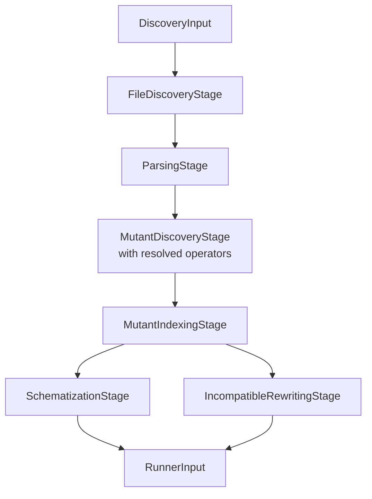
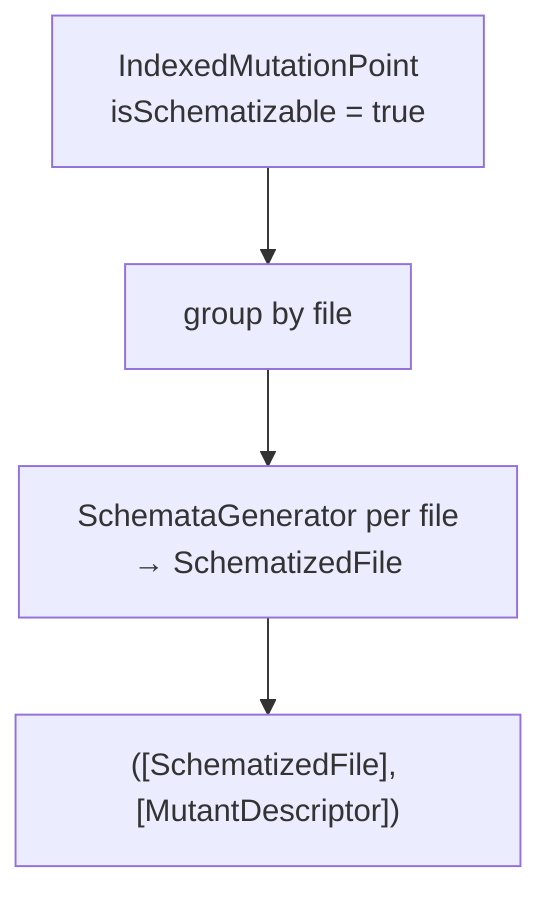

# Discovery Pipeline

← [Configuration](02-configuration.md) | Next: [Mutation Operators →](04-mutation-operators.md)

---

## Discovery/DiscoveryPipeline.swift

```swift
struct DiscoveryPipeline: Sendable {
    static let allOperatorNames: [String]
    func run(input: DiscoveryInput) async throws -> RunnerInput
}
```

Entry point for the discovery phase. Runs six stages sequentially and assembles the `RunnerInput` for the execution pipeline.



`allOperatorNames` is the ordered list of all registered operator identifiers. `ConfigurationFileWriter` uses it to populate the operators section of the generated YAML.

**Operator registry** (registration order is fixed):

| Index | Identifier |
|---|---|
| 0 | `RelationalOperatorReplacement` |
| 1 | `BooleanLiteralReplacement` |
| 2 | `LogicalOperatorReplacement` |
| 3 | `ArithmeticOperatorReplacement` |
| 4 | `NegateConditional` |
| 5 | `SwapTernary` |
| 6 | `RemoveSideEffects` |

When `input.operators` is empty, all seven operators are active. Otherwise only the listed identifiers are used.

---

## Discovery/Pipeline/DiscoveryInput.swift

```swift
struct DiscoveryInput: Sendable {
    let projectPath: String
    let projectType: ProjectType
    let timeout: Double
    let concurrency: Int
    let noCache: Bool
    let sourcesPath: String
    let excludePatterns: [String]
    let operators: [String]
}
```

| Field | Description |
|---|---|
| `projectPath` | Absolute path to the project root (Xcode or SPM) |
| `projectType` | `ProjectType` — `.xcode(scheme:destination:)` or `.spm` |
| `timeout` | Per-mutant test timeout in seconds |
| `concurrency` | Number of parallel test workers |
| `noCache` | Disable result cache |
| `sourcesPath` | Root directory for Swift source file collection |
| `excludePatterns` | Glob patterns for files to skip |
| `operators` | Active operator identifiers (empty = all) |

---

## Discovery/Pipeline/FileDiscoveryStage.swift

```swift
struct FileDiscoveryStage: Sendable {
    func run(input: DiscoveryInput) throws -> [SourceFile]
}
```

Recursively enumerates the directory tree under `input.sourcesPath` using `FileManager.enumerator`. Returns one `SourceFile` per discovered `.swift` file.

**Fixed exclusions** (applied regardless of `excludePatterns`):

`/Tests/`, `/Specs/`, `Mock.swift`, `Stub.swift`, `Fake.swift`, `/.build/`, `DerivedData`, `/.xmr-`, `Pods/`, `Carthage/`, `vendor/`, `Generated/`

Files matching any `excludePatterns` glob pattern are also excluded.

Throws `FileDiscoveryError.sourcesPathNotFound` if `sourcesPath` does not exist.

---

## Discovery/Pipeline/FileDiscoveryError.swift

```swift
enum FileDiscoveryError: Error, Sendable {
    case sourcesPathNotFound(String)
}
```

| Case | Payload | Condition |
|---|---|---|
| `sourcesPathNotFound` | `String` — the missing path | `sourcesPath` directory does not exist |

---

## Discovery/Pipeline/ParsingStage.swift

```swift
struct ParsingStage: Sendable {
    func run(sourceFiles: [SourceFile]) async -> [ParsedSource]
}
```

Parses each `SourceFile` into a SwiftSyntax AST using `withTaskGroup` for concurrency. Files that fail to parse are silently dropped. The output array contains only successfully parsed files.

---

## Discovery/Pipeline/MutantDiscoveryStage.swift

```swift
struct MutantDiscoveryStage: Sendable {
    init(operators: [any MutationOperator])
    func run(sources: [ParsedSource]) async -> [MutationPoint]
}
```

Applies all active operators concurrently across sources via `withTaskGroup`. For each source:

1. Extracts suppressed ranges via `SuppressionAnnotationExtractor`
2. Collects mutation points from every operator
3. Removes suppressed points via `SuppressionFilter`

Results are sorted by `filePath` then `utf8Offset`.

---

## Discovery/Pipeline/MutantIndexingStage.swift

```swift
struct MutantIndexingStage: Sendable {
    func run(mutationPoints: [MutationPoint], sources: [ParsedSource]) -> [IndexedMutationPoint]
}
```

Assigns a globally unique sequential index to each mutation point (sorted by file path, then UTF-8 offset) and classifies them as schematizable or incompatible using `TypeScopeVisitor`. The index becomes the mutant ID suffix in `"swift-mutation-testing_<index>"`.

---

## Discovery/Pipeline/IndexedMutationPoint.swift

```swift
struct IndexedMutationPoint: Sendable {
    let point: MutationPoint
    let id: String
    let isSchematizable: Bool
}
```

| Field | Description |
|---|---|
| `point` | The original mutation point |
| `id` | `"swift-mutation-testing_<index>"` — unique per run |
| `isSchematizable` | `true` if the mutation falls inside a function body (determined by `TypeScopeVisitor`) |

---

## Discovery/Pipeline/SchematizationStage.swift

```swift
struct SchematizationStage: Sendable {
    static let supportFileContent: String
    func run(indexed: [IndexedMutationPoint], sources: [ParsedSource]) -> ([SchematizedFile], [MutantDescriptor])
}
```

Embeds all schematizable mutations into the source files via `SchemataGenerator`. Returns a tuple of schematized files and schematizable mutant descriptors.



The static `supportFileContent` declares `__swiftMutationTestingID` as a computed property reading from `ProcessInfo.processInfo.environment["__SWIFT_MUTATION_TESTING_ACTIVE"]`.

---

## Discovery/Pipeline/IncompatibleRewritingStage.swift

```swift
struct IncompatibleRewritingStage: Sendable {
    func run(indexed: [IndexedMutationPoint], sources: [ParsedSource]) -> [MutantDescriptor]
}
```

Produces full-file rewrites for mutants that cannot be schematized. Each incompatible mutation point is applied to the source via `MutationRewriter`, producing a complete replacement source file stored in `MutantDescriptor.mutatedSourceContent`.

---

## Discovery/Pipeline/SourceFile.swift

```swift
struct SourceFile: Sendable {
    let path: String
    let content: String
}
```

| Field | Description |
|---|---|
| `path` | Absolute path to the `.swift` file |
| `content` | Raw UTF-8 source text |

---

## Discovery/Pipeline/ParsedSource.swift

```swift
struct ParsedSource: Sendable {
    let file: SourceFile
    let syntax: SourceFileSyntax
}
```

| Field | Description |
|---|---|
| `file` | The source file with its raw text |
| `syntax` | SwiftSyntax AST root node |

---

## Discovery/Pipeline/MutationPoint.swift

```swift
struct MutationPoint: Sendable {
    let filePath: String
    let line: Int
    let column: Int
    let utf8Offset: Int
    let originalText: String
    let mutatedText: String
    let operatorIdentifier: String
    let replacement: ReplacementKind
    var description: String { get }
}
```

Represents a single applicable mutation before schematization.

| Field | Description |
|---|---|
| `filePath` | Absolute path to the source file |
| `line` | 1-based line number |
| `column` | 1-based column number |
| `utf8Offset` | Byte offset in UTF-8 encoded content |
| `originalText` | Token(s) before mutation |
| `mutatedText` | Token(s) after mutation |
| `operatorIdentifier` | Name of the operator that produced this point |
| `replacement` | Structural kind of the replacement |
| `description` | Computed: `"\(originalText) → \(mutatedText)"` |

---

## Discovery/Pipeline/MutantDescriptor.swift

```swift
struct MutantDescriptor: Sendable, Codable {
    let id: String
    let filePath: String
    let line: Int
    let column: Int
    let utf8Offset: Int
    let originalText: String
    let mutatedText: String
    let operatorIdentifier: String
    let replacementKind: ReplacementKind
    let description: String
    let isSchematizable: Bool
    let mutatedSourceContent: String?
}
```

The canonical representation of a mutant carried through the execution pipeline and into reports.

| Field | Description |
|---|---|
| `id` | `"swift-mutation-testing_<index>"` — unique per run |
| `isSchematizable` | `true` if the mutation falls inside a function body |
| `mutatedSourceContent` | Complete source file with the mutation applied; `nil` for schematizable mutants |

All position fields (`line`, `column`, `utf8Offset`) match those in the originating `MutationPoint`.

---

← [Configuration](02-configuration.md) | Next: [Mutation Operators →](04-mutation-operators.md)
