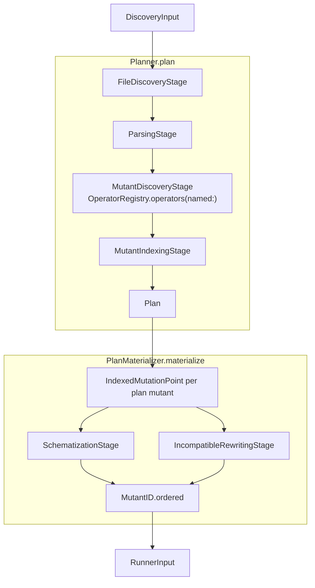
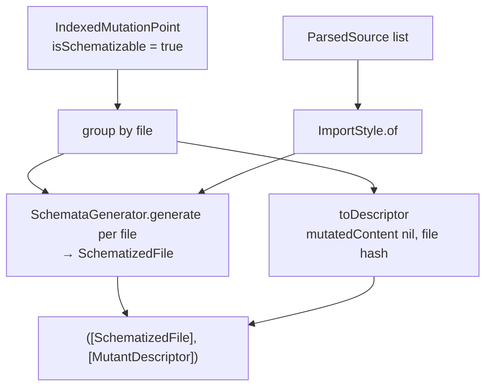

# Discovery Pipeline

← [Configuration](02-configuration.md) | Next: [Mutation Operators →](04-mutation-operators.md)

---

## Discovery/DiscoveryPipeline.swift

```swift
struct DiscoveryPipeline: Sendable {
    func run(input: DiscoveryInput) async throws -> RunnerInput
}
```

The discovery phase in one call. `run` is `Planner.plan` followed by `PlanMaterializer.materialize` on the sources the planner just parsed: the six stages below, with a `Plan` in the middle (see [11 — Plans](11-plans.md)). The commands call the two halves themselves — `RunCommand` through `Planner.plan(for:)`, `run --plan` from a plan read from disk — so every flow shares one materialization; `DiscoveryPipeline` is what the tests drive.


```mermaid
flowchart TD
    subgraph PLANNER["Planner.plan"]
        FD[FileDiscoveryStage] --> PA[ParsingStage]
        PA --> MD["MutantDiscoveryStage\nOperatorRegistry.operators(named:)"]
        MD --> MI[MutantIndexingStage]
        MI --> PL[Plan]
    end
    subgraph MATERIALIZER["PlanMaterializer.materialize"]
        PL --> IX[IndexedMutationPoint per plan mutant]
        IX --> SC[SchematizationStage]
        IX --> IR[IncompatibleRewritingStage]
        SC & IR --> ORD["MutantID.ordered"]
    end
    IN[DiscoveryInput] --> FD
    ORD --> OUT[RunnerInput]
```

---

## Discovery/OperatorRegistry.swift

```swift
enum OperatorRegistry {
    static let allOperatorNames: [String]
    static let loopRiskyNames: Set<String>
    static func operatorNames(upTo tier: OperatorTier) -> [String]
    static func operators(named identifiers: [String]) -> [any MutationOperator]
    static func mutationOperator(named identifier: String) -> (any MutationOperator)?
}
```

Every mutation operator, in the order discovery runs them, with the tier it belongs to. The names are the operators' own `identifier`s, so the registry holds no second copy of them.

`allOperatorNames` is the ordered list of all registered operator identifiers. `ConfigurationFileWriter` uses it to populate the operators section of the generated YAML, and `Planner` and `BaselineScope` record it when the operator list is empty. `operatorNames(upTo:)` is the same list cut at a tier: the identifiers whose `OperatorTier` is at most the given one, in registry order. `loopRiskyNames` is the set of operators whose `isLoopRisky` is `true`, the default `InfiniteLoopFilter` leaves out of loop bodies. `operators(named:)` returns the operators to run, in registry order — every one for an empty list — and `mutationOperator(named:)` the one with an identifier — `SarifRuleCatalog` reads each rule's name and description from it.

**Operator registry** (registration order is fixed; the tier comes from the campaign in `Docs/OPERATORS.md`):

| Index | Identifier | Tier |
|---|---|---|
| 0 | `RelationalOperatorReplacement` | `experimental` |
| 1 | `BooleanLiteralReplacement` | `experimental` |
| 2 | `LogicalOperatorReplacement` | `conservative` |
| 3 | `ArithmeticOperatorReplacement` | `experimental` |
| 4 | `NegateConditional` | `conservative` |
| 5 | `SwapTernary` | `conservative` |
| 6 | `RemoveSideEffects` | `experimental` |

When `input.operators` is empty, all seven operators are active; a run resolved through `ConfigurationResolver` gets the `default` tier's three unless told otherwise. Otherwise only the listed identifiers are used. `ConfigurationResolver` always passes the full list, so the empty case is for callers that build a `DiscoveryInput` by hand.

---

## Discovery/OperatorTier.swift

```swift
enum OperatorTier: String, Sendable, CaseIterable, Comparable {
    case conservative
    case standard = "default"
    case experimental

    static let usage: String
}
```

The three tiers, ordered: `conservative < standard < experimental`. The middle one is `default` to users (`--operator-tier default`); the case is `standard` in Swift, where `default` is a keyword. A tier selects the operators up to it, so `conservative` is the smallest set and `experimental` holds every operator. `usage` is the `UsageError` message for a name that is no tier.

---

## Discovery/Pipeline/DiscoveryInput.swift

```swift
struct DiscoveryInput: Sendable {
    let projectPath: String
    let projectType: ProjectType
    let timeout: Double
    let concurrency: Int
    let noCache: Bool
    let sourcesPath: String
    let excludePatterns: [String]
    let operators: [String]
}
```

| Field | Description |
|---|---|
| `projectPath` | Absolute path to the project root (Xcode or SPM) |
| `projectType` | `ProjectType` — `.xcode(scheme:destination:)` or `.spm` |
| `timeout` | Per-mutant test timeout in seconds |
| `concurrency` | Number of parallel test workers |
| `noCache` | Disable result cache |
| `sourcesPath` | Root directory for Swift source file collection |
| `excludePatterns` | Globs or path fragments of files to skip (`ExcludePattern`) |
| `operators` | Active operator identifiers (empty = all) |

---

## Discovery/Pipeline/FileDiscoveryStage.swift

```swift
struct FileDiscoveryStage: Sendable {
    func run(input: DiscoveryInput) throws -> [SourceFile]
}
```

Recursively enumerates the directory tree under `input.sourcesPath` using `FileManager.enumerator`, skipping hidden files. Returns one `SourceFile` per discovered `.swift` file that reads as UTF-8; one that does not is skipped. When `sourcesPath` is a `.swift` file, it is the only one discovered, under the same exclusions, with its canonical path (`CanonicalPath`, the form the enumerator yields); any other file is refused.

**Fixed exclusions** (applied regardless of `excludePatterns`; the three ending in `.swift` match the end of the path, the others anywhere in it):

`/Tests/`, `/Mocks/`, `/Stubs/`, `/Fakes/`, `/TestHelpers/`, `/TestSupport/`, `Tests.swift`, `Mock.swift`, `Spec.swift`, `/.build/`, `/.swift-mutation-testing-derived-data/`, the cache directory (`/<CacheStore.directoryName>/`, `/.swift-mutation-testing-cache/`), `/DerivedData/`, the package manifests `/Package.swift` and `/Package@swift-` — a manifest is build configuration, not product code, and a mutation in it changes the build of every mutant — and `/Snippets/`, SwiftPM's directory for documentation snippets, which no test runs

Files matching any of `excludePatterns` are also excluded, through `ExcludePattern.matches` (below).

Throws `FileDiscoveryError.sourcesPathNotFound` if `sourcesPath` does not exist, and `.sourcesPathNotSwift` if it is a file that is not Swift.

---

## Discovery/Pipeline/ExcludePattern.swift

```swift
enum ExcludePattern {
    static func matches(_ pattern: String, path: String, projectPath: String) -> Bool
    static func isGlob(_ pattern: String) -> Bool
}
```

How an `--exclude` or `exclude` pattern matches a file. `isGlob` is true for a pattern with `*`, `?` or `[`; such a pattern is matched with `fnmatch(3)` without `FNM_PATHNAME` (so `*` and `**` cross directories) against the path relative to the project root (`ProjectRelativePath.make`), that path with a leading `/`, and the absolute path — any one matching is enough. Any other pattern is a fragment the absolute path must contain. Before, every pattern was a fragment, so the documented globs (`**/Generated/**`) matched nothing.

---

## Discovery/Pipeline/FileDiscoveryError.swift

```swift
enum FileDiscoveryError: Error, Equatable, Sendable, LocalizedError {
    case sourcesPathNotFound(String)
    case sourcesPathNotSwift(String)
    case noMutants(sourcesPath: String)
}
```

| Case | Payload | Condition |
|---|---|---|
| `sourcesPathNotFound` | `String` — the missing path | `sourcesPath` does not exist |
| `sourcesPathNotSwift` | `String` — the path | `sourcesPath` is a file but not a `.swift` file |
| `noMutants` | the sources path | discovery found no mutant (built with `noMutants(for:)` from a configuration, [01 — Entry Point](01-entry-point.md#clicommandsupportswift)); thrown by the entry point for `run` (but not for a shard of a plan, which may be empty) and for `plan`, so that a run over nothing ends with exit code 1 instead of a 100% score |

---

## Discovery/Pipeline/ParsingStage.swift

```swift
struct ParsingStage: Sendable {
    func run(sourceFiles: [SourceFile]) async -> [ParsedSource]
}
```

Parses each `SourceFile` into a SwiftSyntax AST with `Parser.parse(source:)`, one child task per file in a `withTaskGroup`, and wraps it in a `ParsedSource`. The parser recovers from any input, so every file comes back — a file with syntax errors has missing or unexpected nodes rather than no tree. The results arrive in completion order, not input order; every later stage looks sources up by path.

---

## Discovery/Pipeline/MutantDiscoveryStage.swift

```swift
struct MutantDiscoveryStage: Sendable {
    static let standardExclusions: [any MutationExclusion]  // SuppressionFilter, InfiniteLoopFilter, InactiveRegionFilter

    let operators: [any MutationOperator]
    let exclusions: [any MutationExclusion]

    init(operators: [any MutationOperator], exclusions: [any MutationExclusion] = Self.standardExclusions)
    func run(sources: [ParsedSource]) async -> [MutationPoint]
}
```

Applies all active operators concurrently across sources via `withTaskGroup`, one child task per source. For each source:

1. Collects mutation points from every operator, `mutations(in:)`
2. Hands them to each exclusion in turn — through `filter(_:in:)` with the whole `ParsedSource`, so `SuppressionFilter` reuses the file's converter — which drops the points inside its ranges: by default the suppressed declarations (`SuppressionFilter`), then the `while`/`repeat` bodies for loop-risky operators (`InfiniteLoopFilter`), then the `#if` clauses the host build leaves out (`InactiveRegionFilter`)

A test can give the stage exclusions of its own.

Results are sorted by `filePath` then `utf8Offset` (`MutationPoint.inSourceOrder`).

---

## Discovery/Pipeline/MutantIndexingStage.swift

```swift
struct MutantIndexingStage: Sendable {
    func run(mutationPoints: [MutationPoint], sources: [ParsedSource], projectPath: String) -> [IndexedMutationPoint]
}
```

Assigns a globally unique sequential index to each mutation point (sorted by file path, then UTF-8 offset, with `MutationPoint.inSourceOrder` — the order `MutantDiscoveryStage` already returns them in, so the stage checks the order in one pass and sorts only points that come out of it) and classifies them as schematizable or incompatible with the file's `functionScopes` (`FunctionBodyScopes.isSchematizable(utf8Offset:)`; a point of a file not among the sources is incompatible). The index becomes the mutant ID, `MutantID.make(index:)`.

It also computes each mutant's `MutantFingerprint`, from the path relative to the project — one `ProjectRelativePath.Resolver` for the whole run, so the project root's symlinks are resolved once — and the `DeclarationPath` at the offset. The index is renumbered by any mutant added earlier in any file, so it cannot identify a mutant across runs of different code; the fingerprint can. Among mutants that share a file, declaration, operator and change, the ordinal is their position in offset order.

---

## Discovery/Pipeline/MutantID.swift

```swift
enum MutantID {
    static let prefix = "swift-mutation-testing_"
    static func make(index: Int) -> String
    static func index(of id: String) -> Int?
    static func ordered<Item>(_ items: [Item], by id: (Item) -> String) -> [Item]
}
```

The one owner of the mutant id format, `swift-mutation-testing_<index>`: the id a mutant carries in reports, schemata and the environment that activates it. `make(index:)` builds it (`IndexedMutationPoint`, `SchemataGenerator`, `PlanMaterializer`, `Reproducer`); `index(of:)` reads the position back, `nil` for a string that is not a mutant id (`Reproducer`, `SchemaNarrower`); `ordered(_:by:)` sorts items by their mutants' positions, reading each id once, an id that names no position sorting first (`PlanMaterializer`, `RunCommand`).

---

## Discovery/Pipeline/MutationExclusion.swift

```swift
protocol MutationExclusion: Sendable {
    func ranges(in syntax: SourceFileSyntax) -> [Range<AbsolutePosition>]
    func ranges(in source: ParsedSource) -> [Range<AbsolutePosition>]
    func applies(to point: MutationPoint) -> Bool  // default: true
}

extension MutationExclusion {
    func filter(_ mutationPoints: [MutationPoint], excluding ranges: [Range<AbsolutePosition>]) -> [MutationPoint]
    func filter(_ mutationPoints: [MutationPoint], in source: ParsedSource) -> [MutationPoint]
}
```

A part of the source where some mutations must not be made. `ranges(in:)` finds the ranges — from the syntax alone, or from the whole `ParsedSource` when the exclusion can use what it carries, a form that defaults to the first; both are requirements, so an exclusion that overrides the `ParsedSource` form is dispatched to it. `filter(_:in:)` reads the `ParsedSource` form, which `SuppressionFilter` overrides to pass the file's `locationConverter` on; `applies(to:)` says whether a point inside them is left out — every one is, unless the exclusion narrows it. The shared `filter` keeps a point when the exclusion does not apply to it or its `utf8Offset` lies in no range, and returns the points untouched when there are no ranges. `SuppressionFilter`, `InfiniteLoopFilter` and `InactiveRegionFilter` conform — see [04 — Mutation Operators](04-mutation-operators.md).

---

## Discovery/Pipeline/DeclarationPath.swift

```swift
enum DeclarationPath {
    static let topLevel: String  // "<top-level>"
    static func of(utf8Offset: Int, in syntax: SourceFileSyntax) -> String
}
```

Names the declarations that enclose an offset, outermost first, joined with `.`: `Parser.parse(_:strict:)`, `Foo.init(bar:)`, `S.flag.get`, `Outer.Inner.f()`, `Array.f()` for an extension. It walks up from the token at the offset through its ancestors, naming functions (with their argument labels), initializers, subscripts, `deinit`, accessors, variables, and the types and extensions around them. Closures are transparent: a mutant inside a closure belongs to the function that contains it. A mutant in no declaration is `<top-level>`.

---

## Discovery/Pipeline/MutantFingerprint.swift

```swift
enum MutantFingerprint {
    static func make(relativePath: String, declarationPath: String, mutation: MutationPoint, ordinal: Int) -> String
}
```

SHA-256 of the file path relative to the project, the declaration path, the operator, the original and mutated text, and the ordinal, truncated to 16 bytes and written as 32 hexadecimal characters.

| Change | Fingerprint |
|---|---|
| Lines inserted above, another declaration edited, the project cloned elsewhere | unchanged |
| The function or file renamed, the mutated expression edited | new — the mutant is reviewed as new |

The quality gate compares baselines by fingerprint ([10 — Quality Gate](10-quality-gate.md)), and `JsonReporter` writes it to each mutant.

---

## Discovery/Pipeline/IndexedMutationPoint.swift

```swift
struct IndexedMutationPoint: Sendable {
    let index: Int
    let mutation: MutationPoint
    let isSchematizable: Bool
    let fingerprint: String

    var mutantID: String { get }
    func toDescriptor(mutatedContent: String?, sourceContentHash: String) -> MutantDescriptor
}
```

| Field | Description |
|---|---|
| `index` | Position in the run's ordering, assigned by `MutantIndexingStage` |
| `mutation` | The original mutation point |
| `mutantID` | `MutantID.make(index:)`, `"swift-mutation-testing_<index>"` — unique per run, and the value `__swiftMutationTestingID_<hash>` is compared against in the schema |
| `isSchematizable` | `true` if the mutation falls inside a function body (`ParsedSource.functionScopes`, collected by `TypeScopeVisitor`) |
| `fingerprint` | The mutant's `MutantFingerprint`, stable across runs |

---

## Discovery/Pipeline/SchematizationStage.swift

```swift
struct SchematizationStage: Sendable {
    func run(indexed: [IndexedMutationPoint], sources: [ParsedSource]) -> ([SchematizedFile], [MutantDescriptor])
}
```

Embeds all schematizable mutations into the source files via `SchemataGenerator`. Returns a tuple of schematized files and schematizable mutant descriptors. The `ImportStyle` is decided once for all the sources, and each file's descriptors carry its `MutantCacheKey.hash`.


```mermaid
flowchart TD
    IP["IndexedMutationPoint\nisSchematizable = true"] --> GROUP[group by file]
    SRC[ParsedSource list] --> IS["ImportStyle.of"]
    GROUP --> SCHEMA["SchemataGenerator.generate per file\n→ SchematizedFile"]
    IS --> SCHEMA
    GROUP --> DESC["toDescriptor\nmutatedContent nil, file hash"]
    SCHEMA & DESC --> RESULT["([SchematizedFile], [MutantDescriptor])"]
```

Every schematized file ends with `SupportDeclarations.perFile(for:)`, its own `__swiftMutationTestingID_<hash>`, appended by `SchemataGenerator` through `SupportDeclarations.appended(to:path:syntax:style:)` — see [05 — Schematization](05-schematization.md).

---

## Discovery/Pipeline/IncompatibleRewritingStage.swift

```swift
struct IncompatibleRewritingStage: Sendable {
    func run(indexed: [IndexedMutationPoint], sources: [ParsedSource]) -> [MutantDescriptor]
}
```

Produces full-file rewrites for mutants that cannot be schematized. Each incompatible mutation point is applied to the source via `MutationRewriter`, producing a complete replacement source file stored in `MutantDescriptor.mutatedSourceContent`. A file's content hash is computed once, for its first incompatible mutant; a point whose file is not among the sources is dropped.

---

## Discovery/Pipeline/SourceFile.swift

```swift
struct SourceFile: Sendable {
    let path: String
    let content: String
}
```

| Field | Description |
|---|---|
| `path` | Absolute path to the `.swift` file |
| `content` | Raw UTF-8 source text |

---

## Discovery/Pipeline/ParsedSource.swift

```swift
struct ParsedSource: Sendable {
    let file: SourceFile
    let syntax: SourceFileSyntax
    let locationConverter: SourceLocationConverter
    let functionScopes: FunctionBodyScopes
    init(file: SourceFile, syntax: SourceFileSyntax)
}
```

| Field | Description |
|---|---|
| `file` | The source file with its raw text |
| `syntax` | SwiftSyntax AST root node |
| `locationConverter` | The file's offset-to-line converter, named after its path |
| `functionScopes` | Every function, initializer, deinitializer and accessor body (`TypeScopeVisitor`), as `FunctionBodyScopes` — see [05 — Schematization](05-schematization.md#discoveryschematizationtypescopevisitorswift) |

`init` builds the last two once per file. Each of the seven operator visitors used to build its own `SourceLocationConverter` over the whole file, and the suppression filter an eighth; `MutantIndexingStage` and `SchemataGenerator` each walked the file again with `TypeScopeVisitor`. They all read these now. The seven operators still walk the file once each.

---

## Discovery/Pipeline/MutationPoint.swift

```swift
struct MutationPoint: Sendable {
    let operatorIdentifier: String
    let filePath: String
    let line: Int
    let column: Int
    let utf8Offset: Int
    let originalText: String
    let mutatedText: String
    let replacement: ReplacementKind
    let description: String

    static func inSourceOrder(_ lhs: MutationPoint, _ rhs: MutationPoint) -> Bool
}
```

Represents a single applicable mutation before schematization. `inSourceOrder` orders by `filePath`, then `utf8Offset` — the one ordering `MutantDiscoveryStage` sorts by and `MutantIndexingStage` checks.

| Field | Description |
|---|---|
| `filePath` | Absolute path to the source file |
| `line` | 1-based line number |
| `column` | 1-based column number |
| `utf8Offset` | Byte offset in UTF-8 encoded content |
| `originalText` | Token(s) before mutation |
| `mutatedText` | Token(s) after mutation |
| `operatorIdentifier` | Name of the operator that produced this point |
| `replacement` | Structural kind of the replacement |
| `description` | Written by the visitor: `"<original> → <mutated>"` for most operators, `remove <callee>()` and `swap ternary branches` for the other two; a plan stores it and `PlanMaterializer` passes it back |

---

## Discovery/Pipeline/MutantDescriptor.swift

```swift
struct MutantDescriptor: Sendable, Codable {
    let id: String
    let filePath: String
    let line: Int
    let column: Int
    let utf8Offset: Int
    let originalText: String
    let mutatedText: String
    let operatorIdentifier: String
    let replacementKind: ReplacementKind
    let description: String
    let isSchematizable: Bool
    var mutatedSourceContent: String?
    let sourceContentHash: String
    let fingerprint: String
}
```

The canonical representation of a mutant carried through the execution pipeline and into reports.

| Field | Description |
|---|---|
| `id` | `"swift-mutation-testing_<index>"` — unique per run |
| `isSchematizable` | `true` if the mutation falls inside a function body |
| `mutatedSourceContent` | Complete source file with the mutation applied; `nil` for schematizable mutants. A `var`, so the executor's fallback can hand a schematizable mutant its rewritten file on a copy |
| `fingerprint` | Stable identity across runs — see `MutantFingerprint` |

All position fields (`line`, `column`, `utf8Offset`) match those in the originating `MutationPoint`.

---

← [Configuration](02-configuration.md) | Next: [Mutation Operators →](04-mutation-operators.md)
