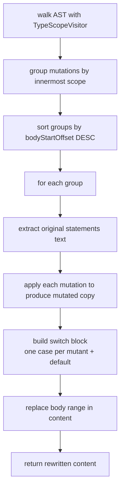

# Schematization

← [Mutation Operators](04-mutation-operators.md) | Next: [Sandbox & Build →](06-sandbox-build.md)

---

## Discovery/Schematization/SchemataGenerator.swift

```swift
struct SchemataGenerator: Sendable {
    func generate(source: ParsedSource, mutations: [(index: Int, point: MutationPoint)]) -> String
}
```

Rewrites a source file to embed all its schematizable mutations into `switch __swiftMutationTestingID` blocks. Returns the complete rewritten source as a `String`.



Groups are processed in reverse `bodyStartOffset` order so that earlier replacements do not invalidate the byte offsets of later ones.

**Generated switch structure:**

```swift
{
switch __swiftMutationTestingID {
case "swift-mutation-testing_<n>":
    <mutated statements>
default:
    <original statements>
}
}
```

Mutant IDs follow `"swift-mutation-testing_<index>"` where `index` is the global sequential index assigned by `SchematizationStage`.

---

## Discovery/Schematization/MutationRewriter.swift

```swift
struct MutationRewriter: Sendable {
    func rewrite(source content: String, applying mutation: MutationPoint) -> String
}
```

Applies a single mutation to a complete source file via raw UTF-8 byte replacement. Used exclusively for incompatible mutants.

Converts the source content to `Data`, replaces the subrange `utf8Offset ..< utf8Offset + originalText.utf8.count` with `mutatedText.data(using: .utf8)`, and converts back to `String`.

---

## Discovery/Schematization/TypeScopeVisitor.swift

```swift
final class TypeScopeVisitor: SyntaxVisitor {
    func isSchematizable(utf8Offset: Int) -> Bool
    func innermostScope(containing utf8Offset: Int) -> FunctionBodyScope?
}
```

Walks the AST and records every `FunctionBodyScope`. Records scopes for:

- `FunctionDeclSyntax`
- `InitializerDeclSyntax`
- `DeinitializerDeclSyntax`
- `AccessorDeclSyntax`

`isSchematizable(utf8Offset:)` returns `true` if any recorded scope contains the given offset.

`innermostScope(containing:)` returns the tightest scope that contains the offset, enabling correct handling of nested functions and closures.

---

## Discovery/Schematization/FunctionBodyScope.swift

```swift
struct FunctionBodyScope: Sendable {
    let bodyStartOffset: Int
    let bodyEndOffset: Int
    let statementsStartOffset: Int
    let statementsEndOffset: Int
}
```

UTF-8 byte offsets describing one function body.

| Field | Description |
|---|---|
| `bodyStartOffset` | Byte offset of the opening `{` |
| `bodyEndOffset` | Byte offset immediately after the closing `}` |
| `statementsStartOffset` | Byte offset of the first statement |
| `statementsEndOffset` | Byte offset immediately after the last statement |

---

## Discovery/Schematization/SchematizedFile.swift

```swift
struct SchematizedFile: Sendable, Codable {
    let originalPath: String
    let schematizedContent: String
}
```

| Field | Description |
|---|---|
| `originalPath` | Absolute path of the original source file |
| `schematizedContent` | Source text with all schematizable mutations embedded |

`schematizedContent` never contains the `__swiftMutationTestingID` global declaration. That declaration is injected separately by `SandboxFactory` via `__SMTSupport.swift`.

---

← [Mutation Operators](04-mutation-operators.md) | Next: [Sandbox & Build →](06-sandbox-build.md)
