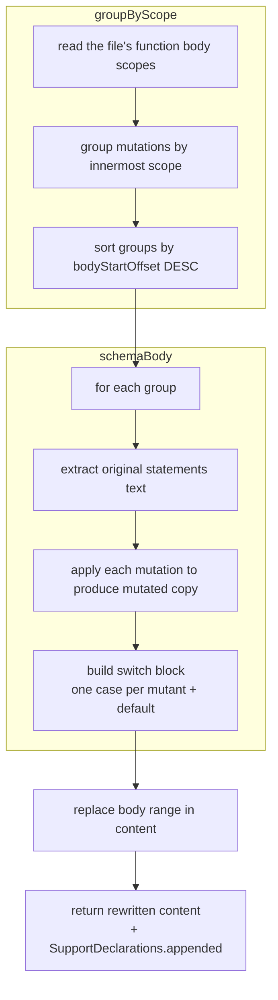

# Schematization

← [Mutation Operators](04-mutation-operators.md) | Next: [Sandbox & Build →](06-sandbox-build.md)

---

## Discovery/Schematization/SchemataGenerator.swift

```swift
struct SchemataGenerator: Sendable {
    func generate(
        source: ParsedSource, mutations: [(index: Int, point: MutationPoint)], importStyle: ImportStyle = .implicit
    ) -> SchemaGeneration

    private func groupByScope(_ mutations: [Entry], in scopes: FunctionBodyScopes)
        -> (groups: [ScopeGroup], discarded: [MutationPoint])
    private func schemaBody(for group: ScopeGroup, in bytes: [UInt8], edits: Edits, path: String)
        -> (switchBody: String?, discarded: [MutationPoint])

    struct Edits {
        var isEmpty: Bool { get }
        func current(_ originalOffset: Int) -> Int
        mutating func record(start: Int, delta: Int)
    }
}

struct SchemaGeneration: Sendable {
    let content: String
    let discarded: [MutationPoint]
}
```

Rewrites a source file to embed all its schematizable mutations into `switch __swiftMutationTestingID_<hash>` blocks, the hash naming the file. Returns the complete rewritten source as `content`, and as `discarded` the mutations it could not place: a point inside no function body, a body whose statements could not be extracted, or a mutation whose text does not fit inside the body it belongs to. A discarded mutation gets no `case`, so `ApplicationVerifier` finds it missing from the sandbox and stops the run rather than letting a mutant that is not in the build be judged. Every byte splice goes through `UTF8Splice`, which answers `nil` instead of trapping when a range falls outside the text or cuts through a character; a `nil` read or mutation is a discarded mutation, and a body whose replacement fails is left as it was.

`generate` is two steps. `groupByScope` takes the file's `functionScopes` from its `ParsedSource`, groups the mutations by the innermost function body holding each — last body in the file first — and discards the ones no body holds. The whole file is one `[UInt8]` for the length of `generate`, decoded once at the end: each body's statements are read from it and each `switch` spliced into it in place, where every group used to encode the whole text to bytes and decode it back, twice. `Edits` maps an offset of the original file to the buffer: the bodies are rewritten from the last one back, so an edit only moves the offsets after its start, and since the edits are recorded with decreasing starts, `current` finds the ones before an offset by binary search over their running totals rather than filtering all of them. An edit is recorded only when its body was replaced. `schemaBody(for:in:edits:path:)` builds one body's `switch`, a case per mutation that fits, or `nil` when none does; `generate` splices each into the content and records the edit.


```mermaid
flowchart TD
    subgraph groupByScope
        A[read the file's function body scopes] --> B[group mutations by innermost scope]
        B --> C[sort groups by bodyStartOffset DESC]
    end
    C --> D[for each group]
    subgraph schemaBody
        D --> E[extract original statements text]
        E --> F[apply each mutation to produce mutated copy]
        F --> G[build switch block\none case per mutant + default]
    end
    G --> H[replace body range in content]
    H --> I[return rewritten content\n+ SupportDeclarations.appended]
```

Groups are processed in reverse `bodyStartOffset` order so that earlier replacements do not invalidate the byte offsets of later ones.

**Generated switch structure**, for a body of statements:

```swift
{
switch __swiftMutationTestingID_<hash> {
case "swift-mutation-testing_<n>":
let _ = __SwiftMutationTesting_<hash>.activated()
<mutated statements>
default:
<original statements>
}
}
```

Every `case` starts by recording that it ran (`SupportDeclarations.activationCall(for:)`). The scope's `FunctionBodyShape` decides how: a body that is one expression keeps each case a single expression, `(__SwiftMutationTesting_<hash>.activated(), <mutated expression>).1`, because such a body is an implicit return and the `switch` is then an expression; a body that is one `if` or `switch` expression in a value-returning scope gets `return` in front of every branch, `default` included. A blank mutated body — a removed sole statement — records the activation alone. The reasoning is in [Architecture — Activation Marker](../Architecture/05-schematization.md#activation-marker).

Mutant IDs are `MutantID.make(index:)`, `"swift-mutation-testing_<index>"`, where `index` is the global sequential index assigned by `MutantIndexingStage`. Scopes are rewritten innermost first, and an enclosing scope reads its statements from the content already rewritten, with its offsets shifted by the edits inside it, so a nested function keeps its own `switch` inside every branch of the enclosing one. When at least one body was rewritten, the file ends with `SupportDeclarations.perFile(for:)`, appended by `SupportDeclarations.appended(to:path:syntax:style:)`.

---

## Discovery/Schematization/MutationRewriter.swift

```swift
struct MutationRewriter: Sendable {
    func rewrite(source: String, applying mutation: MutationPoint) -> String
}
```

Applies a single mutation to a complete source file via raw UTF-8 byte replacement. Used exclusively for incompatible mutants.

Replaces the bytes `utf8Offset ..< utf8Offset + originalText.utf8.count` with `mutatedText` through `UTF8Splice.replacing`. When the splice answers `nil` — the range lies outside the source or cuts through a character — the source is returned unchanged.

---

## Discovery/Schematization/UTF8Splice.swift

```swift
enum UTF8Splice {
    static func substring(of content: String, from start: Int, to end: Int) -> String?
    static func replacing(from start: Int, to end: Int, in content: String, with replacement: String) -> String?
    static func inserting(_ text: String, at offset: Int, in content: String) -> String?
    static func isRange(from start: Int, to end: Int, in bytes: [UInt8]) -> Bool
    static func replacing(from start: Int, to end: Int, in bytes: [UInt8], with replacement: String) -> String?
}
```

Byte-range edits on a string's UTF-8 form, the unit SwiftSyntax offsets count in. Each answers `nil` when the range does not lie inside the string (`start >= 0`, `start <= end`, `end <= byteCount`) or the edit would leave bytes that are not UTF-8, and the caller decides what that means. `inserting` is `replacing` an empty range. The `[UInt8]` forms serve a caller that already holds the bytes — `SchemataGenerator` — so nothing is encoded again; `isRange` is the bounds check they share. `SchemataGenerator`, `MutationRewriter` and `ActivationInstrumenter` make every splice through it; none of them traps.

---

## Discovery/Schematization/TypeScopeVisitor.swift

```swift
final class TypeScopeVisitor: SyntaxVisitor {
    func isSchematizable(utf8Offset: Int) -> Bool
    func innermostScope(containing utf8Offset: Int) -> FunctionBodyScope?
}
```

Walks the AST and records every `FunctionBodyScope`. Records scopes for:

- `FunctionDeclSyntax`
- `InitializerDeclSyntax`
- `DeinitializerDeclSyntax`
- `AccessorDeclSyntax`

`isSchematizable(utf8Offset:)` returns `true` if any recorded scope contains the given offset.

`innermostScope(containing:)` returns the tightest scope that contains the offset, enabling correct handling of nested functions and closures.

Both delegate to `FunctionBodyScopes` (`Discovery/Schematization/FunctionBodyScopes.swift`), the `Sendable` value `functionScopes` hands out, so that the scopes of a file can be kept on its `ParsedSource` and asked without the visitor.

---

## Discovery/Schematization/FunctionBodyScope.swift

```swift
struct FunctionBodyScope: Sendable {
    let bodyStartOffset: Int
    let bodyEndOffset: Int
    let statementsStartOffset: Int
    let statementsEndOffset: Int
    var shape: FunctionBodyShape
}
```

UTF-8 byte offsets describing one function body, and its shape.

| Field | Description |
|---|---|
| `bodyStartOffset` | Byte offset of the opening `{` |
| `bodyEndOffset` | Byte offset immediately after the closing `}` |
| `statementsStartOffset` | Byte offset of the first statement |
| `statementsEndOffset` | Byte offset immediately after the last statement |
| `shape` | What the body is made of, see `FunctionBodyShape` |

---

## Discovery/Schematization/FunctionBodyShape.swift

```swift
enum FunctionBodyShape: Sendable, Equatable {
    case statements
    case expression
    case conditional(returnsValue: Bool)
}
```

| Case | Body | Recorded by `TypeScopeVisitor` when |
|---|---|---|
| `.statements` | zero, several, or one statement that is not an expression (`return x`) | anything else |
| `.expression` | exactly one expression in a body that returns a value, `{ a + b }` | the single item is an `ExprSyntax` other than `if`/`switch`, and the body is a function with a return type or a `get` accessor; a `Void` function, an `init`, a `deinit` or a setter with one expression — `{ print(1) }`, `{ self.init() }` — is `.statements`, since nothing is returned and `self.init` cannot sit inside a tuple |
| `.conditional(returnsValue:)` | exactly one `if` or `switch` *expression* | the single item is an `IfExprSyntax` or `SwitchExprSyntax` whose every branch is itself one expression (an `if` needs its `else`; a nested `if`/`switch` is checked the same way) — a `switch` whose cases `return` is a statement and the body is `.statements`; `returnsValue` is `true` for a function with a return type other than `Void`/`()` and for a `get` accessor, `false` for `init`, `deinit`, setters and observers |

`SchemataGenerator` uses the shape to place the activation call without breaking an implicit return.

---

## Discovery/Schematization/SchematizedFile.swift

```swift
struct SchematizedFile: Sendable, Codable {
    let originalPath: String
    let schematizedContent: String
}
```

| Field | Description |
|---|---|
| `originalPath` | Absolute path of the original source file |
| `schematizedContent` | Source text with all schematizable mutations embedded |

`schematizedContent` ends with `SupportDeclarations.perFile(for:)`, so the file declares the `__swiftMutationTestingID_<hash>` its schema reads. Nothing else in the sandbox declares it.

---

## Discovery/Schematization/SupportDeclarations.swift

```swift
enum SupportDeclarations {
    static func suffix(for path: String) -> String          // eight hex digits of SHA-256(path)
    static func identifier(for path: String) -> String      // "__swiftMutationTestingID_<suffix>"
    static func activationCall(for path: String) -> String  // "__SwiftMutationTesting_<suffix>.activated()"
    static func activatingCall(for path: String) -> String  // "__SwiftMutationTesting_<suffix>.activating"
    static func importLine(_ style: ImportStyle) -> String     // "import Foundation" or "internal import Foundation"
    static func appended(to content: String, path: String, syntax: SourceFileSyntax, style: ImportStyle) -> String
    static func perFile(for path: String) -> String
}
```

The block `SchemataGenerator` appends to every file it changes, named after the file by `suffix(for:)`: a `@usableFromInline internal enum` whose `nonisolated static let id` reads `__SWIFT_MUTATION_TESTING_ACTIVE` from the environment once and whose `activated()` creates the file named by `__SWIFT_MUTATION_TESTING_ACTIVATION_FILE` the first time it is called (`activationRecorded` makes every later call a bool read), and a `@usableFromInline nonisolated internal var __swiftMutationTestingID_<suffix>` that returns the id. The enum also has `activating<T>(_:)`, `@discardableResult`, which calls `activated()` and returns its argument; `ActivationInstrumenter` wraps the expressions of incompatible mutants in it. `identifier(for:)` is the name the generator writes after `switch`, `activationCall(for:)` the text of the call it writes into each `case`, and `activatingCall(for:)` the name of the wrapper. The block carries no import: `importLine(_:)` goes above it only when the file does not already import Foundation, in the project's style. `appended(to:path:syntax:style:)` does both — `content`, a blank line, the optional import and the block, and a final newline — and is the one place `SchemataGenerator` and `ActivationInstrumenter` add the trailer.

## Discovery/Schematization/ActivationInstrumenter.swift

```swift
struct ActivationInstrumenter: Sendable {
    let importStyle: ImportStyle
    func instrument(_ mutant: MutantDescriptor) -> String?
}
```

Returns the mutant's `mutatedSourceContent` with a call that records activation, followed by `SupportDeclarations.perFile(for:)` and, when the file does not import Foundation, `importLine(importStyle)` above it — both through `SupportDeclarations.appended(to:path:syntax:style:)`. The insertion and the wrapping are `UTF8Splice` edits. `IncompatibleMutantExecutor` builds this copy first.

- **An expression mutation** is wrapped whole: the file is parsed, its operators folded with `OperatorTable.standardOperators`, and from the token at `utf8Offset` the first enclosing expression that covers the whole mutated text and can stand as an argument is wrapped in `activatingCall(for:)`. An operator, an assignment, an arrow, `&x`, a type or a pattern cannot, so the search goes on to its parent; folding makes that parent the operator's own `InfixOperatorExprSyntax`, not the whole sequence. The search stops at the statement or member that holds the mutation.
- **A removed statement** (`.removeStatement`) gets `activationCall(for:)` in its place.
- **`nil`**, leaving the mutant unmeasured, when there is no content, no expression qualifies, a splice answers `nil`, or the mutation is inside an attribute, a macro expansion, an enum case (a raw value must stay a literal), or an `#if` condition.

## Discovery/Schematization/ImportStyle.swift

```swift
enum ImportStyle: String, Sendable, Equatable {
    case implicit
    case explicit

    static func of(_ sources: [ParsedSource]) -> ImportStyle
    static func of(_ syntax: SourceFileSyntax) -> ImportStyle
    static func importsFoundation(_ syntax: SourceFileSyntax) -> Bool
}
```

Whether a project puts access levels on its imports: `.explicit` when any import declaration in any source carries a modifier (`internal import`, `public import`, …), `.implicit` otherwise. `SchematizationStage` decides it once over every parsed source, `PlanMaterializer` stores it in `RunnerInput.importStyle`, and the schema retry passes it to `SchemaNarrower.regeneratedSchema`. A bare import and an `internal import` of the same module in one target are rejected as ambiguous, so the import the generator adds must match the project — see [Architecture — Per-file support declarations](../Architecture/05-schematization.md#per-file-support-declarations). It is appended only when at least one schema was written, so a file whose mutations were all skipped is returned untouched. Both `of` and `importsFoundation` read the imports at the top level of the file and inside the active clauses of `#if` blocks, nested ones included; a clause `InactiveRegionExtractor` marks inactive is skipped, and the extractor runs only for a file that has a top-level `#if`. So `internal import Foundation` inside `#if canImport(Foundation)` counts as an explicit Foundation import and the file gets no second one. Why each part is what it is: [Architecture — Per-file support declarations](../Architecture/05-schematization.md#per-file-support-declarations).

---

← [Mutation Operators](04-mutation-operators.md) | Next: [Sandbox & Build →](06-sandbox-build.md)
