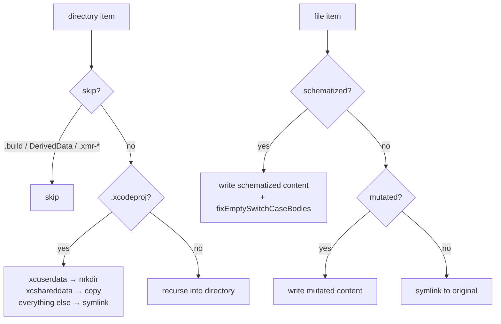

# Sandbox & Build

← [Schematization](05-schematization.md) | Next: [Execution →](07-execution.md)

---

## Sandbox/SandboxFactory.swift

```swift
struct SandboxFactory: Sendable {
    func create(
        projectPath: String,
        schematizedFiles: [SchematizedFile],
        supportFileContent: String
    ) async throws -> Sandbox

    func createClean(
        projectPath: String
    ) async throws -> Sandbox

    func create(
        projectPath: String,
        mutatedFilePath: String,
        mutatedContent: String
    ) async throws -> Sandbox
}
```

Creates an isolated copy of the project in `$TMPDIR/xmr-<UUID>/`. Supports both Xcode and SPM projects. The original project is never modified.

**Three factory methods:**

| Method | Used by | Description |
|---|---|---|
| `create(projectPath:schematizedFiles:supportFileContent:)` | `MutantExecutor` for schematizable path | Embeds all schematized files; injects support file; disables SwiftLint phases |
| `createClean(projectPath:)` | `IncompatibleMutantExecutor` for SPM shared sandbox | Clean sandbox without mutations; mutated files are written directly later |
| `create(projectPath:mutatedFilePath:mutatedContent:)` | `IncompatibleMutantExecutor` for Xcode path | Writes a single mutated file; no support file injection |

**Copy strategy:**



**Post-processing steps (schematizable overload only):**

1. `injectSupportFile` — writes `__SMTSupport.swift` to the sandbox `Sources/` directory (or appends to the first schematized file if no `Sources/` directory exists). When the destination is an Xcode target (not macOS/SPM), transforms the computed property form to a `nonisolated(unsafe)` stored variable.

2. `disableSwiftLintBuildPhases` — patches `project.pbxproj`, replacing the `shellScript` of every `PBXShellScriptBuildPhase` that contains `swiftlint` with `exit 0\n`.

3. `fixEmptySwitchCaseBodies` — post-processes each schematized file after writing. Inserts a `break` statement into any `case "..."` block immediately followed by another case or default, preventing Swift compiler errors when `RemoveSideEffects` removes the only statement in a function body.

---

## Sandbox/Sandbox.swift

```swift
struct Sandbox: Sendable {
    let rootURL: URL
    func cleanup() throws
}
```

A lightweight wrapper around the sandbox root URL.

| Field | Description |
|---|---|
| `rootURL` | Absolute URL of the `xmr-<UUID>` directory in `$TMPDIR` |

`cleanup()` removes the entire `rootURL` directory tree via `FileManager.default.removeItem(at:)`.

---

## Build/BuildStage.swift

```swift
struct BuildStage: Sendable {
    let launcher: any ProcessLaunching

    func build(
        sandbox: Sandbox,
        scheme: String,
        destination: String,
        timeout: Double
    ) async throws -> BuildArtifact

    func buildSPM(
        sandbox: Sandbox,
        timeout: Double
    ) async throws -> BuildArtifact
}
```

Runs a single build inside the sandbox.

**Xcode path (`build`):**

```mermaid
flowchart TD
    A[xcodebuild build-for-testing\n-scheme -destination\n-derivedDataPath sandbox/.xmr-derived-data] --> B{exit code?}
    B -- non-zero --> FAIL[throw BuildError.compilationFailed]
    B -- 0 --> C[search Build/Products for .xctestrun]
    C -- not found --> NFE[throw BuildError.xctestrunNotFound]
    C -- found --> D[Data(contentsOf: xctestrunURL)]
    D --> E[XCTestRunPlist(data)]
    E -- nil --> NFE2[throw BuildError.xctestrunNotFound]
    E -- plist --> F[BuildArtifact]
```

Auto-detects project format: prefers `-workspace` if a `.xcworkspace` exists, falls back to `-project` for `.xcodeproj`.

**SPM path (`buildSPM`):** Runs `swift build --build-tests` in the sandbox directory. Returns a `BuildArtifact` with the sandbox path (no `.xctestrun` needed).

Derived data is placed at `<sandbox>/.xmr-derived-data` to keep it inside the sandbox directory.

---

## Build/BuildArtifact.swift

```swift
struct BuildArtifact: Sendable {
    let derivedDataPath: String
    let xctestrunURL: URL
    let plist: XCTestRunPlist
}
```

| Field | Description |
|---|---|
| `derivedDataPath` | Path passed to `-derivedDataPath`; reused by `test-without-building` |
| `xctestrunURL` | URL of the `.xctestrun` file in `Build/Products` |
| `plist` | Parsed representation of the `.xctestrun` plist |

---

## Build/BuildError.swift

```swift
enum BuildError: Error, Equatable, LocalizedError {
    case compilationFailed(output: String)
    case xctestrunNotFound

    var errorDescription: String? { get }
}
```

Conforms to `LocalizedError` to provide structured error descriptions that propagate through generic `catch` blocks.

| Case | Condition | Handling |
|---|---|---|
| `compilationFailed(output:)` | Build exits with non-zero code | Caught by `MutantExecutor`; triggers `FallbackExecutor` |
| `xctestrunNotFound` | No `.xctestrun` in `Build/Products`, or plist parse failure | Propagates; fatal |

---

← [Schematization](05-schematization.md) | Next: [Execution →](07-execution.md)
