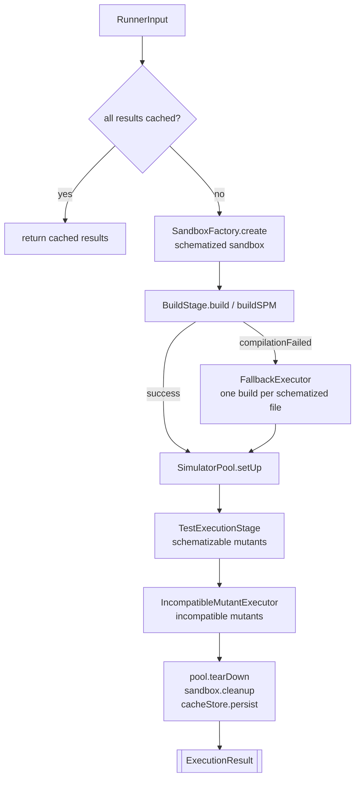
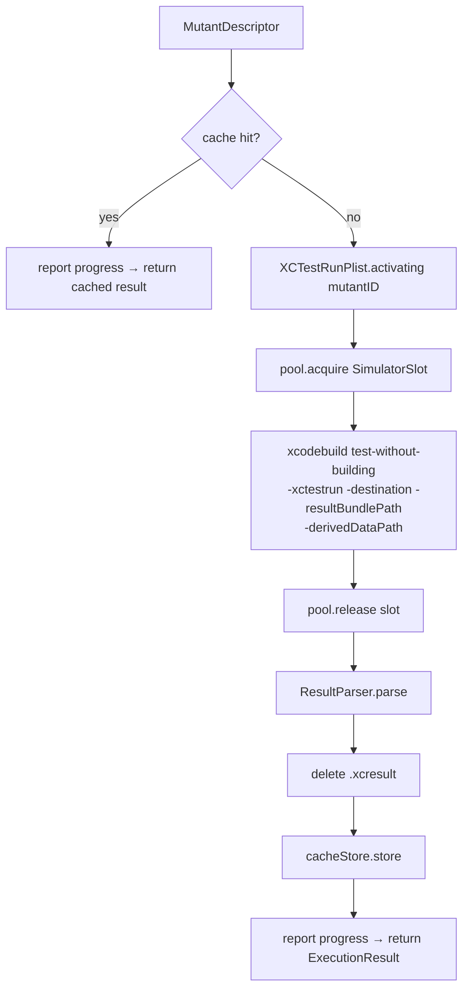
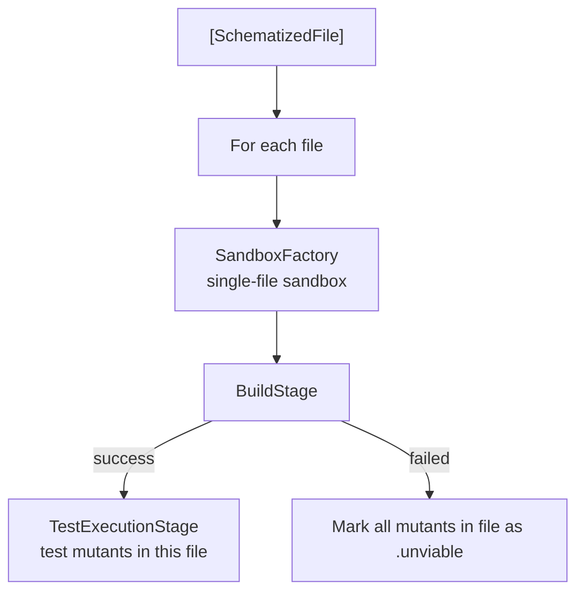
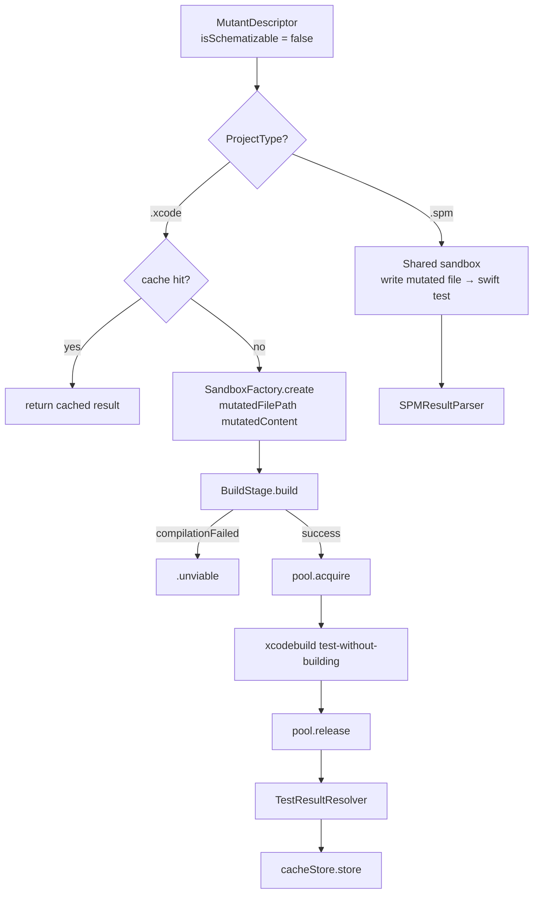

# Execution

← [Sandbox & Build](06-sandbox-build.md) | Next: [Result Parsing & Cache →](08-result-parsing-cache.md)

---

## Execution/MutantExecutor.swift

```swift
struct MutantExecutor: Sendable {
    init(configuration: RunnerConfiguration, launcher: any ProcessLaunching)
    func execute(_ input: RunnerInput) async throws -> [ExecutionResult]
}
```

Entry point for the execution pipeline. Orchestrates sandbox creation, build, simulator pool setup, and test execution for both schematizable and incompatible mutants. Supports both Xcode and SPM project types.



**Normal path:** builds once, runs `TestExecutionStage` for all schematizable mutants in parallel.

**Fallback path:** triggered when `BuildStage` throws `compilationFailed`. Delegates to `FallbackExecutor`, which rebuilds one schematized file at a time. Mutants in files that still fail to compile are marked `.unviable`.

**Incompatible path:** always runs after the schematizable path. Delegates to `IncompatibleMutantExecutor`.

---

## Execution/ExecutionDeps.swift

```swift
struct ExecutionDeps: Sendable {
    let launcher: any ProcessLaunching
    let cacheStore: CacheStore
    let reporter: any ProgressReporter
    let counter: MutationCounter
}
```

Bundle of shared collaborators passed between `MutantExecutor` and the stage types. Avoids threading individual dependencies through every call site.

| Field | Description |
|---|---|
| `launcher` | Process runner used for all `xcodebuild` invocations |
| `cacheStore` | Shared actor for reading and writing result cache entries |
| `reporter` | Progress events sink (console or silent) |
| `counter` | Shared actor tracking the current mutant index |

---

## Execution/TestExecutionStage.swift

```swift
struct TestExecutionStage: Sendable {
    let deps: ExecutionDeps

    func execute(
        mutants: [MutantDescriptor],
        in context: TestExecutionContext
    ) async throws -> [ExecutionResult]
}
```

Runs `xcodebuild test-without-building` for each mutant in parallel via `withThrowingTaskGroup`. Maintains exactly `concurrency` active tasks at all times using a dynamic refill strategy.

**Per-mutant flow:**



A fresh `.xctestrun` file is written for each mutant (UUID-named, deleted after launch). The `.xcresult` bundle is deleted after `ResultParser` extracts failure details.

---

## Execution/TestExecutionContext.swift

```swift
struct TestExecutionContext: Sendable {
    let artifact: BuildArtifact
    let sandbox: Sandbox
    let pool: SimulatorPool
    let configuration: RunnerConfiguration
    let testFilesHash: String
}
```

Bundles the execution-time dependencies required by `TestExecutionStage` and the fallback path.

| Field | Description |
|---|---|
| `artifact` | Build output containing the `.xctestrun` plist |
| `sandbox` | The sandbox directory hosting derived data and temporary files |
| `pool` | Simulator slot pool for acquiring/releasing parallel slots |
| `configuration` | Full runner configuration (timeout, concurrency, testTarget, etc.) |
| `testFilesHash` | SHA256 of all test files; component of cache keys |

---

## Execution/TestLaunchResult.swift

```swift
struct TestLaunchResult: Sendable {
    let exitCode: Int32
    let output: String
    let xcresultPath: String
    let duration: Double
}
```

Raw result from a single `xcodebuild test-without-building` invocation.

| Field | Description |
|---|---|
| `exitCode` | Process exit code; `-1` means killed by timeout |
| `output` | Combined stdout + stderr |
| `xcresultPath` | Absolute path to the `.xcresult` bundle |
| `duration` | Wall-clock seconds from launch to termination |

---

## Execution/FallbackExecutor.swift

```swift
struct FallbackExecutor: Sendable {
    let deps: ExecutionDeps
    let configuration: RunnerConfiguration

    func execute(
        input: RunnerInput,
        pool: SimulatorPool,
        testFilesHash: String
    ) async throws -> [ExecutionResult]
}
```

When the baseline build for all schematized files fails (`BuildError.compilationFailed`), `MutantExecutor` delegates to `FallbackExecutor`. This executor rebuilds one schematized file at a time.



For each schematized file, creates a sandbox containing only that file's schematization, builds it (Xcode or SPM), and runs the test suite against its mutants. Files whose builds fail have all their mutants marked as `.unviable`. Results are cached via `CacheStore`.

---

## Execution/IncompatibleMutantExecutor.swift

```swift
struct IncompatibleMutantExecutor: Sendable {
    let deps: ExecutionDeps

    func execute(
        _ mutants: [MutantDescriptor],
        configuration: RunnerConfiguration,
        pool: SimulatorPool,
        testFilesHash: String
    ) async throws -> [ExecutionResult]
}
```

Handles mutants that cannot be schematized. Behaviour differs by project type.

**Xcode path:** Each mutant creates its own sandbox via `SandboxFactory.create(projectPath:mutatedFilePath:mutatedContent:)`. Runs sequentially with a full build + test cycle per mutant.



**SPM path:** Uses a shared sandbox created via `SandboxFactory.createClean(projectPath:)`. For each mutant, writes the mutated source content (`mutant.mutatedSourceContent!`) directly to the sandbox, runs `swift test`, and restores the original file. Pipeline invariants guarantee `mutatedSourceContent` is always non-nil for incompatible mutants.

---

## Simulator/SimulatorPool.swift

```swift
actor SimulatorPool {
    init(baseUDID: String?, size: Int, destination: String, launcher: any ProcessLaunching)
    var size: Int { get }
    func setUp() async throws
    func acquire() async throws -> SimulatorSlot
    func release(_ slot: SimulatorSlot) async
    func tearDown() async
}
```

Manages a fixed-size pool of simulator slots for parallel test execution.

| Destination | `setUp` behaviour | `tearDown` behaviour |
|---|---|---|
| `platform=macOS` | Creates one no-op slot (no UDID) | No-op |
| iOS / tvOS / watchOS | Clones the base simulator `size` times; boots each clone | Shuts down and deletes each clone |

`acquire()` returns an available slot immediately or suspends the caller until one is released. The suspension is wrapped with `withTaskCancellationHandler` — if the owning task is cancelled, the slot is released to prevent permanent deadlock.

`release(_:)` resumes the oldest pending `acquire()` waiter, or returns the slot to the available pool if no waiters exist.

---

## Simulator/SimulatorSlot.swift

```swift
struct SimulatorSlot: Sendable {
    let udid: String?
    let destination: String
}
```

| Field | Description |
|---|---|
| `udid` | Clone UDID for iOS/tvOS/watchOS slots; `nil` for macOS |
| `destination` | The destination string passed to `xcodebuild` for this slot |

---

## Simulator/SimulatorManager.swift

```swift
struct SimulatorManager: Sendable {
    init(launcher: any ProcessLaunching)
    static func requiresSimulatorPool(for destination: String) -> Bool
    func resolveBaseUDID(for destination: String) async throws -> String
    func waitForBooted(udid: String) async throws
}
```

Provides simulator lifecycle utilities.

`requiresSimulatorPool(for:)` returns `false` when the destination contains `platform=macOS`; `true` otherwise.

`resolveBaseUDID(for:)` parses `id=<udid>` or `name=<name>` from the destination string, then queries `xcrun simctl list devices` to resolve and validate the UDID.

`waitForBooted(udid:)` polls `xcrun simctl list devices` up to 60 times at 500 ms intervals until the simulator state is `Booted`. Throws `SimulatorError.bootTimeout` if not booted within 30 seconds.

---

## Simulator/SimulatorError.swift

```swift
enum SimulatorError: Error, LocalizedError {
    case deviceNotFound(destination: String)
    case bootTimeout(udid: String)
    case cloneFailed(udid: String)

    var errorDescription: String? { get }
}
```

Conforms to `LocalizedError` to provide structured error descriptions that propagate through generic `catch` blocks.

| Case | Condition |
|---|---|
| `deviceNotFound` | No simulator matching the destination string |
| `bootTimeout` | Simulator did not reach `Booted` state within the polling window |
| `cloneFailed` | `xcrun simctl clone` returned a non-zero exit code |

---

## Execution/MutationCounter.swift

```swift
actor MutationCounter {
    init(total: Int)
    nonisolated let total: Int
    func increment() -> Int
}
```

Tracks execution progress across concurrent tasks. `total` is set once at construction and accessed without actor isolation. `increment()` returns the new index after incrementing (1-based), used to format `"<index>/<total>"` progress lines.

---

## Execution/RunnerInput.swift

```swift
struct RunnerInput: Sendable {
    let projectPath: String
    let projectType: ProjectType
    let timeout: Double
    let concurrency: Int
    let noCache: Bool
    let schematizedFiles: [SchematizedFile]
    let supportFileContent: String
    let mutants: [MutantDescriptor]
}
```

The value produced by `DiscoveryPipeline` and consumed by `MutantExecutor`.

| Field | Description |
|---|---|
| `schematizedFiles` | One entry per source file containing schematizable mutations |
| `supportFileContent` | `__swiftMutationTestingID` global declaration for injection |
| `mutants` | All mutants, sorted by global index; `isSchematizable` distinguishes the two populations |

---

## Execution/ExecutionResult.swift

```swift
struct ExecutionResult: Sendable, Codable {
    let descriptor: MutantDescriptor
    let status: ExecutionStatus
    let testDuration: Double
}
```

| Field | Description |
|---|---|
| `descriptor` | The mutant that was tested |
| `status` | Outcome of the test run |
| `testDuration` | Wall-clock seconds for the test-without-building invocation; `0` for cache hits |

---

## Execution/ExecutionStatus.swift

```swift
enum ExecutionStatus: Sendable, Equatable {
    case killed(by: String)
    case killedByCrash
    case survived
    case unviable
    case timeout
    case noCoverage
}
```

| Case | Condition |
|---|---|
| `killed(by:)` | Tests failed; `by` contains the test name or failure message |
| `killedByCrash` | Process crashed (fatal error, EXC_BAD_INSTRUCTION) |
| `survived` | Tests passed with the mutation active |
| `unviable` | Mutant could not be compiled |
| `timeout` | Test process was killed by the timeout handler (exit code `-1`) |
| `noCoverage` | No test exercised the mutated code |

Uses custom `Codable` encoding with `kind` / `by` keys to preserve the associated value of `killed(by:)` across cache serialisation.

---

← [Sandbox & Build](06-sandbox-build.md) | Next: [Result Parsing & Cache →](08-result-parsing-cache.md)
