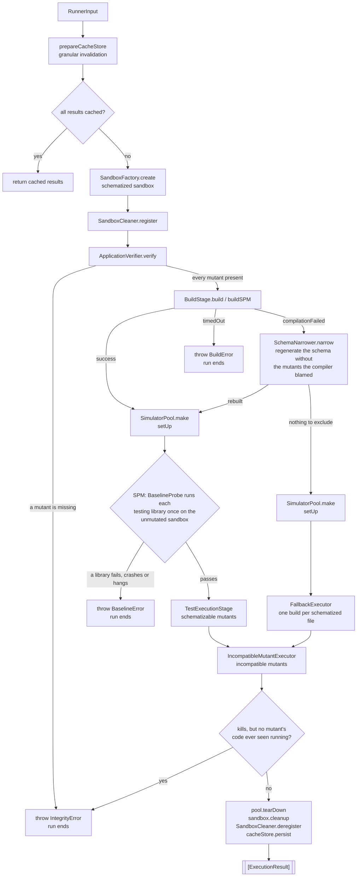
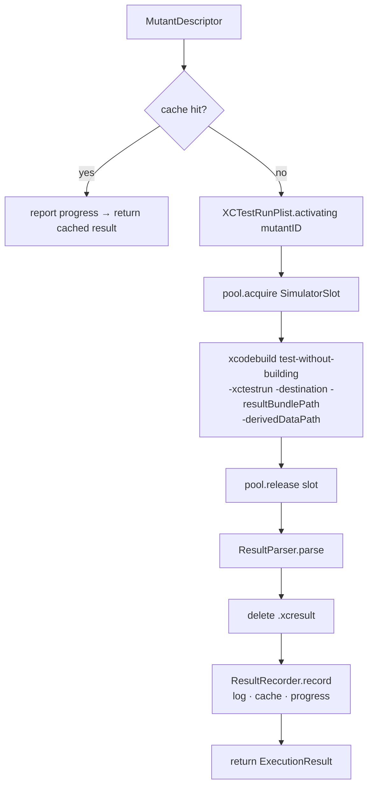
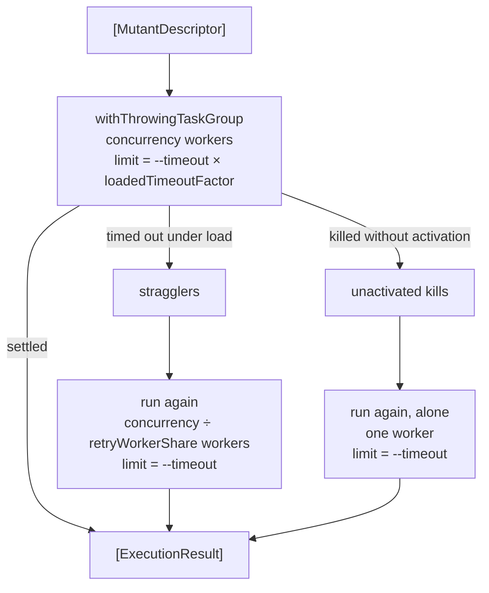
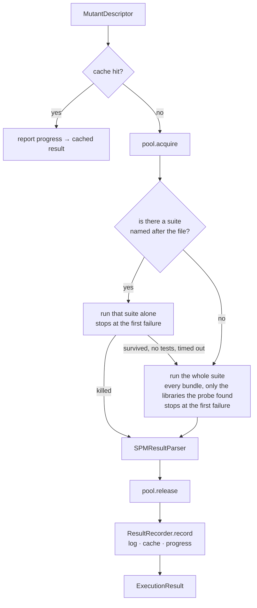
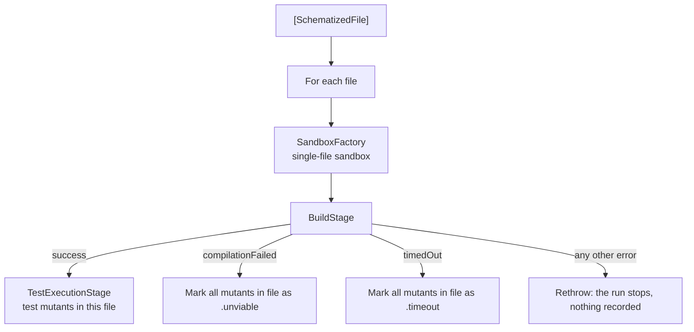
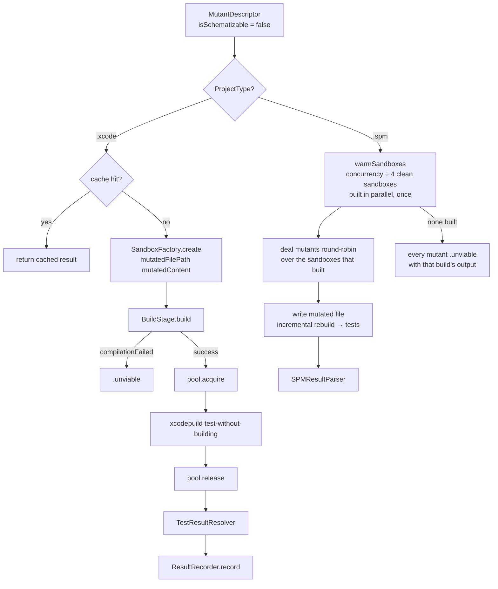

# Execution

← [Sandbox & Build](06-sandbox-build.md) | Next: [Result Parsing & Cache →](08-result-parsing-cache.md)

---

## Execution/MutantExecutor.swift

```swift
struct MutantExecutor: Sendable {
    struct Environment: Sendable {
        var sandboxFactory = SandboxFactory()
        var verifier = ApplicationVerifier()
        var testFilesHasher = TestFilesHasher()
        var reporter: (any ProgressReporter)?
    }

    init(
        configuration: RunnerConfiguration,
        launcher: any ProcessLaunching,
        planJournal: PlanJournal? = nil,
        environment: Environment = Environment()
    )
    func execute(_ input: RunnerInput) async throws -> [ExecutionResult]
}
```

Entry point for the execution pipeline. Orchestrates sandbox creation, build, simulator pool setup, and test execution for both schematizable and incompatible mutants. Supports both Xcode and SPM project types.

`Environment` holds the collaborators a run works through, each the real one unless a test hands in another. With no `reporter`, progress goes to a `ConsoleProgressReporter`, or a `SilentProgressReporter` under `--quiet`. The `sandboxFactory` is also the one `IncompatibleMutantExecutor` is given.

The work that used to live inline here is split across types of its own: `SchemaNarrower` retries a schematized SPM build that does not compile, `BaselineProbe` runs the unmutated suite, `SimulatorPool.make(for:launcher:)` picks the pool, and every verdict goes through `ResultRecorder`.


```mermaid
flowchart TD
    IN[RunnerInput] --> PREP[prepareCacheStore\ngranular invalidation]
    PREP --> CACHE{all results cached?}
    CACHE -- yes --> RETURN[return cached results]
    CACHE -- no --> SANDBOX[SandboxFactory.create\nschematized sandbox]
    SANDBOX --> REG[SandboxCleaner.register]
    REG --> VERIFY[ApplicationVerifier.verify]
    VERIFY -- a mutant is missing --> ABORTI[throw IntegrityError\nrun ends]
    VERIFY -- every mutant present --> BUILD[BuildStage.build / buildSPM]
    BUILD -- success --> POOL[SimulatorPool.make\nsetUp]
    BUILD -- timedOut --> ABORT[throw BuildError\nrun ends]
    BUILD -- compilationFailed --> RETRY[SchemaNarrower.narrow\nregenerate the schema without\nthe mutants the compiler blamed]
    RETRY -- rebuilt --> POOL
    RETRY -- nothing to exclude --> POOLF[SimulatorPool.make\nsetUp]
    POOLF --> FALLBACK[FallbackExecutor\none build per schematized file]
    FALLBACK --> INCOMPAT
    POOL --> PROBE{SPM: BaselineProbe runs each\ntesting library once on the\nunmutated sandbox}
    PROBE -- a library fails, crashes or hangs --> ABORTB[throw BaselineError\nrun ends]
    PROBE -- passes --> NORMAL[TestExecutionStage\nschematizable mutants]
    NORMAL --> INCOMPAT[IncompatibleMutantExecutor\nincompatible mutants]
    INCOMPAT --> OBSERVED{kills, but no mutant's\ncode ever seen running?}
    OBSERVED -- yes --> ABORTI
    OBSERVED -- no --> TEARDOWN[pool.tearDown\nsandbox.cleanup\nSandboxCleaner.deregister\ncacheStore.persist]
    TEARDOWN --> RESULTS[["[ExecutionResult]"]]
```

**Baseline validation (SPM only):** before any mutant runs, `BaselineProbe` runs the suite once with no mutant selected — the schema falls through to its `default` branch, so this is the original code. A kill verdict only means something if the same tests pass unmutated: a suite that already fails kills every mutant it reaches and produces a flattering score with nothing in the report to show it. Anything other than a passing suite throws `BaselineError` and ends the run. The Xcode path has no equivalent yet.

**Normal path:** builds once, runs `TestExecutionStage` for all schematizable mutants in parallel, then re-runs any mutant that timed out on its own before reporting it.

**Fallback path:** triggered when `BuildStage` throws `compilationFailed` on the Xcode path, or on the SPM path when `SchemaNarrower` finds no mutant to blame. Delegates to `FallbackExecutor`, which rebuilds one schematized file at a time. Mutants in files that still fail to compile are marked `.unviable`.

**Incompatible path:** always runs after the schematizable path. Delegates to `IncompatibleMutantExecutor`. Mutants `SchemaNarrower` took out of the schema join it, rewritten with `MutationRewriter` from the original file; one whose rewrite leaves the source unchanged is recorded `.unviable` through `ResultRecorder`.

**Integrity:** `ApplicationVerifier` runs right after the sandbox is created and before anything is built, and `requireObservedActivation(in:)` runs over the results: when at least one measured mutant was killed and no measured mutant recorded activation, the run ends with `IntegrityError.activationNeverObserved` — the marker cannot be written here, or the suite fails on its own, and either way no verdict can be trusted. Both are static so a test can call them on their own.

---

## Execution/SchemaNarrower.swift

```swift
struct SchemaNarrower: Sendable {
    let stage: BuildStage
    let reporter: any ProgressReporter
    let buildTimeout: Double

    func narrow(
        after output: String,
        sandbox: Sandbox,
        input: RunnerInput,
        start: Date,
        alreadyExcluded: [MutantDescriptor] = []
    ) async throws -> (BuildArtifact?, [MutantDescriptor])

    static func excludeProblematicMutants(
        sandboxPath: String,
        originalPath: String,
        errorOutput: String,
        mutantsInFile: [MutantDescriptor],
        importStyle: ImportStyle
    ) -> [MutantDescriptor]

    static func regeneratedSchema(
        originalPath: String, keeping mutants: [MutantDescriptor], importStyle: ImportStyle = .implicit
    ) -> String?
}
```

Narrows a schematized SPM build that does not compile. `narrow` reads the sandbox files the compiler blamed (`<sandbox>/….swift:<line>:`), and for each one that maps back to a project file holding schematizable mutants calls `excludeProblematicMutants`: from every error line it walks up to the nearest `case "<mutant id>":` — stopping at `default:` or `switch` — and takes those mutants out. `regeneratedSchema` rebuilds the file's schema from the original source with the mutants kept (reading each one's index with `MutantID.index(of:)`) and writes it over the sandbox copy. When no error line lands in a mutant's `case`, or the schema cannot be regenerated, the sandbox file goes back to a symlink to the original and every mutant of the file is excluded. It then reports `.schemaNarrowed`, builds again and recurses with what it has excluded so far, until a build compiles or no new mutant is blamed — then it answers no artifact, and `MutantExecutor` falls back to `FallbackExecutor`.

---

## Execution/BaselineProbe.swift

```swift
struct BaselineProbe: Sendable {
    let configuration: RunnerConfiguration
    let launcher: any ProcessLaunching

    func probeTestBundles(in sandbox: Sandbox) async throws -> (bundles: [TestBundle], filter: String?)
}
```

Runs the unmutated suite on the SPM path before any mutant: each test bundle with each testing library, or `swift test --skip-build` (`ToolRequests.swiftTest`) when the build left no bundle. A library that reports no tests is dropped from the bundle; one that has tests must pass them, or the run ends with a `BaselineError` (the output goes to the logs directory when `--keep-logs` is set). Returns the probed bundles and the filter `TestTargetSelection` settled on; when no bundle reported any test, every bundle is kept with both libraries. See the probe under `TestExecutionStage` below for why it exists.

---

## Execution/ResultRecorder.swift

```swift
struct ResultRecorder: Sendable {
    let deps: ExecutionDeps
    let keepLogsPath: String?

    func cached(_ mutant: MutantDescriptor) async -> ExecutionResult?
    func record(
        _ mutant: MutantDescriptor,
        status: ExecutionStatus,
        duration: Double = 0,
        output: String = "",
        activated: Bool? = nil
    ) async -> ExecutionResult
    func finish(_ result: ExecutionResult) async
}
```

Where every verdict of a run goes, whichever path reached it. `record` writes the mutant's log (`MutantLogWriter`, when `--keep-logs` is set), resolves the killer test file for a kill, stores the verdict in the cache — which journals it, and the plan journal with it — then counts it and reports `.mutantFinished`. `cached` answers the cache's verdict through `CacheStore.cachedResult(for:)`, counted and reported as finished, or `nil`. `finish` only counts and reports.

`TestExecutionStage`, `FallbackExecutor`, `IncompatibleMutantExecutor` and `MutantExecutor` (for rerouted mutants that cannot be rewritten) all go through it; each used to repeat those steps, and not all of them. Since it, a fallback build failure and a mutant whose rewrite could not be applied leave a mutant log too — the fallback one carries the build error's description.

---

## Execution/ApplicationVerifier.swift

```swift
struct ApplicationVerifier: Sendable {
    func verify(
        schematizedFiles: [SchematizedFile],
        mutants: [MutantDescriptor],
        sandbox: Sandbox,
        projectPath: String
    ) throws
}
```

Proves, before the build, that the sandbox holds what discovery produced. For each schematized file, the sandbox copy — at the original's path relative to the project — must exist, differ from the original, and contain `SupportDeclarations.perFile(for:)` its path; otherwise `schemaNotApplied` or `supportMissing`. Then every schematizable mutant must have `case "<id>":` in its file's copy, and every incompatible mutant must have `mutatedSourceContent` that differs from its original file; the ones that fail are thrown together as `mutantsNotApplied`, each as `<id> (<file>:<line>)`. `MutantExecutor` runs it on the whole input, and `FallbackExecutor` on each per-file sandbox.

---

## Execution/IntegrityError.swift

```swift
enum IntegrityError: Error, Equatable, LocalizedError {
    case mutantsNotApplied(mutants: [String])
    case schemaNotApplied(path: String)
    case supportMissing(path: String)
    case activationNeverObserved(killed: Int)
}
```

Every case ends the run with exit code `1`. The descriptions name the mutants (the first ten, then a count) or the file, and say why the run stopped rather than reporting.

---

## Execution/ActivationMarker.swift

```swift
struct ActivationMarker: Sendable {
    static let environmentVariable: String  // "__SWIFT_MUTATION_TESTING_ACTIVATION_FILE"
    static let directoryName: String        // ".xmr-activation"

    let path: String

    init(for mutantID: String, in sandbox: Sandbox)
    func wasWritten() -> Bool
}
```

One marker per test run: `<sandbox>/.xmr-activation/<mutant id>-<UUID>`, created by the test process the first time the mutant's `case` runs, and read once by `wasWritten()`, which removes the file. `TestBundleInvocation.environment(mutantID:activationFile:)` puts the path in the test process's environment on the SPM path; `XCTestRunPlist.activating(_:activationFile:)` puts it in every test target's `EnvironmentVariables` on the Xcode path.

---

## Execution/ExecutionDeps.swift

```swift
struct ExecutionDeps: Sendable {
    let launcher: any ProcessLaunching
    let cacheStore: CacheStore
    let reporter: any ProgressReporter
    let counter: MutationCounter
    let killerTestFileResolver: KillerTestFileResolver
}
```

Bundle of shared collaborators passed between `MutantExecutor` and the stage types. Avoids threading individual dependencies through every call site.

| Field | Description |
|---|---|
| `launcher` | Process runner used for all `xcodebuild` invocations |
| `cacheStore` | Shared actor for reading and writing result cache entries |
| `reporter` | Progress events sink (console or silent) |
| `counter` | Shared actor tracking the current mutant index |
| `killerTestFileResolver` | Maps killer test names to source file paths for granular cache invalidation |

---

## Execution/BaselineError.swift

```swift
enum BaselineError: Error, Equatable, LocalizedError {
    case testsFailed(tests: [String])
    case didNotFinish(seconds: Double)
    case runFailed(output: String)

    var errorDescription: String? { get }
}
```

Thrown when the unmutated project does not pass its own tests, which ends the run: every mutant would otherwise be reported killed by a failure that was already there.

| Case | Condition |
|---|---|
| `testsFailed(tests:)` | The probe ran the suite and named failing tests. The message lists them, and points out that tests run against a sandbox copy under the system temporary directory — a test deriving paths from `#filePath` can fail there while passing in place |
| `didNotFinish(seconds:)` | The probe hit `--timeout` |
| `runFailed(output:)` | The suite failed without naming a test — a crash, or a build problem the parser could not attribute |

---

## Execution/TestExecutionStage.swift

```swift
struct TestExecutionStage: Sendable {
    static let loadedTimeoutFactor: Double = 2
    static let retryWorkerShare = 4

    let deps: ExecutionDeps

    func execute(
        mutants: [MutantDescriptor],
        in context: TestExecutionContext
    ) async throws -> [ExecutionResult]
}
```

Runs each mutant's tests in parallel via `withThrowingTaskGroup` — `xcodebuild test-without-building` on the Xcode path, the test bundle directly on the SPM one — keeping exactly `concurrency` active tasks at all times with a dynamic refill strategy.

A mutant whose run times out during that parallel pass is not recorded yet. Once the group has drained, every such mutant is run once more with at most a quarter of the workers (`retryWorkerShare`, never fewer than one), under the configured `--timeout`, and that second outcome is the one reported and cached. The parallel pass itself allows twice the configured timeout (`loadedTimeoutFactor`): a verdict that settles under load is the same verdict the mutant would get alone, so the wider limit only spares the second run, while a mutant that is still running at twice the limit is handed to the quieter pass, whose limit is the one the user asked for.

A mutant killed during the parallel pass without its activation marker is not recorded yet either. After the timeout pass, each such mutant runs once more, alone, one after another, under the configured `--timeout`, and that run's outcome is the one reported and cached. A flaky test usually passes the second time, and the mutant is then judged like any other run: survived, or `noCoverage` when its code still did not run. A kill that repeats without activation stays a kill, reported as an integrity warning. Kills that come from the timeout pass are not run a third time. Warnings are rare: over the campaign projects, 1 to 7 per run against 209 to 1275 mutants, under 1% of mutants, so the extra run costs little.

Measured on `swift-cpd` (944 tests), the suite takes 14s alone, 15s with 8 workers and 24s with 15 on a 12P+4E machine, so a 30s limit under 15 workers turned a third of all mutants into stragglers: each one cost its 30s in the parallel pass and was then run again in series, and the 26 mutants that time out for real cost the full limit twice. Doubling the loaded limit settles almost every straggler in the parallel pass, and a quarter of the workers is a load the machine does not notice (8 workers cost 8% over running alone) while it cuts the second pass by the same factor.

Before that pass, when the package was built to test bundles — one per test target — each bundle is run once with each testing library against the unmutated sandbox. That single run answers two questions at once. A library that reports no tests — exit 69 from SwiftPM's helper, or `Executed 0 tests` from `xctest` — is left out of every mutant's run: on a Swift Testing-only package that links swift-syntax, the `xctest` pass costs 13.8s just to load the bundle and find nothing, against 1.7s for the Swift Testing pass, and it used to run for every surviving mutant. And a library that does have tests must pass them: a failure, a crash or a timeout on the unmutated code ends the run with a `BaselineError` naming the tests, since nothing a mutant does afterwards could be attributed to the mutant. Before this the baseline was a separate `swift test --skip-build` of the whole suite followed by the probe — three runs of the suite to answer two questions. A bundle that reports no tests in either library is dropped from every mutant's run as well; the list that survives the probe, `[TestBundle]`, is fixed before the pass. When the package produced no bundle at all, `swift test --skip-build` is still the baseline, and both libraries are assumed present.

`--target` on this path names a test target: when a bundle carries that name, `TestTargetSelection` keeps only that bundle and passes no filter; when none does, every bundle runs with the name as the libraries' filter, as before. The probe runs the suite to the end; every mutant's run stops at its first failing test. See `ProcessRunner` in [09 — Reporting & Infrastructure](09-reporting-infrastructure.md) for how, and why it is safe.

**Targeted tests first.** On the SPM path a mutant in `Foo.swift` is first run against `FooTests` alone — `--filter FooTests` for Swift Testing, `-XCTest FooTests` for XCTest — and only if that does not kill it does the whole suite run. A kill in the targeted run is a kill in the full run, since the same test would fail there too, so the verdict is the full suite's by construction; everything else — survived, no tests matched, a timeout — falls through to the full run, which decides. `TargetedSuites.declared(in:)` reads the test files once, before the pass — the paths `KillerTestFileResolver` already holds, not a second listing — and keeps only the names whose file declares a type of that name (`struct FooTests`, `final class FooTests: XCTestCase`, …), so a file named after a convention the project does not follow costs nothing: without that check every mutant would pay the helper's start-up — 1.7s on `swift-cpd` — to run zero tests. Measured on `swift-cpd` from the `killedBy` of a full run, 62% of kills (479 of 772) come from the file's own suite.

The targeted run goes to the bundle of the test target that declares the suite, read from the test file's `Tests/<Target>/` directory. When that cannot be told — a test file outside `Tests/<Target>/` — every bundle gets the filter, and the ones without the suite report no tests and cost one process launch each. The full run goes through every bundle in name order and stops at the first failing test, whichever bundle it is in.

**One mutant on the Xcode path:**


```mermaid
flowchart TD
    M[MutantDescriptor] --> CACHED{cache hit?}
    CACHED -- yes --> REPORT[report progress → return cached result]
    CACHED -- no --> PLIST[XCTestRunPlist.activating mutantID]
    PLIST --> ACQUIRE[pool.acquire SimulatorSlot]
    ACQUIRE --> LAUNCH[xcodebuild test-without-building\n-xctestrun -destination -resultBundlePath\n-derivedDataPath]
    LAUNCH --> RELEASE[pool.release slot]
    RELEASE --> PARSE[ResultParser.parse]
    PARSE --> CLEANUP[delete .xcresult]
    CLEANUP --> STORE[ResultRecorder.record\nlog · cache · progress]
    STORE --> REPORT2[return ExecutionResult]
```

A fresh `.xctestrun` file is written for each mutant (UUID-named, deleted after launch). The `.xcresult` bundle is deleted after `ResultParser` extracts failure details.

---

**The three passes:**


```mermaid
flowchart TD
    MUTANTS["[MutantDescriptor]"] --> GROUP["withThrowingTaskGroup\nconcurrency workers\nlimit = --timeout × loadedTimeoutFactor"]
    GROUP -- settled --> RESULTS["[ExecutionResult]"]
    GROUP -- timed out under load --> STRAGGLERS[stragglers]
    STRAGGLERS --> AGAIN["run again\nconcurrency ÷ retryWorkerShare workers\nlimit = --timeout"]
    AGAIN --> RESULTS
    GROUP -- killed without activation --> UNACTIVATED[unactivated kills]
    UNACTIVATED --> ALONE["run again, alone\none worker\nlimit = --timeout"]
    ALONE --> RESULTS
```

**One mutant on the SPM path:**


```mermaid
flowchart TD
    M[MutantDescriptor] --> CACHED{cache hit?}
    CACHED -- yes --> REPORT[report progress → cached result]
    CACHED -- no --> SLOT[pool.acquire]
    SLOT --> SUITE{is there a suite\nnamed after the file?}
    SUITE -- yes --> TARGETED[run that suite alone\nstops at the first failure]
    TARGETED -- killed --> PARSE[SPMResultParser]
    TARGETED -- survived, no tests, timed out --> FULL[run the whole suite\nevery bundle, only the libraries the probe found\nstops at the first failure]
    SUITE -- no --> FULL
    FULL --> PARSE
    PARSE --> RELEASE[pool.release]
    RELEASE --> STORE[ResultRecorder.record\nlog · cache · progress]
    STORE --> REPORT2[ExecutionResult]
```

## Execution/TestExecutionContext.swift

```swift
struct TestExecutionContext: Sendable {
    let artifact: BuildArtifact
    let sandbox: Sandbox
    let pool: SimulatorPool
    let configuration: RunnerConfiguration
    var bundles: [TestBundle] = []
    var testFilter: String?
    var targetedSuites: [String: TargetedSuite] = [:]

    func bundles(declaring suite: TargetedSuite) -> [TestBundle]
}
```

Bundles the execution-time dependencies required by `TestExecutionStage` and the fallback path.

| Field | Description |
|---|---|
| `artifact` | Build output containing the `.xctestrun` plist |
| `sandbox` | The sandbox directory hosting derived data and temporary files |
| `pool` | Simulator slot pool for acquiring/releasing parallel slots |
| `configuration` | Full runner configuration (timeout, concurrency, testTarget, etc.) |
| `bundles` | The test bundles a mutant's run invokes, each with the libraries the probe found tests in. Empty when the package produced no bundle, in which case `swift test --skip-build` runs instead |
| `targetedSuites` | The test suites that exist and are named after a source file, by name, each with the test target that declares it, so a mutant in `Foo.swift` can run `FooTests` first |

`bundles(declaring:)` picks the bundle named after the suite's test target, and every bundle when the target is unknown or no bundle matches.

---

## Execution/TestLaunchResult.swift

```swift
struct TestLaunchResult: Sendable {
    let exitCode: Int32
    let output: String
    let xcresultPath: String
    let duration: Double
    var activated: Bool = false
}
```

Raw result from a single test run — `xcodebuild test-without-building`, or the bundle invocations of the SPM path.

| Field | Description |
|---|---|
| `exitCode` | Process exit code; `-1` means killed by timeout |
| `output` | Combined stdout + stderr |
| `xcresultPath` | Absolute path to the `.xcresult` bundle |
| `duration` | Wall-clock seconds from launch to termination |
| `activated` | Whether the mutant's `case` wrote its activation marker during this run (or, on the SPM path, during the targeted or the full run) |

---

## Execution/TestBundleInvocation.swift

```swift
struct TestBundleInvocation: Sendable {
    static let noTestsExitCode: Int32 = 69

    static func reportsNoTests(exitCode: Int32, output: String) -> Bool
    static func bundleURLs(in sandbox: Sandbox) -> [URL]

    let bundleURL: URL
    let framework: TestingFramework

    func requests(
        filter: String?,
        mutantID: String,
        workingDirectory: URL,
        timeout: Double,
        libraries: Set<TestingFramework> = [.xctest, .swiftTesting],
        stoppingAtFirstFailure: Bool = true
    ) -> [ProcessRequest]
}
```

Builds the process requests that run a package's test bundle directly, skipping `swift test`'s own build check. Two requests per mutant at most, ordered so the configured `--testing-framework` goes first:

| Library | Command |
|---|---|
| Swift Testing | `swiftpm-testing-helper --test-bundle-path <binary> <binary> --testing-library swift-testing [--filter <name>]` |
| XCTest | `xcrun xctest [-XCTest <name>] <bundle>` |

`__SWIFT_MUTATION_TESTING_ACTIVE` carries the mutant id; `DYLD_FRAMEWORK_PATH` and `DYLD_LIBRARY_PATH` point at the platform's frameworks so the helper can load the bundle.

`bundleURLs(in:)` lists every `.xctest` under `.build/out/Products/Debug` in name order, one per test target; the order is what makes a run's output and its first failing test reproducible.

`reportsNoTests` recognises a library that has nothing to run — exit code 69 from SwiftPM's helper, or `Executed 0 tests` from `xctest` — which is what `BaselineProbe` uses to drop a library from every mutant's run. `stoppingAtFirstFailure` attaches `OutputStopRule.firstTestFailure` to each request; the probe passes `false`, because its job is to run the suite to the end.

**`DeveloperToolchain`** — resolves the active developer directory once per process:

```swift
enum DeveloperToolchain {
    nonisolated(unsafe) static var developerPath: String

    static func resolveDeveloperPath(
        running executable: URL = URL(fileURLWithPath: "/usr/bin/xcode-select"),
        arguments: [String] = ["-p"]
    ) -> String

    static var testingHelperPath: String { get }
    static var frameworksPath: String { get }
    static var librariesPath: String { get }
}
```

`resolveDeveloperPath` takes the executable to run so a test can point it at something that fails or prints bytes that are not text; both return `""`, and the paths built from it simply do not resolve.

---

## Execution/TestBundle.swift

```swift
struct TestBundle: Sendable, Equatable {
    static let allLibraries: Set<TestingFramework>

    let url: URL
    var libraries: Set<TestingFramework>
    var name: String { get }

    static func all(in sandbox: Sandbox) -> [TestBundle]
}
```

One built test bundle and the libraries a mutant's run invokes it with. `name` is the bundle's file name without `.xctest`, which is the test target's name. `all(in:)` lists every bundle with both libraries, for the fallback path, which does not probe.

---

## Execution/TargetedSuites.swift

```swift
struct TargetedSuite: Sendable, Hashable {
    let name: String
    let testTarget: String?
}

enum TargetedSuites {
    static let suffix = "Tests"
    static let testsDirectory = "Tests"

    static func declared(in testFilePaths: [String]) -> [String: TargetedSuite]
    static func suite(for sourcePath: String, among suites: [String: TargetedSuite]) -> TargetedSuite?
    static func testTarget(of testFilePath: String) -> String?
}
```

Answers "which test suite is named after this source file, if any, and which test target declares it". `declared(in:)` reads the project's test files once, before the test pass, and keeps the name of each file that *declares a type of its own name* — `struct FooTests`, `final class FooTests: XCTestCase`, `actor FooTests`, `enum FooTests`. A file named `FooTests.swift` that declares `FooSpecs` does not count, and neither does a file that cannot be read as text. `testTarget(of:)` is the directory right under the last `Tests` component of the path — `CoreATests` for `Tests/CoreATests/FooTests.swift` — and `nil` for a test file that is not laid out that way.

That check is what makes the feature free for projects that do not follow the convention: `suite(for:among:)` returns `nil`, no targeted run is attempted, and no mutant pays the test helper's start-up to run zero tests.

---

## Execution/FallbackExecutor.swift

```swift
struct FallbackExecutor: Sendable {
    let deps: ExecutionDeps
    let configuration: RunnerConfiguration

    func execute(
        input: RunnerInput,
        pool: SimulatorPool
    ) async throws -> [ExecutionResult]
}
```

When the baseline build for all schematized files fails (`BuildError.compilationFailed`), `MutantExecutor` delegates to `FallbackExecutor`. This executor rebuilds one schematized file at a time.


```mermaid
flowchart TD
    FILES["[SchematizedFile]"] --> LOOP["For each file"]
    LOOP --> SF[SandboxFactory\nsingle-file sandbox]
    SF --> BS[BuildStage]
    BS -- success --> TES[TestExecutionStage\ntest mutants in this file]
    BS -- compilationFailed --> UNVIABLE[Mark all mutants in file as .unviable]
    BS -- timedOut --> TIMEOUT[Mark all mutants in file as .timeout]
    BS -- any other error --> THROW[Rethrow: the run stops, nothing recorded]
```

For each schematized file, creates a sandbox containing only that file's schematization, builds it (Xcode or SPM), and runs the test suite against its mutants. Only the two build errors that say something about the mutants become their verdict: `BuildError.compilationFailed` marks every mutant of the file `.unviable` and `BuildError.timedOut` marks them `.timeout`, each with a mutant log carrying the error's description. Every other error — a `CancellationError` from Ctrl-C, a launcher that could not start the build, `BuildError.xctestrunNotFound`, a failed read — is rethrown, so it ends the run instead of being recorded: verdicts reach the cache and the plan journal as soon as they are known, and a run resumed after an interruption would otherwise reuse `unviable` verdicts no build ever gave. Cached verdicts are read through `CacheStore.cachedResult(for:)` and every verdict is recorded through `ResultRecorder`.

---

## Execution/IncompatibleMutantExecutor.swift

```swift
struct IncompatibleMutantExecutor: Sendable {
    let deps: ExecutionDeps
    let sandboxFactory: SandboxFactory
    var importStyle: ImportStyle = .implicit

    func execute(
        _ mutants: [MutantDescriptor],
        configuration: RunnerConfiguration,
        pool: SimulatorPool
    ) async throws -> [ExecutionResult]
}
```

Handles mutants that cannot be schematized. Behaviour differs by project type.

**Activation.** Both paths first build the copy `ActivationInstrumenter(importStyle:)` returns, and test it with an activation marker: the environment variable on the SPM path, the same name behind `TEST_RUNNER_` (`testRunnerPrefix`) on the Xcode path, since `xcodebuild` hands those to the test runner without the prefix. The result is classified like a schematized mutant's (`TestExecutionStage.classify`), and a kill without activation is tested once more, without a rebuild, and judged by that run. When the instrumented copy fails to build — not a timeout — the plain `mutatedSourceContent` is built and tested instead, unmeasured (`activated == nil`); the same holds when the instrumenter returns `nil`. `MutantExecutor` passes the input's `importStyle`, so the import the instrumenter adds matches the project's. The activation is cached with the verdict.

**Xcode path:** Each mutant creates its own sandbox via `SandboxFactory.create(projectPath:mutatedFilePath:mutatedContent:)`. Runs sequentially with a full build + test cycle per mutant. The build and the `test-without-building` run come from `ToolRequests` and share its derived data directory, `.xmr-derived-data` (this path used `.derived-data` before).

Cache hits come from `ResultRecorder.cached(_:)`, and every verdict — including a mutation that could not be applied and a failed build — is recorded through `ResultRecorder.record`.


```mermaid
flowchart TD
    MUTANT[MutantDescriptor\nisSchematizable = false] --> PT{ProjectType?}
    PT -- .xcode --> CACHE{cache hit?}
    CACHE -- yes --> CACHED[return cached result]
    CACHE -- no --> SF[SandboxFactory.create\nmutatedFilePath mutatedContent]
    SF --> BS[BuildStage.build]
    BS -- compilationFailed --> UNVIABLE[.unviable]
    BS -- success --> SLOT[pool.acquire]
    SLOT --> LAUNCH[xcodebuild test-without-building]
    LAUNCH --> RELEASE[pool.release]
    RELEASE --> PARSE[TestResultResolver]
    PARSE --> STORE[ResultRecorder.record]
    PT -- .spm --> WARM[warmSandboxes\nconcurrency ÷ 4 clean sandboxes\nbuilt in parallel, once]
    WARM --> DEAL[deal mutants round-robin\nover the sandboxes that built]
    DEAL --> WRITE[write mutated file\nincremental rebuild → tests]
    WRITE --> SPMPARSE[SPMResultParser]
    WARM -- none built --> ALLUNVIABLE[every mutant .unviable\nwith that build's output]
```

**SPM path:** Uses warm sandboxes created via `SandboxFactory.createClean(projectPath:)`, each built once with `swift build --build-tests` (`ToolRequests.swiftBuildTests`) so that every mutant after the first costs an incremental rebuild rather than a cold one. For each mutant, writes the mutated source content (`mutant.mutatedSourceContent!`) directly into its sandbox, rebuilds, runs the tests, and restores the original file. Pipeline invariants guarantee `mutatedSourceContent` is always non-nil for incompatible mutants.

The number of sandboxes is a quarter of `--concurrency` (`TestExecutionStage.retryWorkerShare`, never fewer than one, never more than there are mutants), the same share the second test pass uses: a rebuild and a test run each spread over several cores, so four of them is a load the machine notices and eight is not worth it. Mutants are dealt round-robin over the sandboxes that built; a sandbox whose warm build failed is left out, and only when none built are the mutants reported unviable with that build's output. Results come back in input order whatever the completion order. Measured on `swift-cpd`, nine incompatible mutants took 118s of a 176s subset run when they ran one after another in a single sandbox — the first 26s for the cold build, then 9s each — which is what made this worth parallelising.

---

## Simulator/SimulatorPool.swift

```swift
actor SimulatorPool {
    init(baseUDID: String?, size: Int, destination: String, launcher: any ProcessLaunching)
    nonisolated let size: Int
    nonisolated var usesSimulators: Bool { get }
    func setUp() async throws
    func acquire() async throws -> SimulatorSlot
    func release(_ slot: SimulatorSlot) async
    func cancelPending(id: UUID)
    func tearDown() async
}
```

Manages a fixed-size pool of simulator slots for parallel test execution.

| Destination | `setUp` behaviour | `tearDown` behaviour |
|---|---|---|
| `platform=macOS` and SPM | Creates one no-op slot (no UDID) | No-op |
| iOS / tvOS / watchOS | Clones the base simulator `size` times; boots each clone | Shuts down and deletes each clone |

Each clone's UDID is recorded as soon as its `simctl clone` returns, and every clone call is waited for even after one fails. If any clone or boot fails, `setUp` runs `tearDown` before rethrowing, so a pool that fails part-way leaves no `XMR-<session>-<n>` device behind — the caller only tears down a pool whose `setUp` succeeded.

`usesSimulators` reports whether slots are simulator clones. One no-op slot means a run is effectively sequential regardless of `size`, which is why `ConfigurationResolver` resolves concurrency down to 1 for those destinations.

`acquire()` returns an available slot immediately or suspends the caller until one is released. The suspension is wrapped with `withTaskCancellationHandler` — if the owning task is cancelled, the slot is released to prevent permanent deadlock.

`release(_:)` resumes the oldest pending `acquire()` waiter, or returns the slot to the available pool if no waiters exist.

**`Simulator/SimulatorPool+Make.swift`** — `static func make(for configuration: RunnerConfiguration, launcher: any ProcessLaunching) async throws -> SimulatorPool` builds the pool a run's destination needs: the Xcode destination, or `platform=macOS` for a package; plain slots (`baseUDID: nil`) when `SimulatorManager.requiresSimulatorPool(for:)` says no, otherwise clones of the base simulator `resolveBaseUDID(for:)` finds. `size` is the configured concurrency.

---

## Simulator/SimulatorSlot.swift

```swift
struct SimulatorSlot: Sendable {
    let udid: String?
    let destination: String
}
```

| Field | Description |
|---|---|
| `udid` | Clone UDID for iOS/tvOS/watchOS slots; `nil` for macOS |
| `destination` | The destination string passed to `xcodebuild` for this slot |

---

## Simulator/SimulatorManager.swift

```swift
struct SimulatorManager: Sendable {
    init(launcher: any ProcessLaunching)
    static func requiresSimulatorPool(for destination: String) -> Bool
    func resolveBaseUDID(for destination: String) async throws -> String
    func waitForBooted(udid: String) async throws
}
```

Provides simulator lifecycle utilities.

`requiresSimulatorPool(for:)` returns `false` when the destination contains `platform=macOS`; `true` otherwise.

`resolveBaseUDID(for:)` parses `id=<udid>` or `name=<name>` from the destination string, then queries `xcrun simctl list devices` to resolve and validate the UDID.

`waitForBooted(udid:)` polls `xcrun simctl list devices` up to 60 times at 500 ms intervals until the simulator state is `Booted`. Throws `SimulatorError.bootTimeout` if not booted within 30 seconds.

---

## Simulator/SimulatorError.swift

```swift
enum SimulatorError: Error, LocalizedError {
    case deviceNotFound(destination: String)
    case bootTimeout(udid: String)
    case cloneFailed(udid: String)

    var errorDescription: String? { get }
}
```

Conforms to `LocalizedError` to provide structured error descriptions that propagate through generic `catch` blocks.

| Case | Condition |
|---|---|
| `deviceNotFound` | No simulator matching the destination string |
| `bootTimeout` | Simulator did not reach `Booted` state within the polling window |
| `cloneFailed` | `xcrun simctl clone` returned a non-zero exit code |

---

## Execution/MutationCounter.swift

```swift
actor MutationCounter {
    init(total: Int)
    nonisolated let total: Int
    func increment() -> Int
}
```

Tracks execution progress across concurrent tasks. `total` is set once at construction and accessed without actor isolation. `increment()` returns the new index after incrementing (1-based), used to format `"<index>/<total>"` progress lines.

---

## Execution/RunnerInput.swift

```swift
struct RunnerInput: Sendable {
    let projectPath: String
    let projectType: ProjectType
    let timeout: Double
    let concurrency: Int
    let noCache: Bool
    let schematizedFiles: [SchematizedFile]
    let mutants: [MutantDescriptor]
    var importStyle: ImportStyle = .implicit
}
```

The value produced by `DiscoveryPipeline` and consumed by `MutantExecutor`.

| Field | Description |
|---|---|
| `schematizedFiles` | One entry per source file containing schematizable mutations, each ending with its own support declarations |
| `mutants` | All mutants, sorted by global index; `isSchematizable` distinguishes the two populations |

---

## Execution/ExecutionResult.swift

```swift
struct ExecutionResult: Sendable, Codable {
    let descriptor: MutantDescriptor
    let status: ExecutionStatus
    let testDuration: Double
    let killerTestFile: String?
    let activated: Bool?
    let fromCache: Bool
}
```

| Field | Description |
|---|---|
| `descriptor` | The mutant that was tested |
| `status` | Outcome of the test run |
| `testDuration` | Wall-clock seconds for the test-without-building invocation; `0` for cache hits |
| `killerTestFile` | Source file path of the test that killed this mutant; `nil` for non-killed statuses and cache hits without metadata |
| `activated` | Whether the mutated code ran: `true`, `false`, or `nil` when it was not measured — a mutant the instrumenter could not reach or whose instrumented copy did not build, and unviable ones, which never ran |
| `fromCache` | `true` when the verdict was replayed from the cache rather than tested in this run; counted by the summaries' `Verdicts from cache` line |

---

## Execution/ExecutionStatus.swift

```swift
enum ExecutionStatus: Sendable, Equatable {
    case killed(by: String)
    case killedByCrash
    case survived
    case unviable
    case timeout
    case noCoverage
}
```

| Case | Condition |
|---|---|
| `killed(by:)` | Tests failed; `by` contains the test name or failure message |
| `killedByCrash` | Process crashed (fatal error, EXC_BAD_INSTRUCTION) |
| `survived` | Tests passed with the mutation active |
| `unviable` | Mutant could not be compiled |
| `timeout` | Test process was killed by the timeout handler (exit code `-1`) |
| `noCoverage` | No test exercised the mutated code |

Uses custom `Codable` encoding with `kind` / `by` keys to preserve the associated value of `killed(by:)` across cache serialisation.

---

← [Sandbox & Build](06-sandbox-build.md) | Next: [Result Parsing & Cache →](08-result-parsing-cache.md)
