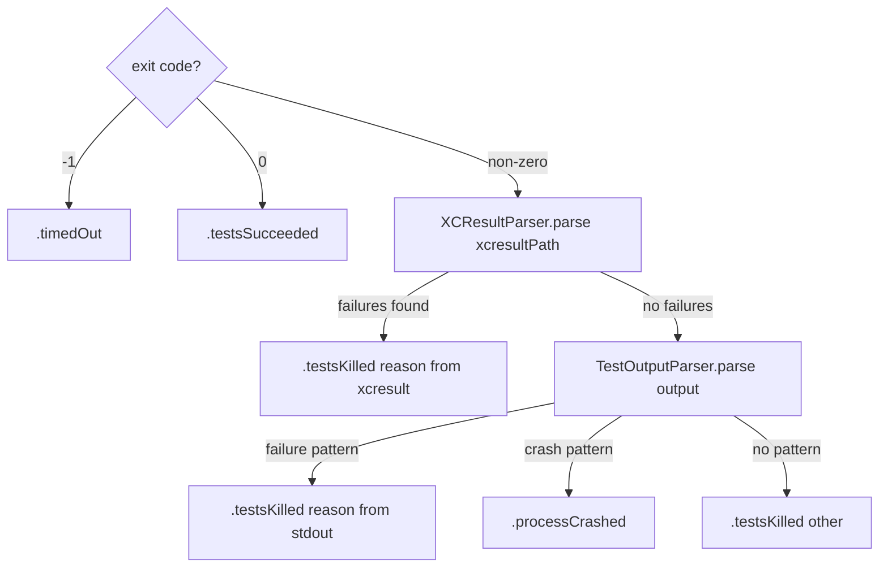

# Result Parsing & Cache

← [Execution](07-execution.md) | Next: [Reporting & Infrastructure →](09-reporting-infrastructure.md)

---

## Execution/TestResultResolver.swift

```swift
struct TestResultResolver: Sendable {
    let launcher: any ProcessLaunching

    func resolve(
        launch: TestLaunchResult,
        projectType: ProjectType,
        timeout: TimeInterval
    ) async throws -> TestRunOutcome
}
```

Delegates to the appropriate parser based on project type:
- `.xcode` → `ResultParser` (xcresulttool + output parsing)
- `.spm` → `SPMResultParser` (output-only parsing)

---

## Execution/Parsing/ResultParser.swift

```swift
struct ResultParser: Sendable {
    init(launcher: any ProcessLaunching)
    func parse(
        exitCode: Int32,
        output: String,
        xcresultPath: String,
        timeout: Double
    ) async throws -> TestRunOutcome
}
```

Determines the `TestRunOutcome` of a completed test invocation.



Exit code `-1` is the sentinel set by `ProcessLauncher` when it kills the process due to timeout. Exit code `0` with no test failures is `.testsSucceeded` (survived). For non-zero exit codes, `XCResultParser` is tried first against the `.xcresult` bundle; `TestOutputParser` is the stdout/stderr fallback.

---

## Execution/Parsing/TestRunOutcome.swift

```swift
enum TestRunOutcome: Sendable {
    case testsSucceeded
    case testsFailed(failingTest: String)
    case crashed
    case timedOut
    case unviable

    var asExecutionStatus: ExecutionStatus { get }
}
```

Intermediate result from `TestResultResolver`/`ResultParser`/`SPMResultParser`, converted to `ExecutionStatus` via `asExecutionStatus`.

| Case | Maps to |
|---|---|
| `testsSucceeded` | `.survived` |
| `testsFailed(failingTest:)` | `.killed(by: failingTest)` |
| `crashed` | `.killedByCrash` |
| `timedOut` | `.timeout` |
| `unviable` | `.unviable` |

---

## Execution/Parsing/TestOutputParser.swift

```swift
struct TestOutputParser: Sendable {
    func parse(_ output: String) -> TestRunOutcome
}
```

Scans stdout/stderr for known failure and crash patterns when `xcresulttool` yields no results.

**Failure patterns detected:**

| Framework | Pattern |
|---|---|
| XCTest | `Test Case '-[…]' failed` |
| Swift Testing | `Test "…" failed` |

**Crash patterns detected:**

`Fatal error`, `EXC_BAD_INSTRUCTION`

Returns `.testsKilled(reason: <first matching line>)` for test failures, `.processCrashed` for crashes, or `.testsKilled(reason: "other")` when no pattern matches but the exit code was non-zero.

---

## Execution/Parsing/SPMResultParser.swift

```swift
struct SPMResultParser: Sendable {
    func parse(exitCode: Int32, output: String) -> TestRunOutcome
}
```

Parses SPM test results from exit code and stdout/stderr output only (no `.xcresult` bundles). Uses `TestOutputParser` to detect failure patterns.

| Condition | Outcome |
|---|---|
| Exit code `-1` | `.timedOut` |
| Exit code `0` | `.testsSucceeded` |
| Non-zero + test failure pattern | `.testsFailed(failingTest:)` |
| Non-zero + empty output | `.crashed` |
| Non-zero + no parseable failure | `.unviable` |

---

## Execution/Parsing/XCResultParser.swift

```swift
struct XCResultParser: Sendable {
    init(launcher: any ProcessLaunching)
    func parse(xcresultPath: String) async throws -> TestRunOutcome?
}
```

Invokes `xcresulttool get test-results tests` on the `.xcresult` bundle and parses the JSON output. Walks the `testNodes` tree recursively looking for nodes where `nodeType == "Test Case"` and `result == "Failed"`. Returns the first failure message as `.testsKilled(reason:)`, or `nil` if no failures are found or the invocation fails.

---

## Cache/CacheStore.swift

```swift
actor CacheStore {
    static let directoryName: String
    init(storePath: String)
    func result(for key: MutantCacheKey) -> ExecutionStatus?
    func store(status: ExecutionStatus, for key: MutantCacheKey)
    func load() throws
    func persist() throws
}
```

Persists execution results across runs. All reads and writes are serialised by the actor.

| Constant | Value |
|---|---|
| `directoryName` | `".swift-mutation-testing-cache"` |

Cache is stored at `<project>/.swift-mutation-testing-cache/results.json` as a JSON array of `CacheEntry` values (key + status pairs).

`load()` is a no-op if the cache file does not exist. `persist()` creates the directory if needed and writes atomically.

---

## Cache/MutantCacheKey.swift

```swift
struct MutantCacheKey: Sendable, Codable, Hashable {
    let fileContentHash: String
    let testFilesHash: String
    let utf8Offset: Int
    let originalText: String
    let mutatedText: String
    let operatorIdentifier: String

    static func make(for descriptor: MutantDescriptor, testFilesHash: String) -> MutantCacheKey
}
```

SHA256-derived cache key. Invalidates automatically when source or test files change.

| Field | Source |
|---|---|
| `fileContentHash` | SHA256 of `mutatedSourceContent` for incompatible mutants; SHA256 of the source file at `filePath` for schematizable mutants |
| `testFilesHash` | Precomputed SHA256 of all test files in the project |
| `utf8Offset` | Mutation position |
| `originalText` | Token before mutation |
| `mutatedText` | Token after mutation |
| `operatorIdentifier` | Operator name |

`make(for:testFilesHash:)` computes `fileContentHash` from `descriptor.mutatedSourceContent` (for incompatible mutants) or from the on-disk content at `descriptor.filePath` (for schematizable mutants).

---

← [Execution](07-execution.md) | Next: [Reporting & Infrastructure →](09-reporting-infrastructure.md)
