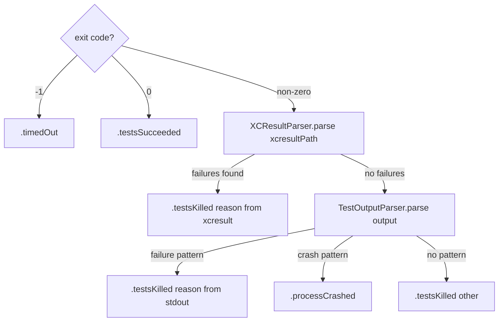

# Result Parsing & Cache

← [Execution](07-execution.md) | Next: [Reporting & Infrastructure →](09-reporting-infrastructure.md)

---

## Execution/TestResultResolver.swift

```swift
struct TestResultResolver: Sendable {
    let launcher: any ProcessLaunching

    func resolve(
        launch: TestLaunchResult,
        projectType: ProjectType,
        timeout: TimeInterval
    ) async throws -> TestRunOutcome
}
```

Delegates to the appropriate parser based on project type:
- `.xcode` → `ResultParser` (xcresulttool + output parsing)
- `.spm` → `SPMResultParser` (output-only parsing)

---

## Execution/Parsing/ResultParser.swift

```swift
struct ResultParser: Sendable {
    init(launcher: any ProcessLaunching)
    func parse(
        exitCode: Int32,
        output: String,
        xcresultPath: String,
        timeout: Double
    ) async throws -> TestRunOutcome
}
```

Determines the `TestRunOutcome` of a completed test invocation.


```mermaid
flowchart TD
    EC{exit code?} -- -1 --> TO[.timedOut]
    EC -- 0 --> SUCCESS[.testsSucceeded]
    EC -- non-zero --> XCR[XCResultParser.parse xcresultPath]
    XCR -- failures found --> KILLED[.testsKilled reason from xcresult]
    XCR -- no failures --> STDOUT[TestOutputParser.parse output]
    STDOUT -- failure pattern --> KILLED2[.testsKilled reason from stdout]
    STDOUT -- crash pattern --> CRASH[.processCrashed]
    STDOUT -- no pattern --> KILLED3[.testsKilled other]
```

Exit code `-1` is the sentinel set by `ProcessLauncher` when it kills the process due to timeout. Exit code `0` with no test failures is `.testsSucceeded` (survived). For non-zero exit codes, `XCResultParser` is tried first against the `.xcresult` bundle; `TestOutputParser` is the stdout/stderr fallback.

---

## Execution/Parsing/TestRunOutcome.swift

```swift
enum TestRunOutcome: Sendable {
    case testsSucceeded
    case testsFailed(failingTest: String)
    case crashed
    case timedOut
    case buildFailed
    case unviable

    var isKill: Bool { get }
    var asExecutionStatus: ExecutionStatus { get }
}
```

Intermediate result from `TestResultResolver`/`ResultParser`/`SPMResultParser`, converted to `ExecutionStatus` via `asExecutionStatus`.

| Case | Maps to |
|---|---|
| `testsSucceeded` | `.survived` |
| `testsFailed(failingTest:)` | `.killed(by: failingTest)` |
| `crashed` | `.killedByCrash` |
| `timedOut` | `.timeout` |
| `buildFailed` | `.unviable` |
| `unviable` | `.unviable` |

`isKill` answers the narrower question "did the tests detect the mutant" — true for `testsFailed` and `crashed` only. `TestExecutionStage` uses it to decide whether the targeted run already settled the verdict or the whole suite still has to run.

---

## Execution/Parsing/TestOutputParser.swift

```swift
struct TestOutputParser: Sendable {
    enum Result: Sendable {
        case killed(by: String)
        case crashed
        case unviable
    }

    func parse(_ output: String) -> Result
    func failingTests(in output: String) -> [String]
    func failingTest(in line: String) -> String?
}
```

Scans stdout/stderr for known failure and crash patterns when `xcresulttool` yields no results.

**Failure patterns detected:**

| Framework | Pattern |
|---|---|
| XCTest | `Test Case '-[…]' failed` |
| Swift Testing | `Test <name>` followed by `recorded an issue` or `failed` |

Swift Testing names an individual test either by its display name in quotes — `Test "a check"` — or,
when it has none, by its function signature — `Test aCheck()`, `Test aCheck(value:)`. Both forms are
read, and both of the lines a failing test prints: one per issue as it records it, and the test's own
closing summary. Matching only `Test "…" failed`, as this used to, missed every parameterized test
(`Test "a check" with 2 test cases failed`) and every test without a display name, so the mutants
they caught were reported as `Crash` and left `killerTestFile` unresolved (issue #83).

The run's aggregate lines — `Suite "…" failed`, `Test run with 3 tests in 1 suite failed` — are
deliberately not matched: naming a suite or the whole run as the killing test would be worse than
naming nothing. A *known* issue is an expected failure and the test still passes, so `recorded a
known issue` is excluded too.

**Crash patterns detected:**

`Fatal error`, `EXC_BAD_INSTRUCTION`

Returns `.testsKilled(reason: <first matching line>)` for test failures, `.processCrashed` for crashes, or `.testsKilled(reason: "other")` when no pattern matches but the exit code was non-zero.

---

## Execution/Parsing/SPMResultParser.swift

```swift
struct SPMResultParser: Sendable {
    static let timedOutExitCode: Int32

    func parse(exitCode: Int32, output: String) -> TestRunOutcome
}
```

Parses SPM test results from exit code and stdout/stderr output only (no `.xcresult` bundles). Uses `TestOutputParser` to detect failure patterns.

| Condition | Outcome |
|---|---|
| Exit code `-1` | `.timedOut` |
| Exit code `0` | `.testsSucceeded` |
| Non-zero + test failure pattern | `.testsFailed(failingTest:)` |
| Non-zero + empty output | `.crashed` |
| Non-zero + no parseable failure | `.unviable` |

---

## Execution/Parsing/XCResultParser.swift

```swift
struct XCResultParser: Sendable {
    init(launcher: any ProcessLaunching)
    func parse(xcresultPath: String) async throws -> TestRunOutcome?
}
```

Invokes `xcresulttool get test-results tests` on the `.xcresult` bundle and parses the JSON output. Walks the `testNodes` tree recursively looking for nodes where `nodeType == "Test Case"` and `result == "Failed"`. Returns the first failure message as `.testsKilled(reason:)`, or `nil` if no failures are found or the invocation fails.

---

## Cache/CacheTestSelection.swift

```swift
struct CacheTestSelection: Codable, Sendable, Equatable {
    let scheme: String?
    let destination: String?
    let container: String?
    let testTarget: String?
    let testingFramework: String
    init(_ build: RunnerConfiguration.BuildOptions)
}
```

What a cached verdict was tested against; `scheme` and `destination` are `nil` for a package. Stored in `CacheMetadata.testSelection`. See `discard(unlessMadeWith:)` below.

## Cache/CacheStore.swift

```swift
actor CacheStore {
    static let directoryName: String
    static let formatVersion: Int
    static let journalName: String           // "journal.jsonl"
    init(
        storePath: String,
        noCache: Bool = false,
        planJournal: PlanJournal? = nil,
        fileSystem: FileSystem = FileSystem(),
        journalWarning: OnceWarning = OnceWarning()
    )
    func result(for key: MutantCacheKey) -> ExecutionStatus?
    func killerTestFile(for key: MutantCacheKey) -> String?
    func activated(for key: MutantCacheKey) -> Bool?
    func cachedResult(for mutant: MutantDescriptor) -> ExecutionResult?
    func store(
        status: ExecutionStatus, for key: MutantCacheKey, killerTestFile: String? = nil, activated: Bool? = nil,
        duration: Double = 0
    )
    func load() throws
    func persist() throws
    func loadMetadata() throws -> CacheMetadata?
    func persistMetadata(_ metadata: CacheMetadata) throws
    func invalidate(diff: TestFileDiff)
    func discard(unlessMadeWith selection: CacheTestSelection) throws -> Bool
    func changedTestFiles(current: [String: String]) throws -> TestFileDiff
}
```

Persists execution results across runs with granular per-file invalidation. All reads and writes are serialised by the actor. Its existence checks, directory creation and removals go through the injected `FileSystem` (see [09 — Reporting & Infrastructure](09-reporting-infrastructure.md)).

| Constant | Value |
|---|---|
| `directoryName` | `".swift-mutation-testing-cache"` |
| `formatVersion` | `3` — bump whenever the shape of `results.json` or `metadata.json` changes, or the meaning of what it holds. `2` added `activated`, so caches written before the activation marker existed are discarded once; `3` discards caches whose incompatible mutants were stored before their activation was measured, which would otherwise keep reporting them as not measured |

Cache is stored at `<project>/.swift-mutation-testing-cache/results.json` as a JSON array of `CacheEntry` values (key + status + killerTestFile + activated).

**The journal.** `store(…)` also appends the entry as one JSON line to `journal.jsonl` (`JSONLines.append`, the helper `PlanJournal` shares), next to `results.json`, the moment it is called — before any report, before `persist()`; a line that cannot be written is reported once through `journalWarning`. `load()` reads `results.json` and then replays the journal over it, the journal's verdicts winning, and does the replay even when `results.json` does not exist yet; a line cut short by a crash is skipped (`JSONLines.read`). `persist()` writes `results.json` and removes the journal. So a run that ends before `persist()` — `Ctrl+C`, a crash, a lost machine — leaves every verdict it reached, and the next `load()` starts from them. `MutantExecutor` writes the cache's metadata at the start of the run for the same reason: the journal must be read back against the test files it ran with. Under `noCache` nothing is journaled here; a `PlanJournal` given at init still records every verdict, timeouts included, since it is the progress of a planned run rather than a cache (see [11 — Plans](11-plans.md)). `store` takes the mutant's test `duration` for it.

`load()` on a missing cache file replays only the journal. `persist()` creates the directory if needed and writes atomically.

**A cache this version cannot read is discarded, not fatal.** `metadata.json` carries `formatVersion`. `load()` starts empty — verdicts, killer test files and activations alike, printing a warning through `StandardError` — when the metadata is there but undecodable or from another version (a metadata file with no version at all, as 1.4 and 1.5 wrote, counts as another version), or when `results.json` itself does not decode. `loadMetadata()` answers `nil` in the same cases, so `changedTestFiles` treats every test file as new. The next `persist()`/`persistMetadata(_:)` overwrites both files in the current format. Errors reading the files from disk still propagate: those are not a stale cache, and hiding them would hide a broken project directory.

Up to 1.5.0 any decode failure ended the run. 1.4.0 added `filePath` to `MutantCacheKey`, so a cache written by 1.3 or earlier made every later run stop right after discovery with *"The data couldn't be read because it is missing"* — `DecodingError.keyNotFound` — until the user deleted the directory by hand. The cache only ever saves time: discarding it costs one full run, while refusing to run over it costs the user the tool.

**`noCache`:** constructed with `noCache: true` — from `--no-cache` or `no-cache: true` in the YAML — the store is inert. It reads nothing from disk, holds no verdict, and writes nothing back. The flag is honoured here rather than at each call site, so a run can neither replay a verdict nor leave one behind for the next run to replay.

**Granular invalidation methods:**

| Method | Description |
|---|---|
| `killerTestFile(for:)` | Returns the stored killer test file path for a cached entry |
| `activated(for:)` | Returns whether the mutated code ran when the cached verdict was recorded, `nil` when that was not measured |
| `cachedResult(for:)` | The whole cached verdict of a mutant — status, killer test file, activation — as an `ExecutionResult` with `fromCache: true` and `testDuration: 0`; `nil` on a miss. Every executor reads the cache through it (via `ResultRecorder.cached(_:)`) instead of assembling the result from the three lookups |
| `store(status:for:killerTestFile:activated:duration:)` | Stores an execution result with optional killer test file and activation metadata |
| `changedTestFiles(current:)` | Compares current per-file test hashes against stored metadata to produce a `TestFileDiff` |
| `invalidate(diff:)` | Removes cached entries based on status-aware rules (see Architecture docs) |
| `persistMetadata(_:)` | Writes `CacheMetadata` (format version, test file hashes and test selection) to disk alongside the results cache |
| `discard(unlessMadeWith:)` | Forgets every verdict, and the journal, when the stored metadata names another `CacheTestSelection`, or none; returns whether it did. Without metadata it keeps everything |

**The test selection.** A verdict says what one set of tests did to a mutant, and nothing about another set. `CacheTestSelection`, built from `RunnerConfiguration.BuildOptions`, records what the tests ran against: the Xcode scheme, destination and container, `--target`, and the testing library. `MutantExecutor.prepareCacheStore` calls `discard(unlessMadeWith:)` right after `load()`, printing a note through `StandardError` when it discards, and the metadata written at the start of the run carries the selection, so an interrupted run's journal is tied to it too. Before this, a run with another `--target` replayed nearly every verdict of the previous one (#135). The selection stays out of `MutantCacheKey`: two targets cannot share one cache, but keying verdicts per target would make every lookup depend on the configuration, for a case — alternating targets over one cache — that a CI job avoids by caching per job.

---

## Cache/MutantCacheKey.swift

```swift
struct MutantCacheKey: Hashable, Sendable, Codable {
    let filePath: String
    let fileContentHash: String
    let operatorIdentifier: String
    let utf8Offset: Int
    let originalText: String
    let mutatedText: String

    static func hash(of content: String) -> String
    static func make(for mutant: MutantDescriptor) -> MutantCacheKey
}
```

SHA256-derived cache key; `hash(of:)` is `VersionedJSON.sha256(of:)` over the content's UTF-8. `fileContentHash` is the hash of the **unmutated file** the mutant was found in, carried on `MutantDescriptor.sourceContentHash` from discovery — so editing the code under test changes the key and the stale verdict is not replayed. It used to fall back to the file *path* for any mutant with no mutated source, which is every schematizable one.

`filePath` sits beside it because content alone would collide for two byte-identical files, whose mutants are not interchangeable — they compile into different places. Renaming a file therefore re-measures its mutants, which is the conservative direction to be wrong in.

Stable across test-only changes; those are handled granularly by `CacheStore.invalidate(diff:)`.

| Field | Source |
|---|---|
| `fileContentHash` | SHA256 of `mutatedSourceContent` for incompatible mutants; SHA256 of the source file at `filePath` for schematizable mutants |
| `operatorIdentifier` | Operator name |
| `utf8Offset` | Mutation position |
| `originalText` | Token before mutation |
| `mutatedText` | Token after mutation |

`make(for:)` computes `fileContentHash` from `descriptor.mutatedSourceContent` (for incompatible mutants) or from the on-disk content at `descriptor.filePath` (for schematizable mutants).

---

## Cache/TestFileDiff.swift

```swift
struct TestFileDiff: Sendable {
    let added: Set<String>
    let modified: Set<String>
    let removed: Set<String>
    var hasChanges: Bool
}
```

Represents changes to test files between cache runs. Produced by `CacheStore.changedTestFiles(current:)` and consumed by `CacheStore.invalidate(diff:)`.

| Field | Description |
|---|---|
| `added` | Test file paths present in current hashes but absent from stored metadata |
| `modified` | Test file paths present in both but with different content hashes |
| `removed` | Test file paths present in stored metadata but absent from current hashes |
| `hasChanges` | `true` when any of the three sets is non-empty |

---

## Cache/KillerTestFileResolver.swift

```swift
struct KillerTestFileResolver: Sendable {
    init(testFilePaths: [String], projectPath: String)
    func resolve(testName: String) -> String?
}
```

Maps killer test names back to their source file paths. Supports both XCTest class names (e.g. `CalculatorTests`) and Swift Testing function names (e.g. `addReturnsSum()`).

Resolution strategy: extracts the class or function name from the test name, then searches `testFilePaths` for a file whose name contains the extracted identifier.

Candidates are absolute, since matching a suffix and reading a file both need a real path, but the result is returned **project-relative** via `ProjectRelativePath`. That is the form `TestFilesHasher.hashPerFile` keys its hashes by, and `CacheStore.invalidate` compares the two directly — when they disagreed, no killed verdict was ever invalidated by an edit to the test that killed it.

---

← [Execution](07-execution.md) | Next: [Reporting & Infrastructure →](09-reporting-infrastructure.md)
