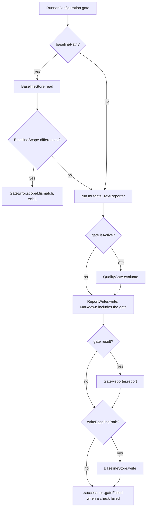

# Quality Gate

← [Reporting & Infrastructure](09-reporting-infrastructure.md) | Next: [Plans →](11-plans.md)

---

The gate turns a run's result into a pass or fail. It is evaluated after the text summary and before the report files, so the Markdown summary can include it, and printed after them; a failed gate ends the run with `ExitCode.gateFailed` (`2`). It is inactive — and the run behaves as it did before the gate existed — unless a policy or a baseline is configured. The user-facing flow is in [Usage — Quality Gate](../USAGE.MD#quality-gate).



The baseline is read and its scope checked before discovery, so a run that could never be compared stops before it spends any time. The steps live in `RunConclusion` (`CLI/RunConclusion.swift`): `loadBaseline` before the run, then `conclude` — text report, `evaluateGate`, `ReportWriter`, `applyGate` — after it, for `run` and `merge` alike. See [01 — Entry Point](01-entry-point.md#clirunconclusionswift).

---

## Gate/GatePolicy.swift

```swift
struct GatePolicy: Sendable, Equatable {
    var minScore: Double?
    var maxScoreDrop: Double?
    var maxNewSurvivors: Int?
    var maxIntegrityWarnings: Int?
    var isEmpty: Bool { get }
}
```

The four policies, each optional; `isEmpty` is true when none is set. `maxScoreDrop` and `maxNewSurvivors` need a baseline; `ConfigurationResolver` rejects them without one. `maxIntegrityWarnings` does not.

---

## Gate/QualityGate.swift

```swift
struct QualityGate: Sendable {
    func evaluate(_ summary: RunnerSummary, policy: GatePolicy, baseline: Baseline?) -> GateResult
}
```

| Policy | Check | Fails when |
|---|---|---|
| `minScore` | `.minScore(score:minimum:)` | `summary.score < minScore` |
| `maxScoreDrop` | `.scoreDrop(drop:maximum:)` | `baseline.score − summary.score > maxScoreDrop` |
| `maxNewSurvivors` | `.newUndetected(count:maximum:)` | undetected mutants whose fingerprint is not in the baseline number more than `maxNewSurvivors` |
| `maxIntegrityWarnings` | `.integrityWarnings(count:maximum:)` | `summary.integrityWarnings` — kills and timeouts whose mutated code never ran — number more than `maxIntegrityWarnings` |

"Undetected" is `RunnerSummary.undetected` — survived and no coverage — so a new mutant without coverage counts as a new survivor. Timeouts are detected, as in the score. A check that needs a baseline is skipped when there is none.

With a baseline, the result also lists the new undetected mutants, sorted by file and line, and counts the baseline's mutants that are no longer undetected (`fixedCount`). Both are informational.

---

## Gate/GateResult.swift

```swift
struct GateResult: Sendable {
    let checks: [Check]
    let newUndetected: [ExecutionResult]
    let fixedCount: Int?
    var passed: Bool { get }

    enum Check: Sendable, Equatable {
        case minScore(score: Double, minimum: Double)
        case scoreDrop(drop: Double, maximum: Double)
        case newUndetected(count: Int, maximum: Int)
        case integrityWarnings(count: Int, maximum: Int)
        var passed: Bool { get }
    }
}
```

The gate passes when every check passes; with no checks it passes. `fixedCount` is `nil` without a baseline.

---

## Gate/Baseline.swift, BaselineScope.swift, BaselineEntry.swift

```swift
struct Baseline: Sendable, Codable, Equatable {
    static let formatVersion: Int
    let formatVersion: Int
    let toolVersion: String
    let createdAt: Date
    let score: Double
    let scope: BaselineScope
    let undetected: [BaselineEntry]

    init(formatVersion: Int = Baseline.formatVersion, toolVersion: String, createdAt: Date, score: Double,
         scope: BaselineScope, undetected: [BaselineEntry])
    init(summary: RunnerSummary, scope: BaselineScope, projectPath: String, toolVersion: String, createdAt: Date)
}

struct BaselineScope: Sendable, Codable, Equatable {
    let operators: [String]
    let sourcesPath: String
    let excludePatterns: [String]

    init(operators: [String], sourcesPath: String, excludePatterns: [String])
    init(configuration: RunnerConfiguration)
    func differences(from other: BaselineScope) -> [String]
}

struct BaselineEntry: Sendable, Codable, Equatable {
    let fingerprint: String
    let file: String
    let line: Int
    let operatorIdentifier: String
    let original: String
    let replacement: String
    let status: String

    enum CodingKeys: String, CodingKey
}
```

`Baseline.formatVersion` is `1`. `BaselineEntry.operatorIdentifier` is encoded under the key `operator`, and `status` is `survived` or `noCoverage`.

A baseline is the undetected mutants of one run, meant to be committed. `init(summary:scope:projectPath:toolVersion:createdAt:)` builds one from `RunnerSummary.undetected` and its score, each entry's file relative to the project through a `ProjectRelativePath.Resolver`. Entries are sorted by file, line and fingerprint — the memberwise `init` sorts them, whatever builds it — and `BaselineStore` writes sorted keys, so its diff in a pull request is stable and readable. The gate reads only `fingerprint`; `file`, `line`, `operator`, `original` and `replacement` are there for the people reviewing the diff.

`BaselineScope(configuration:)` records what the run covered: the operators (all of them, `OperatorRegistry.allOperatorNames`, when none is selected), the sources path relative to the project with both resolved through `CanonicalPath` (`.` for the project itself), and the `exclude` patterns; `init(operators:sourcesPath:excludePatterns:)` sorts both lists. `differences(from:)` names every field that differs as `<field>: <baseline's> → <this run's>`, and a non-empty result stops the run: a different scope turns out-of-scope mutants into "new survivors", or hides real ones.

---

## Gate/BaselineStore.swift

```swift
struct BaselineStore: Sendable {
    func read(from path: String) throws -> Baseline
    func write(_ baseline: Baseline, to path: String) throws
}
```

Both halves go through `VersionedJSON`, which `PlanStore` shares. `write` encodes with `VersionedJSON.encode(_:dates: .iso8601)` — pretty-printed JSON with sorted keys, no escaped slashes, ISO 8601 dates and a trailing newline — and writes it atomically. `read` is `VersionedJSON.read`: it decodes `formatVersion` first, and throws `GateError.unsupportedBaselineVersion` for any version but `Baseline.formatVersion`, before trying the rest of the file; a missing file is `baselineNotFound`, an undecodable one `unreadableBaseline`.

---

## Gate/GateError.swift

```swift
enum GateError: Error, Equatable, LocalizedError {
    case baselineNotFound(path: String)
    case unreadableBaseline(path: String)
    case unsupportedBaselineVersion(path: String, version: Int)
    case scopeMismatch(path: String, differences: [String])
}
```

Every case ends the run with exit code `1`, and each description says how to recover — usually by writing a new baseline with `--write-baseline`.

---

## Reporting/GateReporter.swift

```swift
struct GateReporter: Sendable {
    static let listedLimit: Int
    let projectRoot: String
    func report(_ result: GateResult)
    func format(_ result: GateResult) -> String
}
```

Prints the gate after the text summary:

```
Quality gate: FAILED
  ✓ score 90.4% ≥ 85.0%
  ✓ score drop 0.7 pts ≤ 2.0 pts
  ✗ 2 new undetected mutants (max 0)
      Sources/Cache.swift:12   RemoveSideEffects   remove store()
      Sources/Parser.swift:88   RelationalOperatorReplacement   < → <=
  ℹ 3 mutants detected now that were undetected in the baseline
```

The checks come in the order `QualityGate` adds them — minimum score, score drop, new undetected mutants, integrity warnings — and the wording of each comes from `GateResult+Summary`, which `MarkdownReporter` shares. New undetected mutants are listed under their check, in the gate's file-and-line order, at most `listedLimit` (20) of them, followed by `and N more — see the report`; each line is the project-relative location, the operator and the mutation's description. The `ℹ` lines are `GateResult.notes`, also shared with `MarkdownReporter`: with a baseline but no `maxNewSurvivors`, the new undetected mutants as a count, and the count of baseline mutants detected now.

---

← [Reporting & Infrastructure](09-reporting-infrastructure.md) | Next: [Plans →](11-plans.md)
